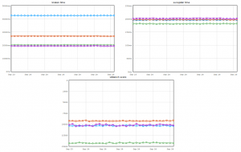
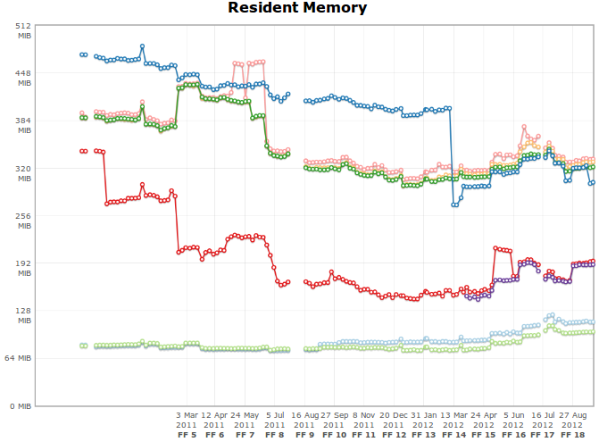

Firefox 或許不是地表最快瀏覽器，但要說它「慢」總也該有點依據。程式的速度受到很多因素影響，包括：

- 電腦配備，你可以視其為「資源」

- 同時間啟動的程式、分頁等。畢竟同一份資源拿來同時做一件事情跟做 20 件事情，總是有點差別。

- 網頁使用的技術，越複雜牽涉的就越多

- 是否裝了會影響網頁編排、解析網頁內容的附加元件？有的話必然多少耗點速度。

- 程式的問題。要做一件事情有快的方法也有慢的方法，程式邏輯上也是如此。

- 還有超多因素，不及備載。

每隔一陣子，就會有文章拿各種測量數據來評比各瀏覽器的速度，而由於瀏覽器的大廠日日進步，每次結果也不盡相同。有件事情大家應該先了解：測量數據不代表你的感覺。每種 Benchmark 都為了特定目的存在，有的測試 A 項目多點、有的測試 B 項目多點，這些目的很顯然都為網頁引擎的開發而來 — 否則，也不需要用到毫秒這種人類無法感覺的單位來檢視。對使用者真正最有用的部份，會在作業流程的整體速度，這牽扯到啟動、UI 反應、與現有工作的整合等。

在 Firefox 4 的開發期間，Mozilla 就已經針對以前較為人詬病的啟動速度與記憶體使用量做了不少改善；這些改進讓 Firefox 獲得好評，不過我們的腳步依然沒有停止：在進入快速開發週期以後，Mozilla 啟動了「[Snappy](https://wiki.mozilla.org/Performance/Snappy)」專案，[從各種角度全面地試圖增加 Firefox 的反應速度](https://blog.mozilla.com.tw/posts/79/)。在過去幾個版本內，Snappy 專案至少改善了上百個大小問題，讓 Firefox 從裡到外、一版比一版快。這點似乎也有不少鄉民[有感覺](https://www.ptt.cc/bbs/Browsers/M.1338639304.A.DA1.html)：

而 Firefox 即將上場的 JavaScript 加速機制 IonMonkey 還會讓許多網頁跑起來更快一些！JavaScript 引擎的小組有個網站「[are we fast yet](https://arewefastyet.com/)」，每日比較 JavaScript 引擎開發進度與速度，從這個網站可以看到加上 IonMonkey 後，在 3 種測試中的兩種都確實有超過 10% 的顯著進步。由於 Firefox 程式的介面也有很多地方以 JavaScript 撰寫，所以改善 JavaScript 引擎可以一舉提升網頁及程式介面速度，更是令人期待。

那記憶體問題呢？除了 Snappy 之外，Mozilla 也有另一個專案名喚 [MemShrink](https://wiki.mozilla.org/Performance/MemShrink)，正為記憶體相關問題而來。使用記憶體首重效率，當然我們不會要求要馬兒好又要馬兒不吃草，不過若能在顯示同一網頁時使用較少記憶體、且看完還能有效釋放記憶體，那就最好了。MemShrink 試圖處理過去舊版 Firefox 記憶體使用上的缺陷，這個小組也建了一個「[are we slim yet](https://areweslimyet.com/)」 – 姑且稱為「啊是還不夠瘦嗎？」網站，記錄每段期間各種記憶體使用測試的結果。從表上可以發現，從去年三月到現在，有許多部份也持續改善中，特別是 [Firefox 15 的記憶體回收能力，顯然有非常大幅的改善](https://blog.mozilla.com.tw/posts/872/)。

剛巧在前幾天也有人貼了測試文章，[比較部份瀏覽器的記憶體使用與回收能力](https://techlogon.com/2012/09/21/review-of-firefox-chrome-and-ie-memory-usage-2012/)。Firefox 表現頗為出色，真該給 MemShrink 團隊鼓鼓掌！

所以，如果你對 Firefox 的印象還停留在「很慢」、「記憶體怪獸」的時代，別忘了[再回來試試看](https://mozilla.com.tw/)，相信能有全新感受。
