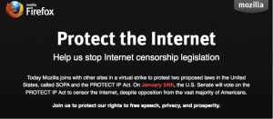

### 超過四千萬名網友迴響

(2012/01/20 台北訊) Mozilla 是美國反 SOPA 聯盟的主力軍之一，昨日於美國時間 1/18 響應虛擬反 SOPA 行動，美國 Firefox 首頁塗黑並嵌入『STOP INTERNET CENSORSHIP』（終止網路審查制度）的字句。結果有超過 4000 千萬名網友透過 Mozilla 的網頁瞭解到反 SOPA 的行動，進而有 36 萬封信件被寄到美國國會表明反 SOPA 的立場。

Mozilla 一向支持網路開放自由，在 SOPA 法案提出時便積極參與反 SOPA 聯盟活動。Mozilla 基金會主席 [Mitchell Baker](https://blog.lizardwrangler.com/2012/01/17/pipasopa-and-why-you-should-care/) 在其部落格中表示，SOPA 法案並無法有效針對提供盜版內容的網站，也無法禁止企圖透過網路取得盜版內容的網友繼續下載盜版內容，而是針對那些沒有主動禁止提供或下載盜版內容的網站平台作出懲罰，其後果將是危險的。

Mozilla 積極表明反對 SOPA 的立場。在美國地區有將近 3000 萬名網友以 Firefox 作為瀏覽器首頁，在昨日有三千萬名網友看到 Mozilla 反 SOPA 的行動。Mozilla 更主動在其社群管道 (如 Twitter 與 Facebook) 發出反 SOPA 聲明給 9 百萬名網友，而 Mozilla 的訊息被轉載超過 2 萬次。有 180 萬名網友來到mozilla.org/sopa網頁，閱讀並瞭解反 SOPA 的重要性並進而採取行動。最終有 36 萬名 Mozilla 社群成員發函給國會與其支持的參議員表明支持反 SOPA 法案的立場。

下週於美國時間 1/24 日，美國國會將針對 SOPA 法案進行投票，Mozilla 表明持續反 SOPA 的立場，並希望更多民眾可以瞭解支持開放網路環境的重要性，Mozilla 歡迎美國地區或非美國地區一同響應反 SOPA 行動。詳細內容請上 [mozilla.com/sopa](https://mozilla.com/sopa) 網站。

 

