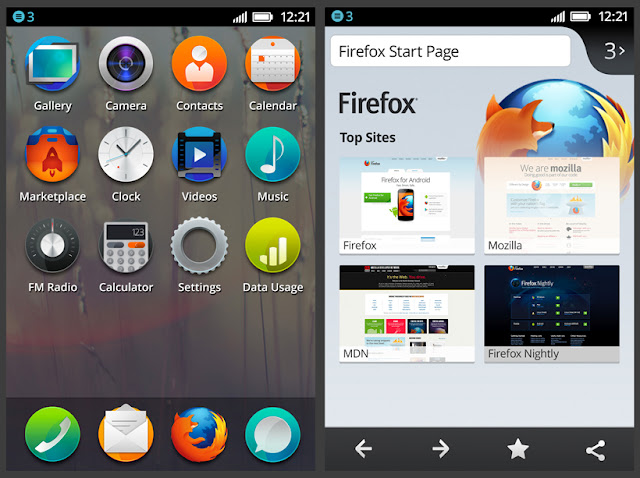

本文中我想聊聊 Firefox OS 專案，它的代表意義及它的未來在哪，並解釋為什麼我說它有些神奇魔力。

在過去的一年半中，我花費越來越多的時間在 Mozilla 的最新專案 Firefox OS 上。就在這段時間裡，我愛上了這個專案以及它的主張。我過去從來沒有對技術平台有這種體驗過。

讓我再說得清楚點：Firefox OS 只是個開始，之後將會有更多成果出現；它是一個醞釀中的革命；它讓人耳目一新；它是科技前緣的潮流；它很神奇，而且將改變一切。

## Firefox OS 是什麼

對於根本不知道我在講什麼的人，我在此迅速地介紹：

Firefox OS 是一個新的行動裝置作業系統，由 Mozilla 的 Boot to Gecko (B2G) 專案開發。它使用 Linux 核心，開機之後進入以 Gecko 為基礎的執行引擎 (Runtime Engine) 讓用戶執行完全透過 HTML、JavaScript 及其他開放網路程式 API (Open Web Applicaiton APIs) 所開發的程式。

—[Mozilla Developer Network](https://developer.mozilla.org/en-US/docs/Mozilla/Firefox_OS)

簡單說，Firefox OS 是使用網頁背後的技術—例如 JavaScript，來開發一個完整的行動作業系統。花點時間消化一下……它是個由 JavaScipt 驅動的手機系統！

為此開發了一個經過輕微修改的 Gecko (Firefox 背後的成像引擎)，並導入[創造出近於手機體驗所需的全新 JavScript API](https://wiki.mozilla.org/WebAPI#APIs)，包括 WebTelephony 用來撥打電話；WebSMS 用於傳送簡訊；以及 Vibration API……顯然是拿來振動用的。

但是 Firefox OS 不只是最新網路技術的瘋狂應用，它同時將 Mozilla 的其他專案整合入一個單一願景中——網路即是平台 (The Web as a platform)。這些專案包含我們的 [Open Web Apps](https://developer.mozilla.org/en-US/docs/Apps) 及 [Persona](https://login.persona.org/about) 網路身分識別服務 (技術名為 BrowserID*)。能看到 Mozilla 這麼多不同專案整合成一個渾然的願景，絕對是讓人著迷的。

更詳細的敘述在此略過不提，畢竟本文並非要解釋專案的詳細內容，更多細節可以在 MDN 的 [Firefox OS 頁面](https://developer.mozilla.org/docs/Mozilla/Firefox_OS) 找到，我絕對推薦大家閱讀。

*編按：[Mozilla Persona](https://login.persona.org/) 為 Mozilla 實作 BrowserID 認證技術的平台。

## 為什麼要 Firefox OS

你可能在想：「這聽起來不錯，可為什麼要用 JavaScript 來開發一隻手機呢？」你是對的，這是個非常重要的問題。幸運的是，除了「有機會讓讓網路開發者腿軟」以外，我們還有許多理由來解釋為什麼這個主意還不錯。

兩個主要的原因：Firefox OS 填補了行動市場上的空缺；它給當前的專利保護、限制性的手機環境提供了另一種選擇。

### 填補行動市場的空缺

對很多人來說，智慧型手機出奇地貴，哪怕是在那些被認為是高收入所得的地區，人們也不覺得便宜。但如果你認為，它們在那些擁有足夠收入，可負擔的國家會比較貴的話，以下是個反證：16GB 的 iPhone 4S 在開發中市場，例如巴西，要價相當於 615 英鎊（台幣兩萬九千元），比同樣的手機在英國的價格貴上 100 英鎊（台幣七千元）。

巴西高漲的價格主要源自於進口稅，蘋果公司顯然正透過在當地建立生產線來避免。但不管怎麼說，這都說明了一個關鍵問題：昂貴的高階裝置不是世界各地都適合的選項。更別說在某些地區[你可能不會想揮舞一台價格等同於一台車的手機](https://en.wikipedia.org/wiki/Crime_in_Brazil)。

如果你想要擁有一部智慧型手機，又不想支付一大筆錢該怎麼辦？你或許可以買一台便宜的 Android 手機，不過它們大多表現的很糟。

幸運的是，Firefox OS 來了……

Firefox OS 的目的不是要與高階機種競爭，它是要以功能性手機的價格，提供入門至中階的智慧型手機。

—[Bonnie Cha](https://allthingsd.com/20120906/mozilla-makes-a-mobile-web-browser-feel-like-a-smartphone)

Firefox OS 完美地填補了這個市場空缺。它在廉價、低階的硬體上，提供可以與 Android 中階硬體相媲美的智慧型手機體驗，這不是在開玩笑的。

舉例來說，目前我正用來測試 JavaScript 遊戲的 Firefox OS 裝置，價值不到台幣 2500 元（可以說是非常低階的硬體）。你可能會覺得它應該會運行得很糟糕，但實際上，同一個遊戲不但比在同一裝置的 Android 瀏覽器中（Firefox 或 Chrome）執行的更快，甚至能跟價格是它四至五倍的手機跑的一樣好。

為什麼在同樣的設備上，跟 Android 的瀏覽器相比，會有如此巨大的性能差異？這是因為 Gecko 與硬體之間沒有太多東西，意味著 JavaScript 這樣的東西可以全速執行。過去就是因為塞太多，才導致 JavaScipt 跑得那麼慢！

在如此便宜的硬體上的 JavaScript 效能表現，促使我相信 Firefox OS 將是大事的開端。

我需要特別說明 Mozilla 不一定會先發佈一個價值 2500 台幣的手機，這只是我們目前用於開發與測試的裝置之一。

### 提供一個開放平台的選擇

「為什麼要 Firefox OS」 的第二個理由是，它不只試圖提供一個開放的手機平台，也同時挺身而出，希望能影響那些行動市場上的大玩家，並做出改變。

Mozilla 自 1998 年從一個軟體專案開始、成為基金會及公司，使命一直都是提供開放技術，挑戰市場支配者的產品。

—[Steve Lohr](https://bits.blogs.nytimes.com/2012/02/23/why-mozilla-is-entering-the-smartphone-war/)

Mozilla 希望複製 Firefox 的成功。Firefox 席捲瀏覽器市場，告訴用戶他們可以有所選擇，成為讓用戶得以自行掌控要如何使用網路的選擇。

這一次被威脅的是行動網路，而威脅者不再是微軟，而是蘋果及 Google 這兩個主要的智慧型手機平台公司。透過原生 App、封閉平台、專屬軟體商店及反覆無常的開發者條款，Apple 與 Google 正讓網路技術變得無足輕重。

—[Thomas Claburn](https://www.informationweek.com/development/mobility/mozillas-firefox-os-seeks-innovation-wit/240007065)

在手機上，有一個很需要改善的地方，就是應用程式的可攜性…

手機 App 除了讓人興奮的地方外，在某些方面來看則是在退步：它們將用戶捆綁到特定的作業系統及裝置上。網路的發展則相反，網路使內容能在任何裝置上提供相近的體驗。

Mozilla，Firefox 網路瀏覽器的創造者，正打算在智慧型手機上促使同樣的事成真。

—[Don Clark](https://blogs.wsj.com/digits/2012/09/06/backers-tout-firefox-os-as-open-mobile-option/)

Firefox OS 希望利用網路天生的跨平台能力，提供一個平台，允許應用程式可以在行動裝置、桌面電腦、平板電腦，或者任何可以使用瀏覽器的地方執行。當你離開手機時，你想不想在電腦上繼續玩手機上的《憤怒鳥》遊戲？我是非常想的！

### 開發者的駭客夢

最後一個需要 Firefox OS 的原因是，目前我們還沒有一個可以駭的行動平台（某種程度上你可以自定 Android，但並不容易）。

因為 Firefox OS 使用 HTML、JavaScript 和 CSS 建造，代表你只要擁有基本的網頁開發技能，就可以開始來改造你的裝置體驗。你可以只改一行 CSS 就完全改變桌面上的圖式外觀，又或者重寫一些處理電話撥號功能的核心 JS 程式。

這是一個真正為開發者打造的平台，我非常期待想知道大家能把它帶到哪兒。

## 絕佳時機

在 Mozilla 的這一年半中，我一直覺得自己非常幸運，能在 Firefox OS 專案的起頭就加入。如果我沒有記錯的話，那是在我剛開始這份工作的前幾週內部公開（當時叫 Boot to Gecko）。

從當時事情就讓人非常興奮，隨著時間發展，現在變得更加有意思了。Firefox OS 可以說是我第一個接觸的工作，我真的很愛它，也非常榮幸能成為其中一份子。

我經常在想，Firefox 最初發佈時，在 Mozilla 工作的人是不是也有這樣的感受：興奮、熱情、緊張，然後又無法解釋它有多麼驚人、人們為什麼應該關注它。

老實說，我不認為很多人能真正明白 Firefox OS 將帶來的變化，及為什麼它真的重要，直到它發佈的那一刻。就有點像 Firefox 吧，我想。

至於現在，我非常高興自己在它生命中一個非常有意義的時間點加入 Mozilla。

## 心靈衝擊

目前能理解它的，是那些跟著 Mozillians 一同參與活動，能親手操作到展示設備的人。對我來說最享受的，就是看著他們把玩手機時，情緒上所經歷的不同變化……

- 剛開始總是很迷惘——一種「你給我個 Android 手機搞什麼」的表情。

- 突然地意識到這不是 Android，這是使用 JavaScript 開發的。

- 不一會兒就是興奮感開始，喊出「媽呀」這樣的心靈衝擊時刻。

- 再久一點，他們會開始非常專注的摸索設備的各方面，並且問出許多問題。

- 最後當我要求取回設備時，他們多少有些不太情願：「這一點也不差，讓我印象深刻！」

你可能覺得我過於誇大，讓事情看起來更加美好與驚人，但我只是真實地描繪許多人在我展示時的反應，真的很有趣。

看見越多人試玩 Firefox OS 裝置，我越確信這是一個能真正改變賽局的專案。它看起來就是要衝擊你的心靈的，根本不需要我多加解釋。

## 許多挑戰

如果光談 Firefox OS 的好及我的工作內容，而不聊一些我們需要面對的挑戰，那就顯得不太公平了。

一方面，我們有很多的一般性問題，例如：如何管理一個開放且無限制的 App 生態系統；又或者可能出現，類似 Android 的設備分化（Device fragmentation）問題。這些都是重要的問題，不過對我來說沒什麼興趣。

我最感興趣的，是行動裝置上 HTML5 遊戲面臨的挑戰：可預見及現行開發者經常抱怨的是性能問題。這並非 Firefox OS 特有的問題（在 Android 與 iOS 也一樣糟），不過我目前主要關注在 Firefox OS 上我們要怎麼改進它。

照目前的狀況來看，大部分現行的 HTML5 手機遊戲，要嘛跑得很糟糕（0-20FPS），要嘛跑得恰恰好（20-30FPS）。且大部分狀況下遊戲不會在穩定的更新頻率上運行，導致遊戲體驗不是非常好。

有趣的是，大部分的問題似乎與裝置或 JavaScript 的極限無關。有些非休閒遊戲，比如 [Biolab Disaster](https://playbiolab.com/)，即便在我所測試的 50 英磅低端機上，也能跑得非常不錯，我說的是達到 40 至 60 FPS。

對我來說這就很清楚，雖然某些時候應該指責設備與平台，但我們也可以從那些低端機上表現不錯的遊戲中，學習它們使用的技術，並思考如何更好地傳達給其他打算在手機上使用 HTML5 的開發者們。

我真心相信，即使是硬派的 HTML5 遊戲，也可以在手機上執行得很好，哪怕是低階設備。為什麼我如此自信？因為人們目前已經在製作這些遊戲了。有兩樣東西是我一生中最信任的……親身體驗及親眼所見。

我們會抵達那兒的。

## 超越行動電話

Firefox OS 讓我最激動的，其實與我們明年即將發佈的手機無關，而是在於它所掌握的未來。在談到 Firefox OS 如何成就一個駭客夢時我曾觸及：其他人能怎樣運用它、讓其超越 Mozilla 所能預見。

好消息是現在就已經發生了。我們已經有 Firefox OS 的 [Raspberry Pi 移植版](https://www.youtube.com/watch?v=rk1oTO6cYH0)以及一個 [Pandaboard 移植版](https://developer.mozilla.org/en-US/docs/Mozilla/Boot_to_Gecko/Pandaboard)。它們還不完美，但最棒的是，這甚至是在 Firefox OS 的正式釋出前就開始了。

你也可以在 Mac、Windows 和 Linux 上運行 [Firefox OS 的桌面用戶端程式](https://developer.mozilla.org/docs/Mozilla/Boot_to_Gecko/Using_the_B2G_desktop_client)。雖然無法給你跟手機上一樣的硬體存取能力，但桌面端程式允許你試用一些這個作業系統的特性（例如獨立的應用程式執行緒），而且設置起來很簡單。

我甚至可以想像不久後，當 Gamepad API 進入 Gecko，同時可以通過 Firefox OS 桌面端存取時。這有什麼酷的呢？不難想像我們可以看到 Firefox OS 桌面端執行在連接電視的裝置上，然後透過特製的作業系統，使用遊戲手把來替代滑鼠與觸控操作（要記住這全都是 JavaScript）。

你將擁有的是一個 HTML5 遊戲主機，實際上，這也是我在 Mozilla 之外的業餘時間正在積極探索的。

我的看法是，我們已經到了可以使用製作網站相同的技術，驅動驅動硬體裝置的一刻。在一個滿是這些技術驅動的裝置、全都可以通過相同 API 來存取與交流的世界中，我們能夠做到什麼呢？

我真是太迫切的想要看看這樣的世界會是什麼樣子的！

編按：Rob Hawkes 是 Mozilla 的技術傳教士，他以個人觀點[撰寫了這篇文章](https://rawkes.com/articles/there-is-something-magical-about-firefox-os)，講述其對 Firefox OS 的觀點。本文[轉載自 Mozilla Links 中文版](https://mozlinks-zh.blogspot.com/2012/09/firefox-os.html)，由 Irvin 協助[改寫陳三翻譯的簡體中文版](https://www.zfanw.com/blog/firefox-os.html)，以[創用 CC 姓名標示-非商業性-相同方式分享 3.0 台灣](https://creativecommons.org/licenses/by-nc-sa/3.0/tw/)條款授權大眾使用，特此致謝。
