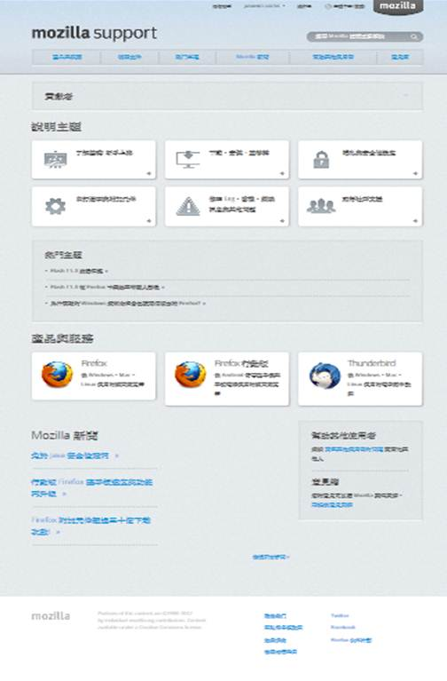
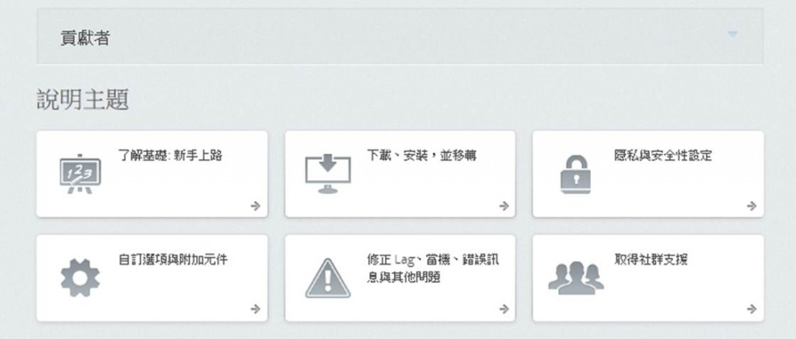
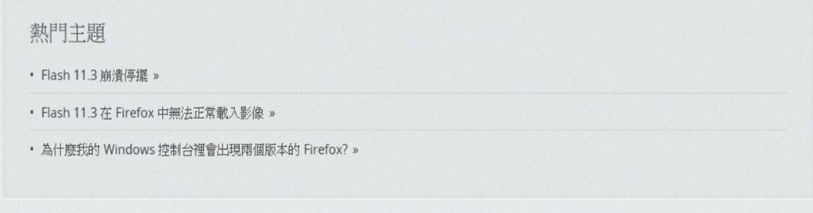
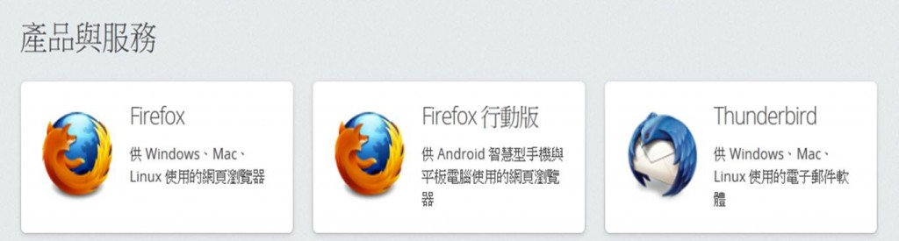
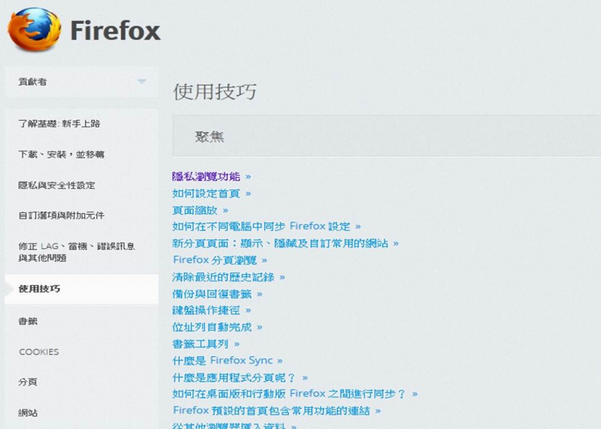
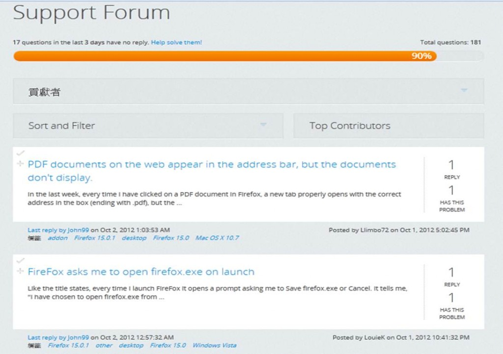

Mozilla 在 9 月針對其技術支援網站 SUMO 進行一系列重大更新，對使用者體驗和開發者來說都有明顯的優化，詳細內容請見本文介紹。

首先，我們先來回顧，你知道 SUMO 團隊今年在開發什麼嗎？

今年年初開始，SUMO 團隊一直致力於研究一種新的方式，方便使用者觀看我們的網站內容。一直以來，使用者都是透過傳統的搜尋方式來看我們的文章，或通過文章連結找到相關文章。我們也發現，這種方式只滿足部分使用者的需求，有些使用者習慣透過搜尋的方式，有些人則是用瀏覽方式找文章，在這種情況下， 我們必須用明確清楚的標題，讓同類型的文章方便尋找。

要優化一個新的網站架構，我們首先得研究網站使用者的使用模式，包括他們是怎麼看待問題的？他們會在哪些類別中找答案？因此，我們建立了分類，將我們知識庫中的文章利用分類做區別。

接下來要找出易於使用的網站架構，我們開始在紙上畫出了各種可能方案，並在實驗室找人實際參與測試，透過這樣的方式和多次重複試驗，我們敲定了最終的設計和流程。

準備工作完成，正式開始網站的優化。但因為這是一個大幅度的網站更新，同時考量到需迅速切換到統一的 [One Mozilla](https://www.mozilla.org/b/en-US/sandstone/)風格設計，我們決定重設網站的主題，這就是為什麼更動的部分不僅在知識庫，而是網站的每一個部分。

那麼，到底是什麼改變了？外觀是什麼樣的呢？

主要的變化是，我們現在在起始頁支援多種產品，並可通過這個起始頁瀏覽所有文章。那麼就讓我們來看看這個起始頁吧：

說明主題在起始頁上方，使用者可以先選定主題，再選擇產品以及問題。

下方你將看到熱門主題列表，這些文章可能是目前大家最關心的議題，透過這個列表，使用者不需尋找就可以立即找到解決方法。

接下來，我們有產品與服務選項。這是根據產品來瀏覽內容，縮小主題範圍。

無論您選擇什麼樣的方式，主題或產品，我們都希望將文章數量縮小的到一個較小的範圍，方便使用者繼續閱讀。

對於在地化的開發者來說，全新 SUMO 上為您建立了自動的主題頁供搜尋，可以減少搜尋上產生的困擾。

那麼，文章的外觀有哪些變化呢？表面上並沒有太大的改變，但因為我們提供了左側的主題頁，因此您可以在相關主題間快速尋找您要的答案，這對外部搜尋來的用戶來說十分便利，看到方便、省力的看到更多的主題內容。

改變的幅度相當大，但這也是知識庫的精華所在！

那麼，對於論壇的貢獻者來說有什麼樣的變化呢？

雖然新的 iA 本身沒有支援 SUMO，但我們將這次改版視作一個新的機會，把我們貢獻者的建議都應用在改版中。

新的設計更易於使用與乾淨，但同時也提供更多的資訊以及有關的主題搜尋。這對於貢獻者針對執行序下列表的問題可以一目了然，並可就問題一一進行處理。

我們已經在 9月24日把貢獻者庫中的用戶和普通用戶移到新網站中。如果你想嘗試，現在就來註冊一個帳號。如果您有任何意見，請在網站下方的評論處留言。新網站的網站架構將開拓我們的內容給更大的使用群，並使得瀏覽變得相當容易，而我們也保證新設計的連貫性，如同我們第一個版本中提供的所有功能那樣，都是符合 Mozilla 的網站風格。為此我們感到非常興奮，希望此舉會讓我們更接近我們的第一目標：讓用戶滿意！

[加入請點選 Mozilla support (SUMO)](https://support.mozilla.org/zh-TW/home)
