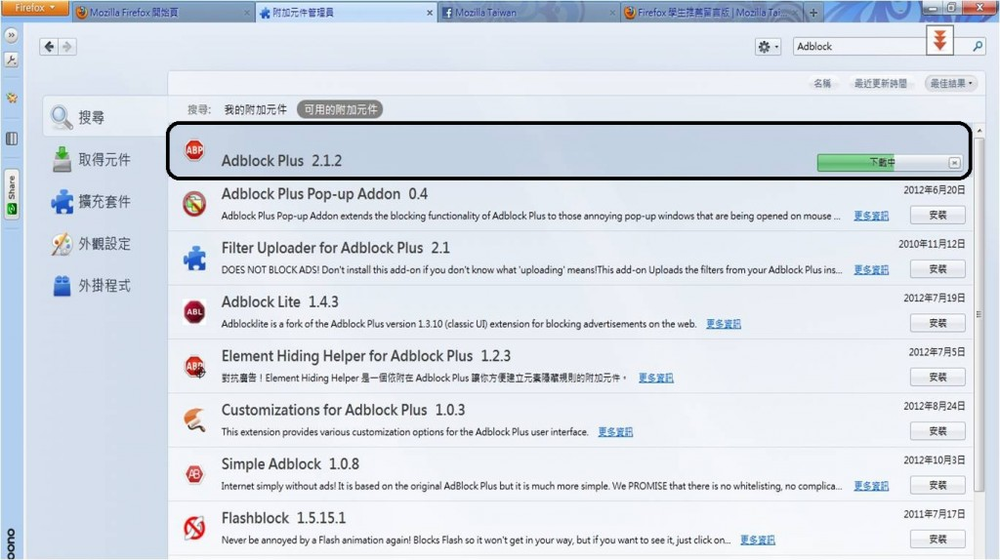
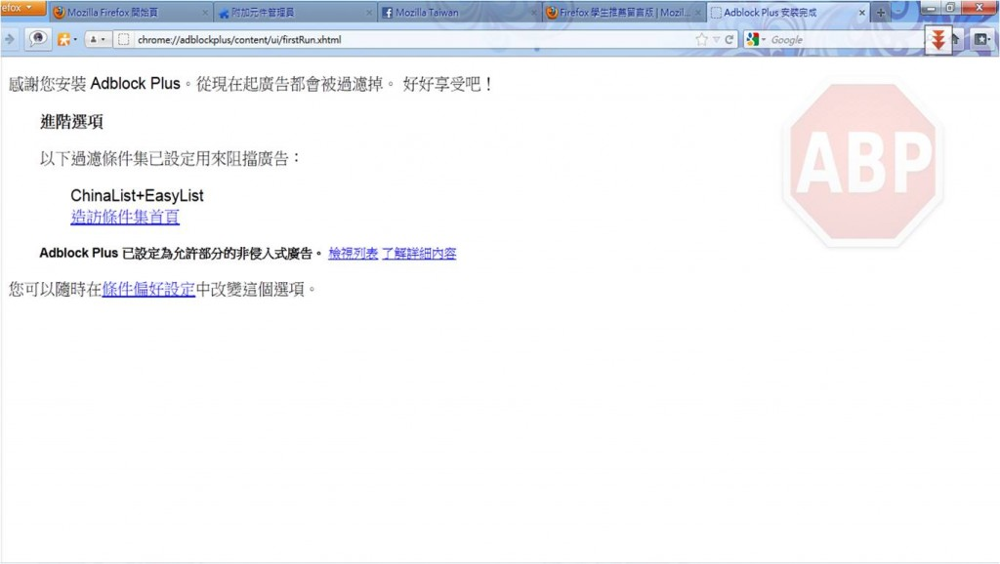
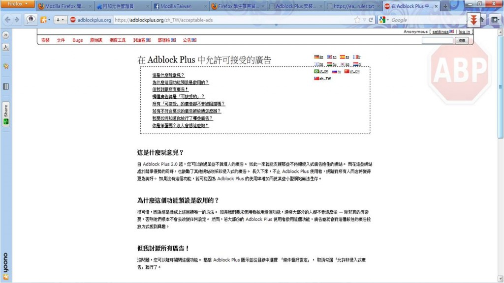

討厭擾人的廣告嗎？害怕被追蹤嗎？痛恨一大片的橫幅廣告嗎？今天的【Add-On 一點通】要和大家介紹一個好用又安全的附加元件「Adblock Plus」！安裝 「Adblock Plus 」讓您重拾網路控制權，自己決定想看的內容。此附加元件內含 40 種以上不同國家及語言的過濾條件集，能自動設定從移除線上廣告到封鎖惡意網域等過濾範圍。「Adblock Plus 」也允許自訂您自己的過濾條件，並有許多好用的功能協助您阻擋廣告，例如圖片右鍵阻擋、Flash 及 Java 物件的頁籤阻擋、提供可阻擋項目清單以便您移除程式碼和樣式表。

以下先來看看「Adblock Plus 」 的一分鐘影片介紹（英文）：

看完影片，現在就準備下載囉！你可以在工具→ 附加元件選項，輸入「Adblock Plus 」找到這個附加元件

安裝完成會顯示如下資訊：

使用者也可以透過說明選項編輯自己的白、黑名單

安裝完成，現在就來試試「Adblock Plus 」有何厲害吧！

安裝前：

安裝後：

如果你不想在瀏覽網頁時被廣告干擾，「Adblock Plus 」提供你方便、安全又安心的解決方案！今天就來試試吧！

