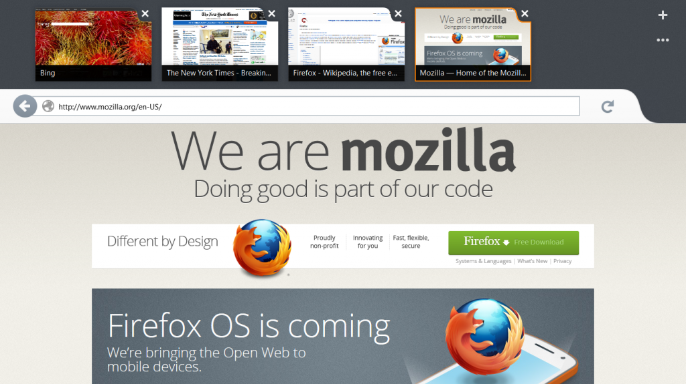
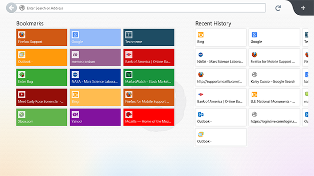

【美商謀智訊息】以推動網路平等、自由、開放為宗旨的全球非營利組織－Mozilla 基金會，2012年推出以 HTML5 為基礎的行動作業系統Firefox OS 並獲得市場廣大期待。宣佈於美西時間 (4日) 提供 Firefox Metro 預覽版本下載，此版本目前正式進入測試階段。Firefox Metro 為 Windows 8 量身打造，同時支援 Windows 傳統界面和全新的 Metro Style 瀏覽模式，可隨使用者習慣自行切換。除了必備的 Firefox Sync 同步功能外，也加入了 Windows 8 一系列特別功能，如多點觸控、手勢、Windows 8 虛擬鍵盤…等功能，設計完全與 Windows 8 的 Metro 風格與使用習慣融合，期望在 Windows 8 平台內提供一流的 Firefox 使用經驗。歡迎使用 Windows 8 測試版 (RTM) 的使用者加入下載與測試 Firefox Metro 的行列，並提供回饋與建議。

以下內容取自[部落格原文](https://blog.mozilla.org/futurereleases/2012/10/04/firefox-metro-preview/)

———

今年稍早，Mozilla 開始開發 x86 Windows 8 上的新版本，這個版本可以同時在 Windows 8 的“傳統界面”和全新的” Metro Style 瀏覽模式” 使用，並在第一階段的開發中取得了[大幅度的進展](https://www.brianbondy.com/blog/id/153/metro-preview-release-status-update-8)。

使用[Windows 8 測試版 (RTM)](https://msdn.microsoft.com/en-us/evalcenter/jj554510.aspx)的使用者，可以從 Elm 開發分支中下載 [Nightly 版 的Mozilla Firefox](https://ftp.mozilla.org/pub/mozilla.org/firefox/nightly/latest-elm/firefox-18.0a1.en-US.win32.installer.exe)並開始測試。Elm是一個實驗性質的資料庫，用來收集我們在 Metro 開發中遇到的問題。這個資料庫也有 Nightly 機制，類似 Firefox 的 Nightly 分支，安裝後，機制將會自動升級，用戶可以追蹤到Metro 的開發進度。

本次推出的預覽測試版，包含全新 Metro 風格的 Firefox 啓始頁面，支援同步，多點觸控和手勢，整合了 Windows 8 的魅力，並完成一個簡單但具流線型、時尚美觀的 [Australis 介面](https://ywang.dropmark.com/82786)。在未來，我們將添加更多的功能和完成所有的必須工作，為Windows 8 提供一流的瀏覽體驗。

此版本是一個非常初期的預覽，不可避免的還存在著 bug 和一些尚未完成的功能，歡迎大家在使用中提交您的使用心得，如果您發現 bug，歡迎立即反應。現階段 Metro 預覽測試版會停留在 Nightly 版中等到之後的更新。
