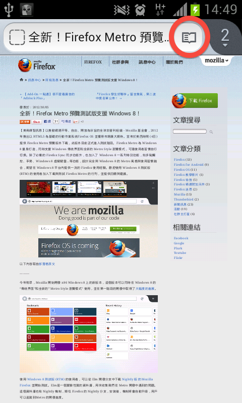
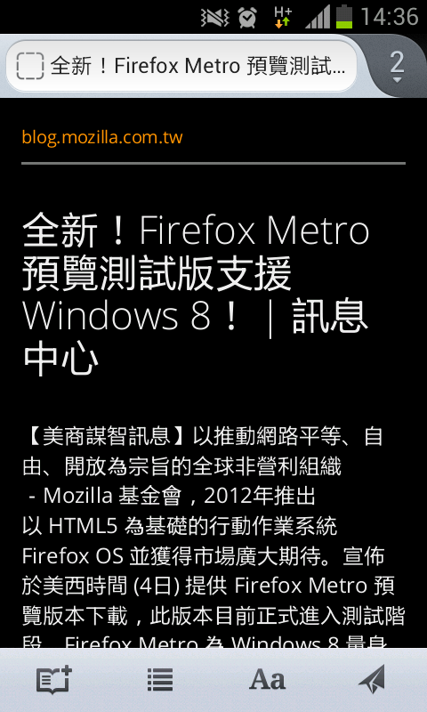
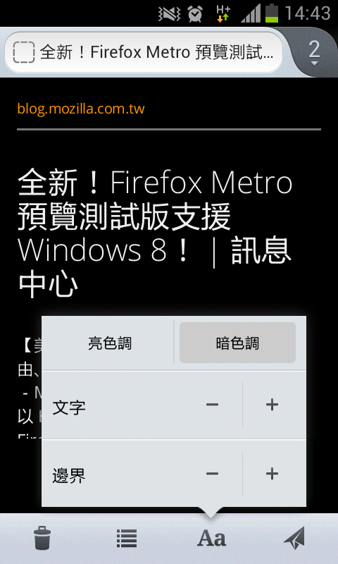
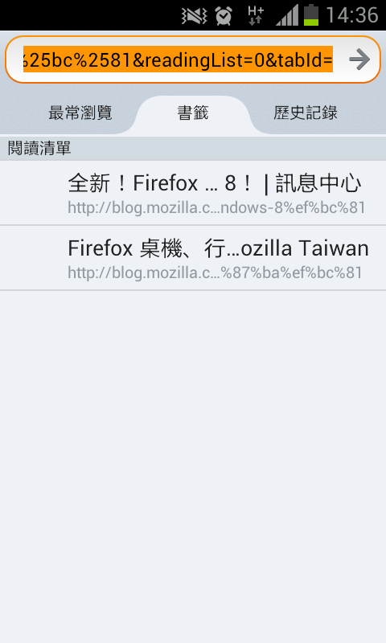
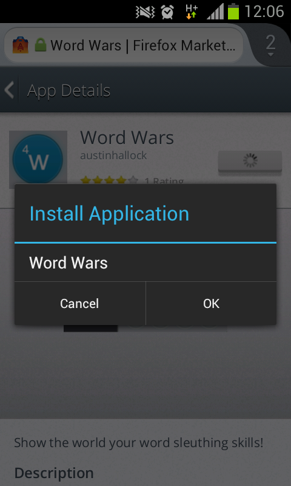
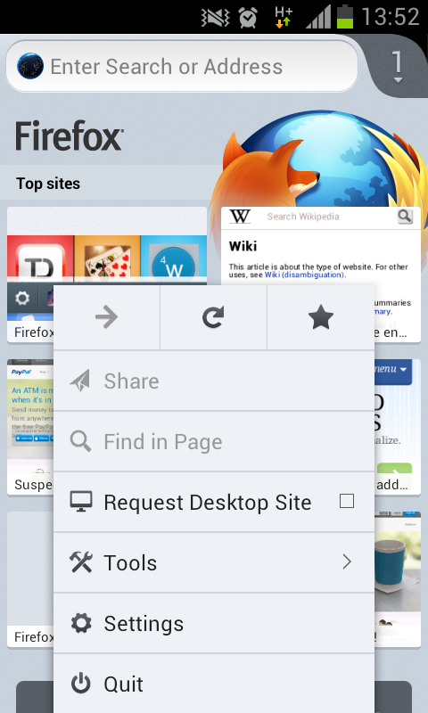

這篇來聊一下近期 [Firefox for Android](https://mozilla.com.tw/firefox/#mobile) 的改變。本篇圖多，請耐心等候 😛

為還沒有試過 Firefox for Android 的朋友大致介紹一下。在你的手機上，Firefox 也致力將良好的瀏覽體驗帶給獨一無二的你，目前的版本已經有很多與桌機 Firefox 相同的功能，例如：

- Firefox Sync ，可以同步桌機 Firefox 的分頁、書籤、瀏覽歷史、密碼等資訊

- Awesome Bar ，跟桌機一樣強而有力，結合搜尋網路、搜尋書籤與歷史等功能，讓你打字的時間大幅減少

- 附加元件 ，包括知名的 AdBlock Plus 等附加元件已經可以在 Firefox for Android 上使用，再度發揮 Firefox 自定瀏覽體驗的特色

嗯差點忘了說：如果你很追求速度，相信在 Android 上的 Firefox 也會令你滿意。當然，設備人人不同，不過確實有許多人提到 Firefox for Android 在啟動速度及瀏覽網頁速度上，都比內建瀏覽器令人滿意。你可以[上 Google Play 下載英文版](https://play.google.com/store/apps/details?id=org.mozilla.firefox)，進階使用者也可以考慮[到 Mozilla FTP 上下載中文版的 apk 檔](https://ftp.mozilla.org/pub/mozilla.org/mobile/releases/latest/android/zh-TW/)自行安裝。

賣瓜時間結束，那麼最近 Firefox for Android 又有什麼新鮮事？

### 「閱讀模式」上場

現在已經有許多網站提供「行動版」網頁，方便螢幕較小的行動裝置使用者閱讀文章。不過，萬一遇上沒有行動版網頁的網站，你就不免要經常放大縮小、東移西移了。在最新的 Firefox 裡提供「閱讀模式」，點選後就可以把網頁重新顯示為適合閱讀的版面。

在這個介面裡，你還可以調整字型大小、邊界寬度、背景顏色，不相關的東西也都消失（例如廣告…），讓你用更輕鬆的方式閱讀。

不僅如此，點選左下角的圖示後還可將此網頁儲存在閱讀清單中，即使手機網路收訊不良或甚至沒有網路的情況下，仍然可以將資訊找出來閱讀。

### Web App 支援

Web App 是 Mozilla 今年的重點之一，在經過了許多的開發、測試之後，Firefox 終於即將推出整合 App 支援的版本。初期的 Web App 將著重在行動市場上，Firefox for Android 跟 Firefox OS 都將有順暢的流程方便你執行 Web App。

現在已經有一些網路服務、遊戲等可以執行。不得不稱讚一下 Twitter 的 Web App 真的寫得不錯，畫面也很適合手機瀏覽。

目前 Firefox for Android Beta 版已經支援 Web App，點選 Android 的「選單」鈕就可以看到。有興趣也可以[在 Google Play 上下載](https://play.google.com/store/apps/details?id=org.mozilla.firefox_beta)。

### 詐騙防範

桌機版的 Firefox 很早就把防範詐騙網站的功能放進去，在遇到詐騙網站時會出現警訊以保護你的安全。現在 Android 版也即將有這個功能：

開發中的介面跟桌機版基本無異，不過最後將會以比較適合小螢幕閱讀的方式展現，持續調整中！

此功能大約會在年底時推出，想協助測試的可以下載 Aurora 版。不過 Firefox Aurora 是給開發者的搶先測試版，可能會有功能變動或不夠穩定的地方，還請斟酌一下 — 一般使用者，請至少再等六個星期吧！

### 介面調整

目前的 Nightly 每幾天就有些大大小小的介面調整，例如我們可以看到圖中選單已經跟目前大不相同，把常用的書籤、重新讀取、上一頁等項目改為按鈕，並且將附加元件等項目都收攏為「Tools」選單的一份子等等。

後續則還有包括自動更新、Mozilla 新訊、隱私瀏覽模式正在實作中！

Firefox for Android 隨著時間變得越來越好，Mobile UX 團隊的努力功不可沒。而拜與桌機版使用同一套引擎所賜、各種效能的更新也同時在行動版上發揮效果。如果你是 Android 的使用者，不妨[立即下載一試](https://play.google.com/store/apps/details?id=org.mozilla.firefox)，或許你也會愛上它唷！
