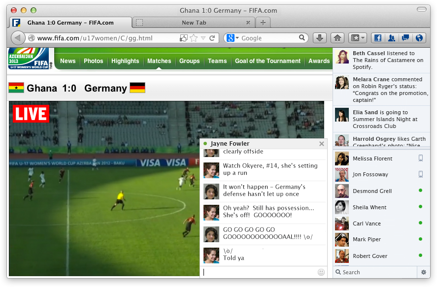
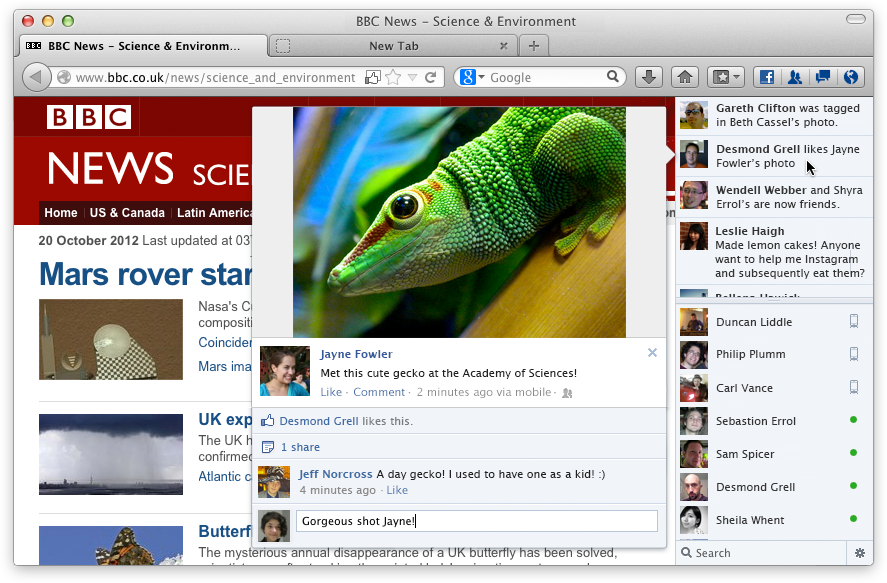

Firefox 的社交網站整合功能終於在 Beta 版中出現了，現正公測中！這幾個月來，我們努力打造 [Social API](https://developer.mozilla.org/zh-TW/docs/Social_API)，讓您可以將最愛的社交網站整合到 Firefox 中。而在這次的測試中，我們將 Facebook Messenger 整合進 Firefox 裡，非常歡迎各位協助測試這項功能，讓我們在正式推出前還可以更上層樓。

社交網站跟其他的 Web 應用程式不盡相同，並非是為了完成一項特定工作、用完就結束，而是在生活中不斷用以查閱朋友近況、與朋友聊天、分享資訊等等。當我們規劃 Firefox 中的社交整合功能時，我們的第一原則就是讓眾人能輕鬆地保持聯繫，而不只是當成「另一個開著的分頁」。過程中，我們也發現 Social API 擁有超越「社交網站」之外的無盡可能 — 除了朋友之外，我們也會想與新聞、財經、電子郵件等資訊緊密保持聯繫，這就是 Social API 的潛力所在。

我們覺得這真的很酷：一旦打開社交整合功能，就會出現一個內含社交新聞及聊天功能的側邊欄，在你四處瀏覽網頁時持續顯示、無需切換或開啟分頁。你也可以輕鬆點擊位址列上的按鈕，將閱讀中的網頁與朋友分享。社交網站還可以讓你隨時收到新通知，不必離開目前閱讀的網頁。當然，如果你想要專心點，這些功能也都可以關閉。

Mozilla 在努力打造 Social API 的同時，Facebook Messenger 團隊作為我們第一個合作的社交網站夥伴，也非常勤奮地工作。雙方團隊合作測試、除錯，也不斷激勵對方將程式推向更好的層級。Social API 設計上可以支援多個社交平台，我們也希望在 Web 上建立社交訊息互通的標準，就像當初在 OpenSearch 標準上做的努力一樣。很快，我們會加入更多社交網站，甚至一次提供多種選擇。不過，就以首次亮相來說，再沒有比 Facebook 更好的夥伴了！

如果你想幫忙測試，只要下載[最新的 Firefox Beta](https://www.mozilla.org/zh-TW/firefox/beta/)，接著像平常一樣前往 Facebook 網站。當 Facebook 要提供 Firefox 整合功能時，只要一鍵安裝即可。當然，移除也很容易，而且如果你打開始就不想裝，則什麼也不會出現。Social API 並不影響你的隱私設定，而除非你將當前的文章透過社交網站分享，否則社交網站也不會知道你現在正在看什麼；我們就是想讓你更方便地與他人保持聯繫，如此而已。

你目前看到的只是第一版，而我們知道這個東西將成為未來數年內 Firefox 的重要特色之一。記住，Mozilla 是非營利組織，而我們只為你打造 Firefox。類似 Social API 這樣的功能，就是為了讓你有更加一體、更具人性、更棒的網路體驗。請試試看我們做得如何。

原文來源: https://blog.mozilla.org/futurereleases/2012/10/22/help-us-test-the-social-api-with-facebook-messenger-for-firefox/
