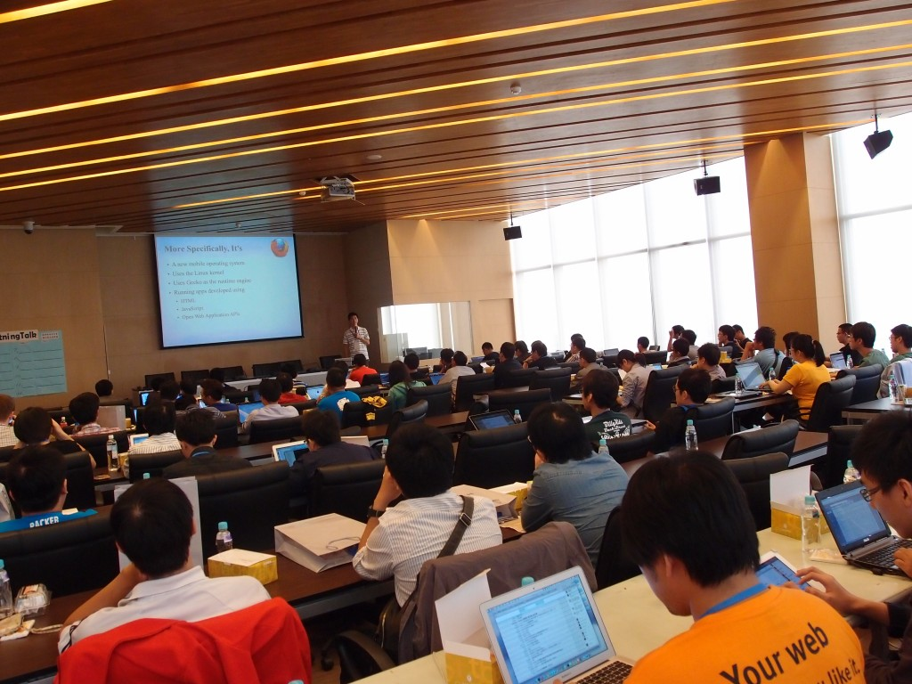
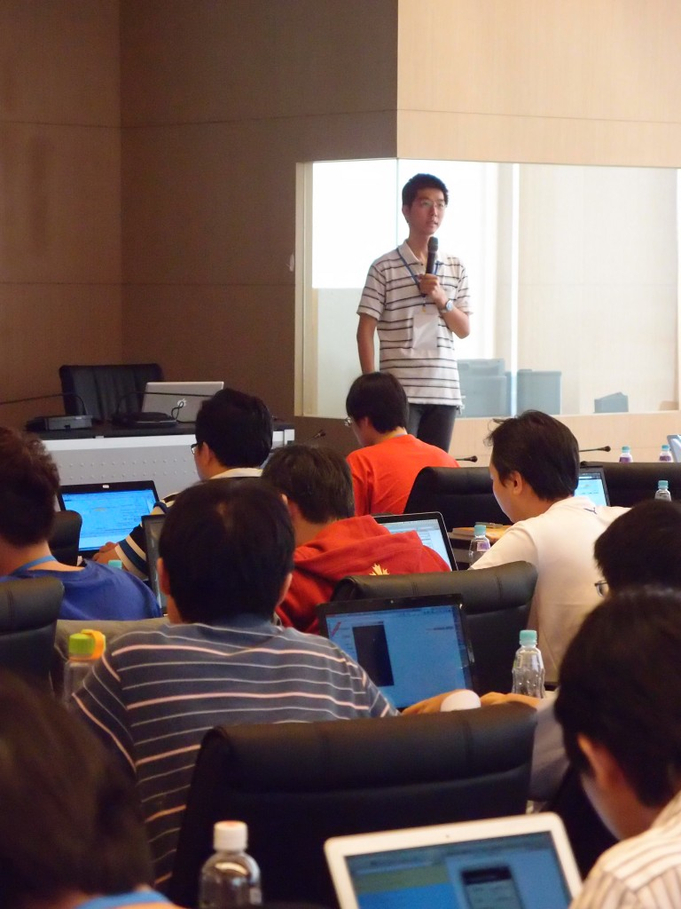
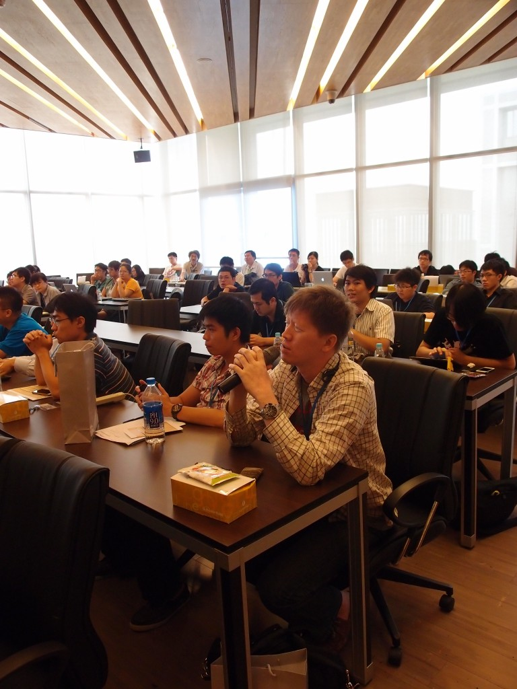
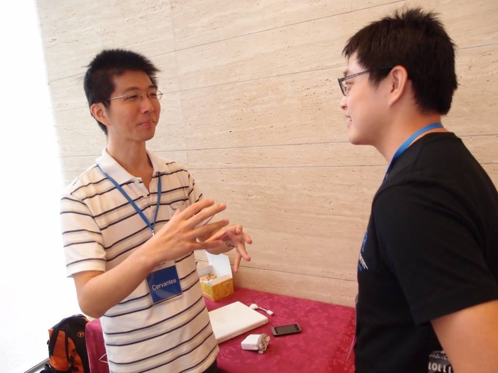
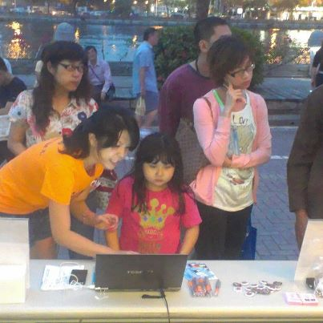
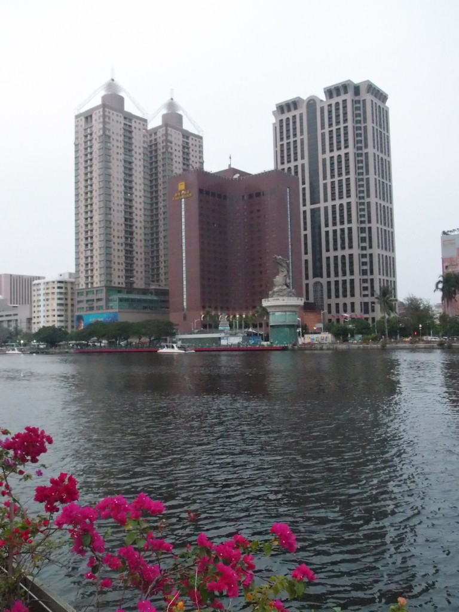

10/27 Firefox  首度前進高雄，第一站我們到了南台灣著名的百人級資訊研討會現場- MOPCON (Mobile Open Platform Conference)，由 Firefox OS 開發成員之一的工程師 Cervantes  與大家現場進行約莫 1 小時的分享交流！時間來到星期六的上午11 點，讓我們以圖文進行實況花絮報導！

話說早起的鳥兒有蟲吃，看看南台灣早起吸收新知的資訊愛好者～

有請 Firefox OS 開發工程師之一 Cervantes 主講：以 HTML 5 打造的新世代移動作業系統 – Firefox OS

QA 時間，現場發問十分踴躍～

發問熱潮延續到台下～

第二場的 Firefox 見面體驗會來到愛河旁的「黃金愛河」，愛河邊的氛圍實在很美！現場有 Firefox 桌機版以及行動版的功能搶先體驗，體驗完成就有獨家小徽章／筆或是飲料一杯的招待卷哦！

現場體驗的小妹妹，正專心聽工作人員的解說！

工作人員攤位前來一張合照！

再會了南台灣，咱們下回見～
