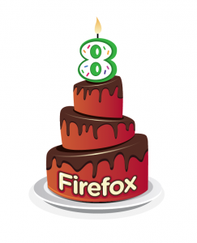

八年前，Mozilla [推出了第一版 Firefox](https://www-archive.mozilla.org/press/mozilla-2004-11-09.html)。我們相信我們可以改變些什麼，也相信瞭解 Web 威力、將「人」看得比營利還重的社群，可以創造神奇的事物。

今天是 Firefox 的八歲生日。我們可以驕傲地說，Mozilla 的使命從未改變，而 Web 則不斷進步。這些日子，數百萬人信任 Firefox，用 Firefox 享受線上的生活，也鼓勵親友一起使用。我們仍然以人為尊，而藉由 Firefox 愛好者的支持，我們也讓 Web 向著開放、互通持續前進。

去年在眾人努力之下，Firefox 越來[越快](https://blog.mozilla.com.tw/posts/872/)、[越安全](https://blog.mozilla.com.tw/posts/713/)、[越容易使用](https://blog.mozilla.com.tw/posts/585/)、[自訂起來也越發有趣](https://blog.mozilla.com.tw/posts/741/)。我們同時也以 [Firefox for Android](https://blog.mozilla.com.tw/posts/646/) 提供智慧型手機使用者一樣快速、一樣有威力的網路世界。而來年，我們還將讓 Firefox [發展到另一個境界](https://blog.mozilla.com.tw/posts/1289/social-api-beta-test)。

Firefox 是優秀的軟體，同時也是 [Mozilla 價值與願景](https://mozilla.com.tw/about/manifesto/)的展現。當前便是 Web 發展與這份願景最為貼近的情況，而為了讓它蓬勃發展，我們還有很多事情得做。謝謝你成為這份發展的助力之一。

親愛的 Firefox，生日快樂！

