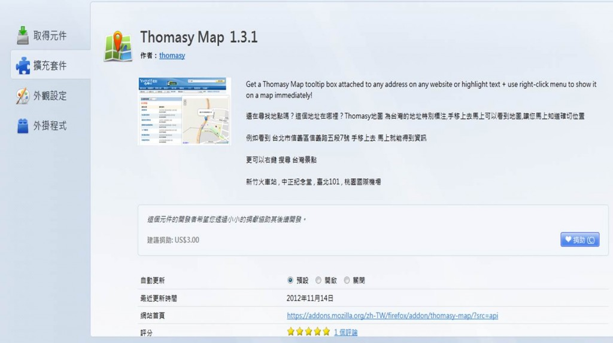
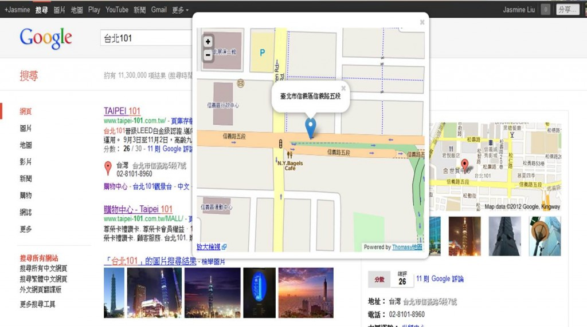
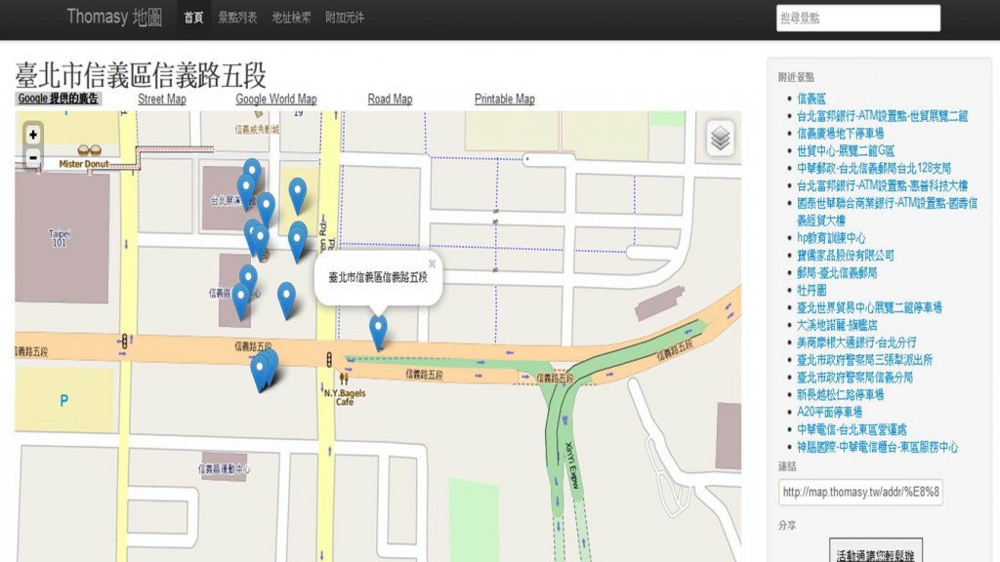

除了大家最常使用的 Google map 外，今天【Add-On 一點通】要再推薦由 Mozilla reps 台灣之光成員之一的[Thomasy](https://reps.mozilla.org/u/thomasy/)撰寫的一個方便的找路小工具：Thomasy Map，專為台灣的地址特別標注，滑鼠移上去馬上可以看到地圖顯示。有了這個小工具，凡網頁中或是文章中出現地址，透過 Thomasy Map 就會立即顯示地圖！話不多說，快跟著介紹一步步看下去！

首先，在 Firefox 瀏覽器的工具，找「附加元件」選項，搜尋「Thomasy Map」

下載後就可以馬上開始使用了！

不論是在搜尋，或是看網頁文章出現某地點，滑鼠移過去，就可以直接看到地圖，立即知道大概的地理位置。如果想找 Taipei 101 的地圖，滑鼠移到地址處，地圖立馬顯示如下：

如果想把地圖放大，點選「放大檢視」

試用心得：Thomasy Map 就精緻度來說不若 Google map 等精細，但就方便立即性來說，不失為一款可馬上顯示位置和鄰近道路的小工具，大家參考看看囉！【Add-On 一點通】咱們下回見！
