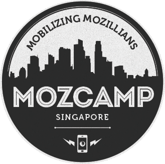

本週末（11/17-18） Mozilla 將在新加坡舉辦 [MozCamp Asia 2012](https://wiki.mozilla.org/MozCampAsia2012)。這是增進核心社群成員彼此交流經驗，同時讓跨區合作更為緊密的研討會，會中將由志工與員工發表各種議題，並共同參與研討。台灣、香港的志工也有多人受邀。

在兩天的議程裡，除了有基金會主席 Mitchell Baker 等人的基調演講外，更有[高達五軌議程，涵蓋桌機行動版、Firefox OS 及社群等主題](https://wiki.mozilla.org/MozCampAsia2012/Schedule)。按照去年的慣例，在設備允許的狀況下有部分議程會有錄影甚至直播，而當然我們也會把即時訊息傳到 Facebook 及 Google+ 上，歡迎各位夥伴緊盯這些即時頻道，了解最新訊息。

ps. 會上 IRC 的朋友，也可以考慮連到 [#mozcamp](https://mibbit.com/?channel=%23mozcamp&server=irc.mozilla.org) 來參與即時聊天喔！
