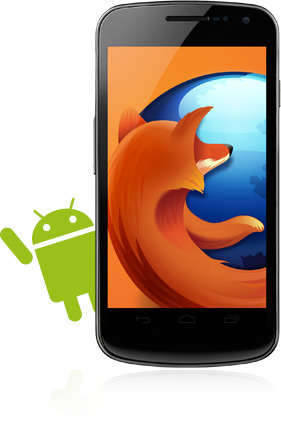

新版 Firefox for Android 即日起支援更多手機機型，包含 HTC Status、HTC ChaCha、Samsung Galaxy Ace、摩托羅拉 Fire  XT 以及 LG Optimus  Q。在此之前，Firefox  for  Android 可支援 Android  2.2 及以上版本的手機，但手機必須搭載 ARMv7 處理器。而現在，Firefox  for  Android 可支援[一系列使用 ARMv6 處理器的手機](https://blog.mozilla.org/futurereleases/2012/09/07/firefox-for-android-beta-is-expanding-support-to-new-devices-help-us-test/)。Mozilla 的使命是將 Web 盡可能帶給所有人，在 5 億 Android 手機市場中，大概有近一半是在 ARMv6 架構上操作的，因此，為了讓更多人擁抱開放 Web 世界，這次的版本可說是重要的一步。

Firefox  for  Android 也支援了一些新的[協助工具上的進階功能](https://hacks.mozilla.org/2012/10/accessibility-features-in-firefox-on-android/)，包含讓視障朋友更方便瀏覽網頁的觸摸探索（Explore by Touch）和手勢操控（Gesture Navigation）功能。觸摸探索（Explore by Touch）是 Android 平台上的一個特殊功能，開啟後，使用者只需用手指在螢幕上拖動，此功能就能透過語音、聲音和振動做回應。

- [下載 Firefox for Android](https://play.google.com/store/apps/details?id=org.mozilla.firefox&referrer=utm_source%3DMozilla%26utm_medium%3DWebBlog%26utm_campaign%3Dblogpost-mobile-downloadlink-20121811)

- [版本資訊與技術細節](https://www.mozilla.org/en-US/mobile/17.0/releasenotes/)

- 原文引用：https://blog.mozilla.org/blog/2012/11/19/firefox-for-android-now-available-for-millions-more-phones/
