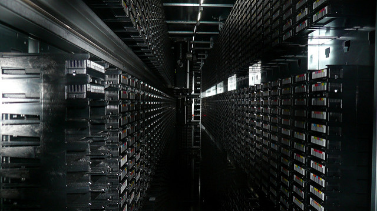

編按：[Mitchell Baker](https://zh.wikipedia.org/wiki/%E7%B1%B3%E5%88%87%E7%88%BE%C2%B7%E8%B2%9D%E5%85%8B) 是 Mozilla 基金會的主席、Mozilla 公眾授權條款 MPL 催生者、同時也是業餘的空中飛人（[真的！](https://www.flickr.com/photos/badubadu/2050953320/)。）在這篇文章裡，Mitchell 說明了目前雲端服務盛行的情形下，背後隱含的使用資料主權問題，並且提出 Mozilla 在這方面即將努力的方向。

紛繁的網際網路使用體驗已經融入越來越多的私人資料。 有時候是我們自己建立的資料，有時是朋友或熟人建立的，也有時是所用的服務替我們建立資料。從一方面來說，這種方式能刺激更多新應用程式出現；但另一方 便，在網路上暴增的私人資料也帶來些擔憂。這些資訊揭露我們是誰、又做了些什麼；而讓資料和雲端服務提供者擁有監控、記錄、存儲、使用、關聯和販賣這些資 訊的能力，對於個人乃至於社會都有重大影響。

以我個人而言，目前還沒找到比較方便的方式，讓我在分享個人資料的同 時，也能維持對於那些資料的主導權。 我在分享資料的時候，將既有的資料存放在一個規則是由他人主導的地方。 這裡所指的「他人」即「應用程式供應者」，大部分的人可能想到 Facebook 或 Google，但其實狀況之嚴重，不僅是區區兩個網站而已。 這事關當前使用者資料架構設計，牽連了整個網際網路。想想那些常見、推薦的網站，或是花去你很多時間的線上服務，以及使用個人身份登入的社交網站頁面。目 前要在這些網站上有個自己的頁面，僅存、較為方便的方式就是提供自己的個人資料，而後我們對資料的控制能力便端看程式開發者的決定。

這些爭議對於 Mozilla 來說有重大的影響。

首先，這代表在使用者資料層面上，我們該有點創新。為了在當前使用及分享資料的方式下真正幫助使用者，Mozilla 也該提供使用者一個雲端資料存放的選擇，並能讓其他服務在使用者允許下存取其個人資料。這對於 Mozlla 來說是全新的嘗試，也蘊含新的挑戰。我們必須做這件事情、也必須把事情做對。一旦我們開發出一項服務，能合適地處理使用者資料，那便能在新世代線上生活中確實保護使用者的選擇權。我們每個人對於自己的資料英如何被儲存與管理，都該有個有意義的選擇。沒有別的組織能一方面視使用者主權 甚於營利，又同時還能廣為傳播這項理念。Mozilla 在雲端的這一席，能讓我們在重要的新世代線上生活中達成我們的使命。

其次，這也意味著我們處理使用者資料的方式，必須有別於當前產業的常態。 我們的方式完全以使用者為中心，讓資料維持在你手邊，並能以你所同意的條款，將資料授與任何你要使用的程式。這種方式應該在對使用者有明顯好處的情形下才儲存資料，而不只想一古腦把資料都留下來，希望從中挖出對他人有利的價值；也應該給使用者權力，知道別人能夠獲得自己的哪些資料。 [使用者主權的原則](https://blog.lizardwrangler.com/2011/08/04/extending-our-reach-%20many-layers-of-user-sovereignty/)將影響我們如何設計這些服 務，Mozilla 的服務也必須體現 [Mozilla 宣言](https://www.mozilla.org/about/manifesto.zh-tw.html)所倡導的價值以及 Mozilla 的[各項私密資料原則](https://wiki.mozilla.org/Privacy/Roadmap_2011#Operating_Principles:) 。

我的同事 Ben Adida（身份驗證和使用資料專案主管，同時也是一位密碼學家）發表了一篇文章 ，描述[我們打造這類產品時的想法](https://blog.mozilla.com/privacy/2012/01/13/mozilla-to-offer-new-user-centric-services-in-2012/)。

[原文](https://blog.lizardwrangler.com/2012/01/13/user-sovereignty-for-%20our-data/)，本文感謝 MozillaOnline 翻譯初稿，以及數名社群成員協力補綴。[刊頭圖片以創用 CC 姓名標示-相同方式分享授權使用](https://www.flickr.com/photos/doctorow/2711081060/)。
