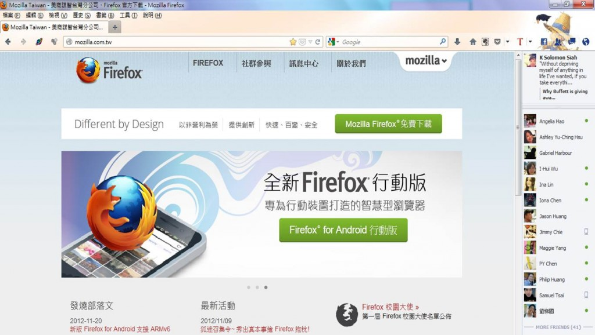
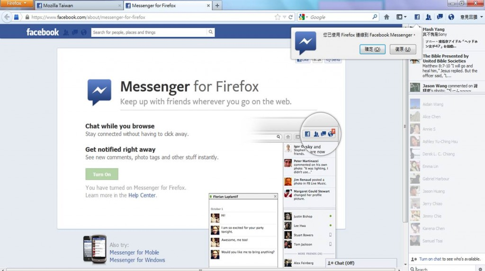

【美商謀智訊息】以推動網路平等、自由、開放為宗旨的全球非營利組織－ Mozilla 基金會，2012年推出以 HTML5  為基礎的行動作業系統 Firefox OS 並獲得市場廣大期待。今於美西時間20日釋出全新 Windows、Mac 和 Linux 版本適用的全新 Firefox 瀏覽器，首度結合 Social API 功能，並率先與 Facebook 攜手整合 Facebook Messenger for Firefox，讓瀏覽器進階成為同步提供社交聊天、新訊分享、網頁瀏覽功能的好助手。

與 Firefox 早年推出的 OpenSearch 標準相似 (編按：OpenSearch 為多家瀏覽器採用的一個專用搜尋列，提供快速搜索功能)，Mozilla 全新 [Social API](https://developer.mozilla.org/docs/Social_API) 將社群服務與 Firefox 瀏覽體驗完美整合，讓你的 Web 瀏覽更便利與個人化！全新 Social API 結合社交側邊欄 (sidebar)、工具欄通知鈕 (toolbar notification buttons) 以及即時通功能，不論使用者逛到哪一個網頁都可與社群網站上的朋友即時聊天。

透過 Social API 側邊欄 (sidebar) 的社群服務整合功能，使用者可以不需要切換頁面或開啓新視窗，而隨時隨地與家人朋友保持聯繫，取得朋友的最新狀態更新、進行即時聊天、分享瀏覽網頁於社群網站，使用瀏覽器逛網頁、看影片或是玩遊戲的同時，依然與朋友保持聯繫。

Firefox 很高興展示 Social API 在社群整合上的第一步：Facebook 即時通，歡迎搶先下載／更新最新 [Firefox](https://mozilla.com.tw/firefox/download/)版本，接著至 [Facebook Messenger for Firefox page](https://www.facebook.com/about/messenger-for-firefox) 頁面並點選「開啓」就可立即體驗！

一旦你開啓此功能，你將發現 Firefox 瀏覽器頁面右側出現 Facebook 即時通以及所有的 Facebook近態更新，包括新留言、相片標籤等，你也可立即獲得訊息通知、朋友邀請等，方便你從 Firefox工具欄立馬做回應。

今天發佈的 Social API只是 Firefox 邁向社交方向的第一步，我們很快就會釋出更多支援不同社交功能、平台等訊息。Firefox 致力提供您更多、更豐富，隨時隨地的線上社交生活體驗，歡迎您使用後提出意見。

更多相關訊息：

- [下載 Windows、Mac 或 Linux 版 Firefox](https://mozilla.com.tw/firefox/download/)

- [版本資訊與技術細節](https://www.mozilla.org/en-US/mobile/17.0/releasenotes/)
