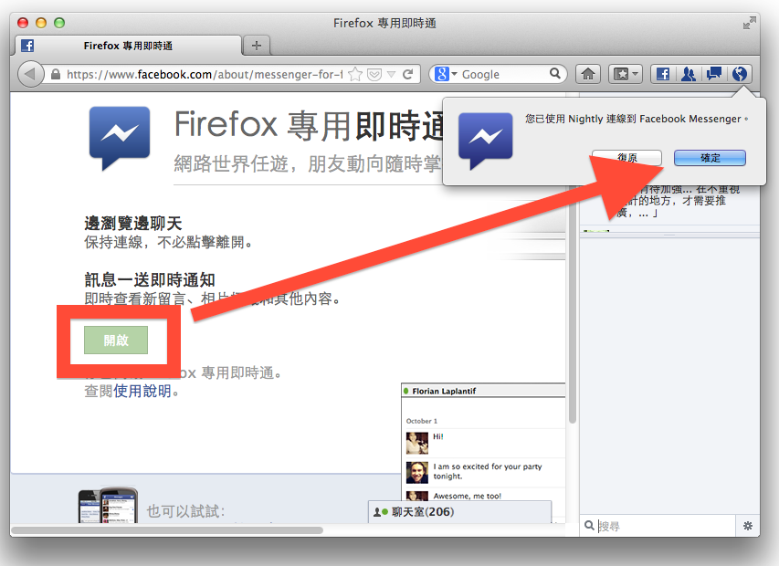

我們很高興宣布，Firefox 透過全新的 [Social API](https://developer.mozilla.org/docs/Social_API)，與 [Facebook 的 Firefox 專用即時通](https://www.facebook.com/about/messenger-for-firefox) 緊密結合，讓網路社交環境更加完善。

全球有上億使用者選擇採用 Firefox，而平常大家上社交網站與朋友聊天、得知朋友的最新消息，[花費 20% 的時間](https://www.comscoredatamine.com/2012/01/people-spent-6-7-billion-hours-on-social-networks-in-october/)在社交網站上。由於社交網站已經成為眾人網路生活不可或缺的一部分，我們希望大家能更容易、更依自我想法來使用社交網站的服務。

我們[嘗試過](https://blog.mozilla.org/futurereleases/2012/07/06/bringing-social-to-firefox/)不少新的方法，要讓社交網站進一步與您的 Web 體驗整合。而今，我們以 Facebook 的 Firefox 專用即時通作為踏進社交整合領域的第一步。要啟用這個功能，只要升級到最新版 Firefox，接著瀏覽 [Firefox 專用即時通網頁](https://www.facebook.com/about/messenger-for-firefox)，再點選「開啟」即可。

一旦啟用這個功能，您會看到一條側邊欄，無論你逛到哪個網站，都可以用它跟朋友聊天、了解他們的近況。一旦有新訊息、好友請求訊息，Firefox 的工具列上也會有所提醒。

Facebook 的 Firefox 專用即時通讓您無時無刻都能與朋友保持聯繫，而不需要開啟或切換分頁。您可以在購物網站挑禮物時跟親友聊天、在玩網頁遊戲時與隊友彼此激勵、在觀賞影片或 其他事情時與他人討論。當然，如果你不想要花那麼多時間在社交網站上，把側邊欄隱藏起來或甚至移除此功能，也是輕而易舉的事。

現在的 Firefox 專用即時通，只是我們在社交整合方面的第一步。很快我們還會提供更多功能，並整合其他社交網站。

Mozilla 作為推廣 Web 上開放、創新及機會的非營利組織，十分期待開發者以 [Social API](https://developer.mozilla.org/docs/Social_API) 創造出更多令人驚奇的酷炫 Web 體驗。我們希望打造 Web 上的社交相關標準，讓開發者有更多機會、而使用者有更多選擇，就像當初我們致力於 OpenSearch 規格一般。想像一下讓 Firefox 的側邊欄、工具列或智慧位址列的按鈕與新聞、音樂、財經、電子郵件、協作網站等事項結合，是多有趣的事！

原文來源：https://blog.mozilla.org/blog/2012/12/03/firefox-gets-social-w-facebook/
