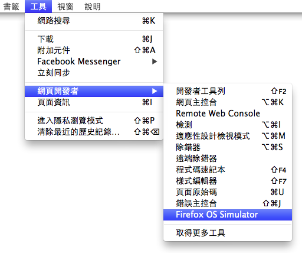
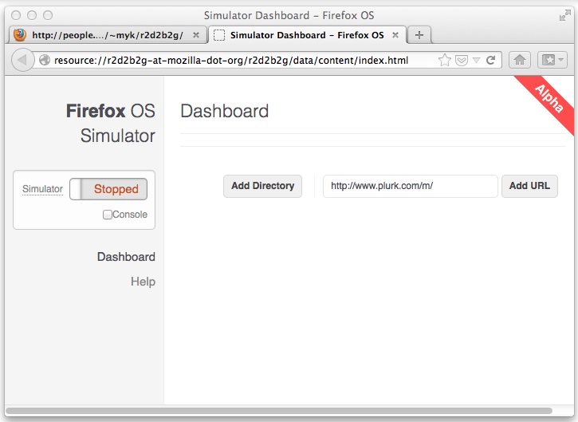
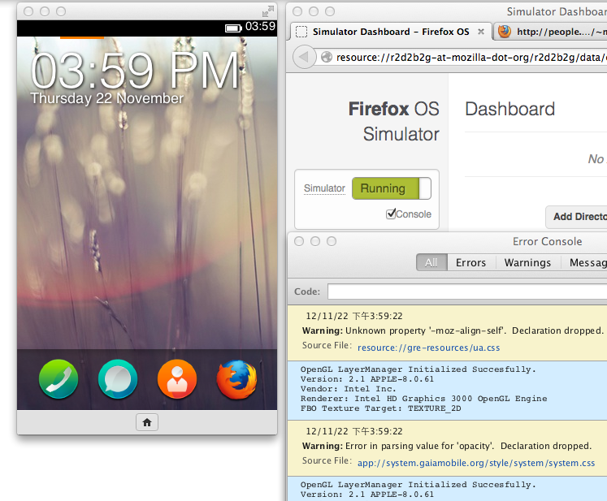

對於行動 App 開發具有濃濃興趣的你，想必已經立馬報名 Firefox OS App Days 的活動！想知道如何事先準備，偷做功課，讓自己實力加倍嗎？快參考以下 「Firefox OS Simulator」文章，本篇文章已在 2012 年 11 月 22 日發表過，讀過沒讀過的，快來溫習一下，[ 行動 App 開發密技 ] 開麥拉！

—

作為熱愛新知的開發者，你已經聽我們說了很多關於 Firefox OS 的事情，想來已經迫不及待打算動手玩，甚至寫個 WebApp 試試吧？雖然實機最快也要等到明年才會發售，但其實現在你就可以嘗嘗鮮，或開始測試自己的 WebApp 在 Firefox OS 上跑起來如何，只要安裝 Firefox OS 模擬器就可以了。

Firefox OS 模擬器是個 Firefox 的附加元件，[你可以到開發網站下載](https://people.mozilla.org/~myk/r2d2b2g/)。目前雖然只是 0.8 的版本，但拿來測試已經算蠻好用。安裝完這個巨大（數十 MB，因為把 Firefox OS 包進去了）的附加元件之後，你可以在「工具 > 網頁開發者」裡找到「Firefox OS Simulator」來啟動。

啟動之後會看到 Firefox OS Simulator 的 Dashboard，左邊的開關非常明顯 — 就是拿來開關 Firefox OS 模擬器用的 😛 右側則能讓你自己加入 WebApp，在測試 WebApp 開發時會有用（也別忘了開啟 Console 來看錯誤訊息），或者你可以直接把某個網站的網址打進去，用 Firefox OS Simulator 看看被當成 WebApp 時效果如何。

如果一切順利的話，點選開關後就會跑出另一個小視窗，裡面就是目前開發中的 Firefox OS。你可以用滑鼠模擬手指來滑動，也可以點選下方的「Home」回到第一頁。

如果你眼尖的話，應該有注意到上一段的開頭「如果一切順利的話」… 目前 Firefox OS Simulator 畢竟只是開發測試環境的原形，有時候不是非常穩定。如果發生無法啟動的狀況，重開一下 Firefox 試試看吧！

無論如何，這即使不敢說是完美的測試環境，至少也及格了，歡迎各位網頁開發者動手裝起來試試看！
