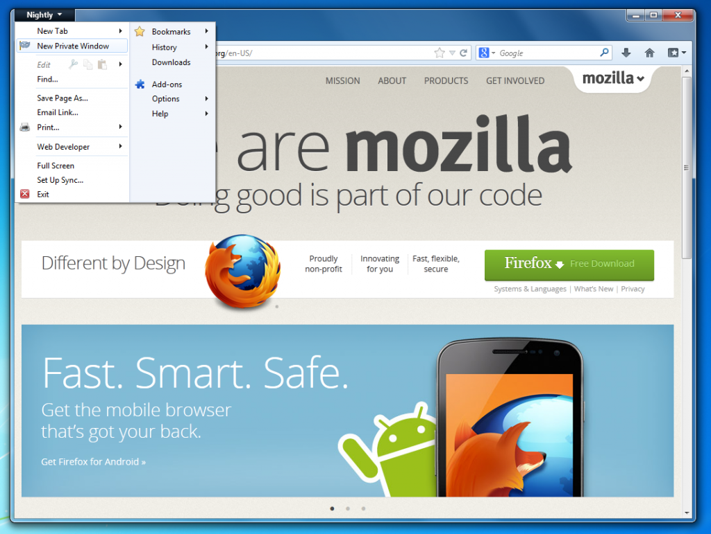
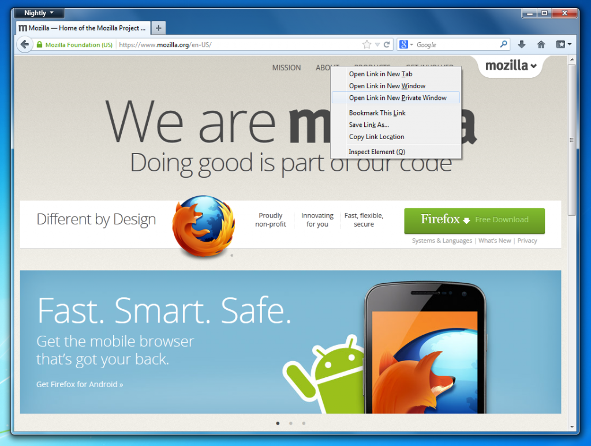

在過去，Firefox 「隱私瀏覽功能」最常被人詬病的地方在於，開啓此功能需把原來使用中的瀏覽視窗全部關閉，才能開啓「隱私瀏覽功能」。在經過 19 個月的辛勤開發，我們重新打造更優化的「隱私瀏覽功能」，讓使用者不需關閉所有視窗即可在分頁中使用。Firefox  團隊很高興在此宣佈首度測試版很快可以在 Firefox Nightly 中供您測試，歡迎[點選此處下載](https://nightly.mozilla.org/)。

首先讓我們看看以下幾張截圖：

優化後的「隱私瀏覽功能」讓你開啓此功能的同時，保有原本使用中的視窗。另外，我們特別針對使用者需求，在喜愛的連結上，加進右鍵點擊即可在隱私瀏覽模式開啓之功能，方便您使用。

為了本次「隱私瀏覽功能」的優化，我們費了非常多的心血從頭設計與打造，也從 Mozilla 社群得到非常多的幫忙，以完成如此龐大的專案。在此特別感謝所有參與者的辛苦投入，沒有你們，就不會有今天的成果。

原文連結： [https://blog.mozilla.org/futurereleases/2012/12/11/per-window-private-browsing-in-nightly/](https://blog.mozilla.org/futurereleases/2012/12/11/per-window-private-browsing-in-nightly/)
