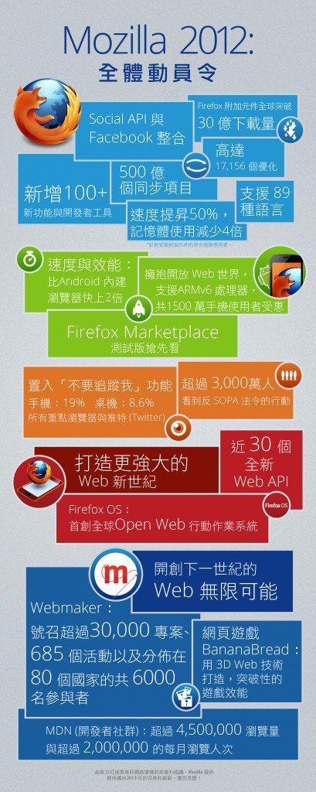

2012 年對 Mozilla 來說意義非凡，在今年，Mozilla 全體動員了！我看到 Mozilla 在可以為網路世界帶來突破性影響的地方，有了非常好的表現！在影響力發酵的同時，我們專注在創新的打造以及影響力的傳遞。2012 年是 Mozilla 值得驕傲的一年，以下特別整理了幾項本年度重點回顧。

首先，在 Firefox 桌機版上我們成功找回市場吸引力。在資源精簡使用和升級版本優化的雙重威力下，Firefox 開發團隊完成了十分了不起的突破！其中，效能顯著的[開發者工具](https://blog.mozilla.com.tw/posts/896/)、[附加元件全球突破 30 億下載量](https://blog.mozilla.com.tw/posts/741/) 、支援高達 89 種語言，以及前所未見的 [Social API 與 Facebook 整合](https://blog.mozilla.com.tw/posts/1521/)等，我們隨著 Web 的發展快速成長！使用者會發現新版的 Firefox 比過去的更好用，這樣的正面回饋從四面八方而來，不論是從官方管道，甚至路上的陌生人都有，我們甚至聽到有陌生人直接向身穿 Firefox T 恤的人給予正面肯定。

再來講到[Firefox for Android](https://blog.mozilla.com.tw/posts/646/)，我們細心傾聽每一位使用者的需求，甚至不惜從頭建造更好的使用者體驗，這樣的苦心成就了很好的成效！Firefox for Android 的效能卓越，而且我們沒有因此捨棄 Firefox 的強大核心 Gecko，實際上，我們甚至能在效能較低階的 ARMv6 機種上暢快使用。功能面的突破，不只得到使用者的肯定，在 [Google Play 商店](https://play.google.com/store/apps/details?id=org.mozilla.firefox&hl)更得到同類瀏覽器中最高等級的評價。

集眾人高度期待的 [Firefox OS](https://mozilla.com.tw/firefoxos/)，在過去一年的開發表現優異。Firefox OS 團隊與合作夥伴正在打造全球首創的 Open Web 行動作業系統，更提供近 30 個全新 Web API，期待將行動 App 打造成更強大的開放 Web App。

最後，2012 年我們提升自己在 Web 上的聲量，並以使用者主權提倡者和領導者自居，目前有超過 19% 的 Firefox for Android 愛用者以及 8% 的 Firefox 桌機版使用者開啓「不要追蹤我」功能，再再證實使用者們對網路隱私的重視。年初我們針對美國 SOPA 法案舉辦的『網路熄燈活動』，有超過 3,000萬人看到反 SOPA 法令的決心；而 [WebMaker](https://webmaker.org/en-US/)在 2012年成功號召超過 30,000 專案、685 個活動以及分佈在 80 個國家的共 6000 名參與者。

Mozilla 在 2013 年的目標十分明確，但卻不是一條輕鬆好走的路，我們需在原有的基礎上繼續發光發熱。就 Firefox 瀏覽器而言，功能面需要隨著使用者的需求，持續不斷的進步與創新，例如針對 Social API 使用上的加強，直接探索瀏覽器的所有可能。而在 2013 年 Firefox OS 將實際呈現在使用者眼前，大眾不只將會親眼看到，親手使用內建 Firefox OS 的裝置，更將發現 Web 技術的無窮魅力。對於很多使用者而言，Firefox OS 手機甚至會是他們人生中的第一台智慧型手機。在此，我們急需要你／妳的一同參與，來完成如此龐大的任務，我們需要集合眾人的力量，包括開發者、工程師、學生、[設計師](https://hacks.mozilla.org/2012/12/ten-things-developers-should-know-about-the-mozilla-developer-network-mdn/)、企業夥伴… 等，透過訊息的傳遞，讓更多人知道我們在 Web 上做的種種努力並以此為基礎出發的理由，一個最迷人、開放、透明、威力強大的Web技術。

Johnathan Nightingale

Firefox 工程副總裁

參考原文：https://blog.mozilla.org/blog/2012/12/14/mozilla-in-2012/
