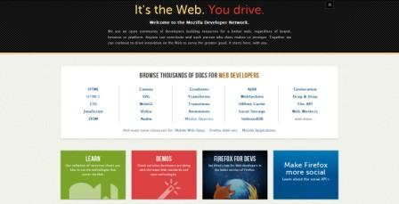

Mozilla 開發者社群網站 (Mozilla Developer Network，簡稱 MDN) 是 Web 世界中最受開發者喜愛與推崇的網站。為開發者而生，由開發者親手打造的 MDN，認同 Mozilla 理念，為網路環境的開放與創新持續努力。

MDN 作為一個開放、社群取向的 wiki，致力於向 Web 開發者、程式設計師、應用開發者、擴充套件以及佈景主題開發人員，提供最多元化的資料、教學指導和開發者工具。任何人都可以新增和編輯內容，幫助 MDN 更加完整。而 MDN 上所有的資源，不分品牌、瀏覽器或平台，皆有一個共同的出發點：打造更好的 Web！

我們特別整理 10 項開發者必知事項，幫助開發者快速瞭解 MDN，立馬上手！

- MDN 是目前數一數二熱門的開發者社群網站，每月有超過 200萬訪客量，450 萬的網頁瀏覽量。

- 提供開發者最豐富完整的資源，包括 49,748 篇文件，並且在持續增加中；9,185 名志工，截至目前完成了 272,134 次編輯。

- 想與 MDN 上活躍的開發者交流，你可在 [IRC頻道](https://wiki.mozilla.org/IRC)上的 #mdn-dev、#devmo、 #mdn 找到。

- MDN 是唯一具備 15 種在地化語言的開發者社群網站。多達 15 種語言的 HTML 文件，13 種語言的 CSS 文件，以及 11 種語言的 JavaScript 文件。所有翻譯皆由全球志工，根據在地需求和喜好度來完成。點擊[這裡](https://developer.mozilla.org/docs/Project:Localization_Projects)來看看還有哪些語系需要幫助。

未完待續

原文參考：[https://hacks.mozilla.org/2012/12/ten-things-developers-should-know-about-the-mozilla-developer-network-mdn/](https://hacks.mozilla.org/2012/12/ten-things-developers-should-know-about-the-mozilla-developer-network-mdn/)
