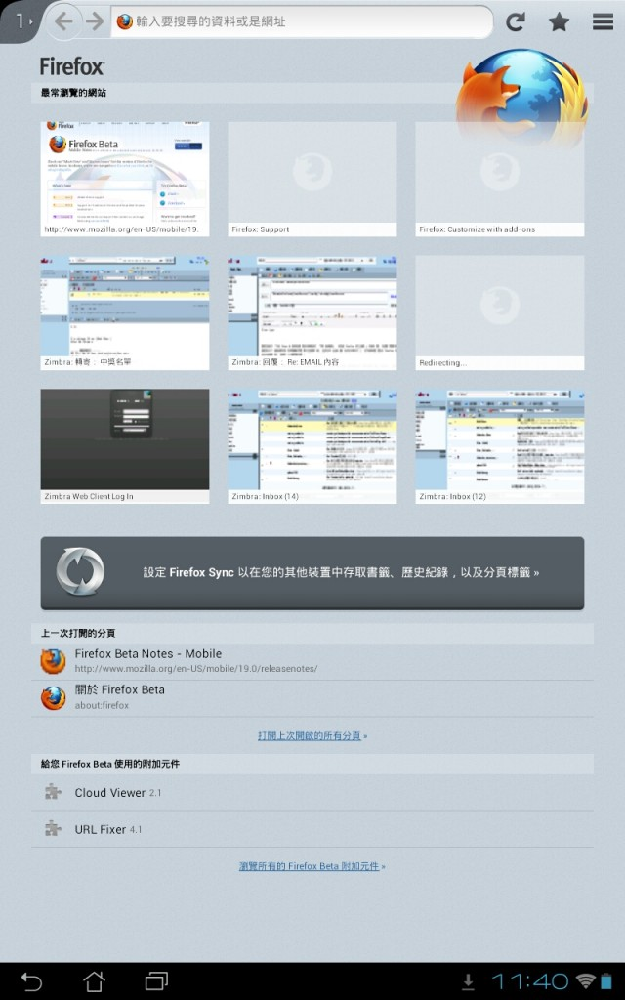

Mozilla 在美西時間 10 日釋出全新 Firefox for Android Beta 版供[下載與測試](https://bit.ly/ApGMUh)。 此次更新擴大支援約 1500萬支的 ARMv6 處理器手機，手機只需具備最基本的 600MHz、512MB 和 HVGA 配備規格即可使用，包括 LG 的 Optimus One、T-Mobile 的 myTouch 3G slide、HTC 的野火機 (Wildfire S)以及中興的 R750等多款手機。

新版 Firefox for Android Beta 支援易於使用的個性面板附加元件，使用者可以輕鬆改變瀏覽器的介面，卻不會影響原本的上網瀏覽體驗。直接利用 Android 手機造訪 [addons.mozilla.org](https://addons.mozilla.org/)，點選「個性面板」選項，選擇喜歡的主題並按下「儲存」。透過以上簡單的動作，不論新舊個性面板都會自動儲存，使用者可於任何時刻隨時切換並個人化你的 Firefox 行動瀏覽器。

同時，新版 Firefox for Android Beta 與 Google 搜尋小工具整合，讓使用者可直接在手機桌面上的 Firefox for Android Beta 小工具中打開 Google 搜尋，更快且方便的使用。欲開啓此功能，您可到 Android 手機的 Menu 上按「小工具」，選取 Firefox 選項的小工具再拉至桌面即可使用。

Firefox for Android Beta 今起將支援繁體中文、簡體中文用戶，將絕佳 Web 體驗拓展給更多更廣的用戶。

更多資訊：

- 下載 [Firefox for Android Beta](https://play.google.com/store/apps/details?id=org.mozilla.firefox_beta&referrer=utm_source%3DFuture%2520of%2520Firefox%26utm_campaign%3Dbeta-blog-fx18-20121127)

- Firefox for Android Beta 版本資訊與技術細節

