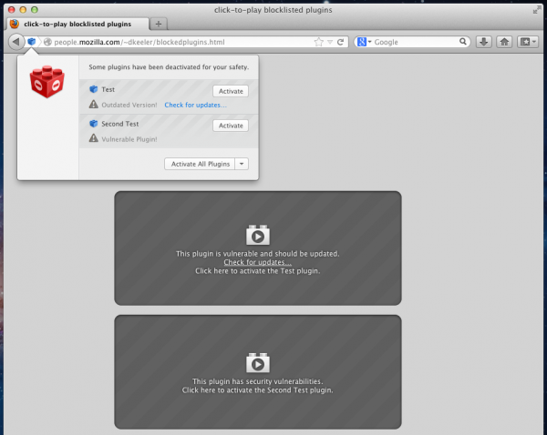

針對 Oracle 日前對安全性漏洞所發佈的更新，您可以點擊[這裡](https://www.oracle.com/technetwork/topics/security/alert-cve-2013-0422-1896849.html)瞭解更多，以及點選[下載更新](https://www.oracle.com/technetwork/java/javase/downloads/index.html)。

起因

Mozilla 發現目前 Java 版本（Java 7 升級到 10）中存有安全性漏洞，此漏洞會影響使用者在瀏覽器中使用 Java 外掛程式。此外，已安裝 Java 外掛程式在瀏覽器中的 Firefox 使用者也可能受到影響。想知道自己安裝了哪些外掛程式，請點擊[這裡](https://www.mozilla.org/plugincheck/#list-plugins)。

影響

此安全性漏洞非常容易讓駭客有機可乘。駭客可利用這個漏洞在使用者的電腦上執行惡意軟體，進而攻擊並危害使用者個資安全，此惡意攻擊代碼已經出現在攻擊軟體套件 (exploit kits) 中。

現況

為保護 Firefox 使用者，我們在 Java 版本（Java 7u9, 7u10, 6u37, 6u38）中啟動了“ [Click To Play](https://blog.mozilla.org/security/2012/10/11/click-to-play-plugins-blocklist-style/) ”（點擊播放）功能。若您使用的是舊版 Java 版本則已受到保護，惡意程式會被現有外掛程式攔截或受到“點擊播放”的防護。

“點擊播放”功能讓 Java 外掛程式，在沒有獲得使用者明確的點擊和允許前，不會進行下載和啟動。此防護功能可以有效阻止自動執行程式所帶來的風險。若您非常需要在某網站使用 Java 外掛程式，“點擊播放”同時允許使用者在該網站啟動 Java 外掛程式。

其他資訊：

建議您把 Java 版本更新至最新版本：[檢查您的外掛程式](https://www.mozilla.org/zh-TW/plugincheck/)

了解如何[關閉 Java 外掛程式](https://support.mozilla.org/zh-TW/kb/How%20to%20turn%20off%20Java%20applets?esab=a&s=Java&r=0&as=s)

原文：https://blog.mozilla.org/security/2013/01/11/protecting-users-against-java-vulnerability/
