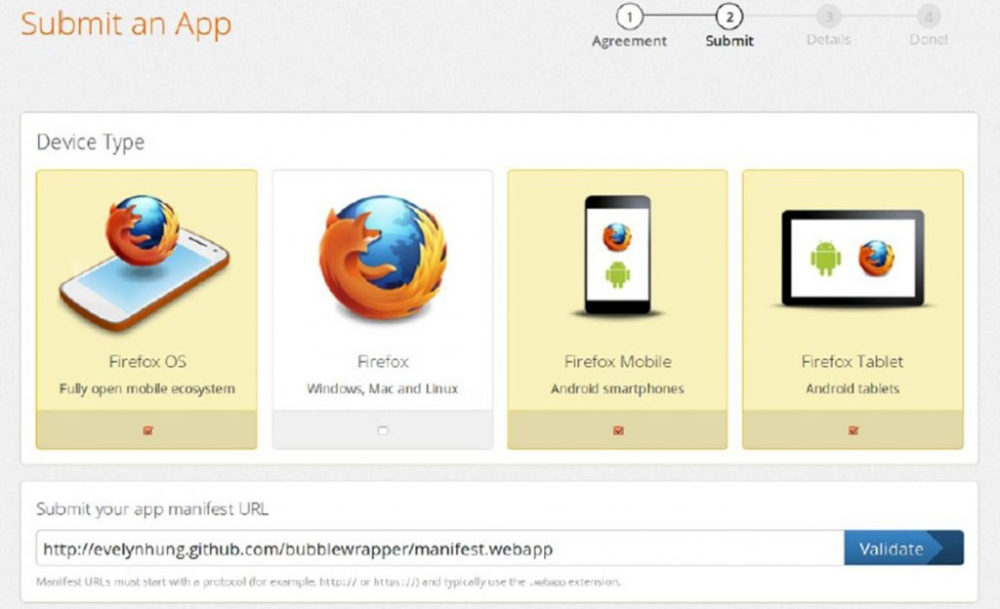
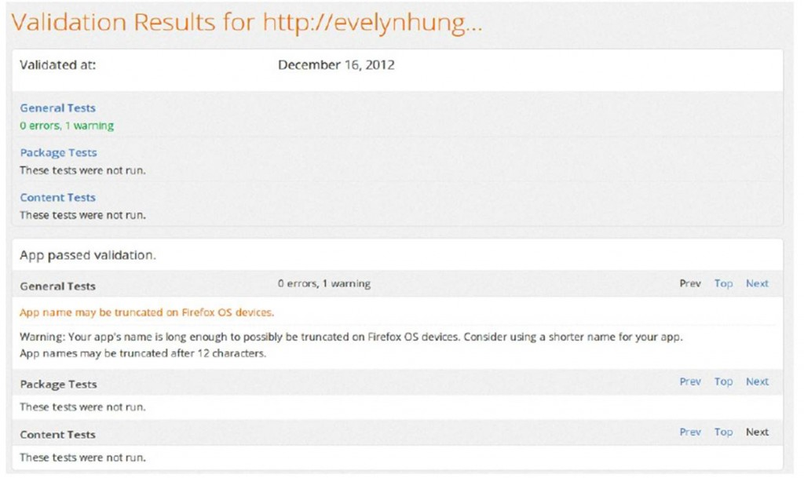
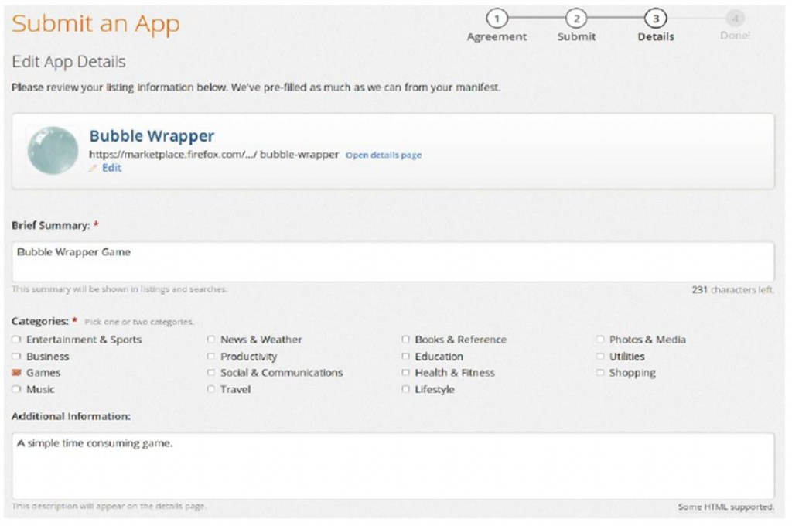
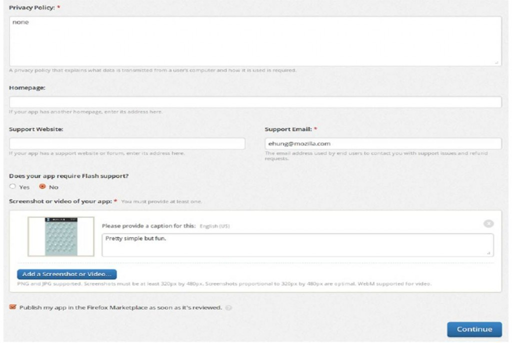
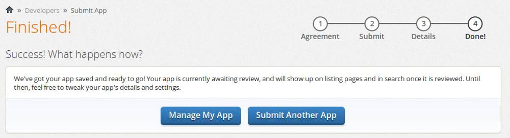

參考資料：[https://marketplace.firefox.com/developers/docs/mkt_hosting](https://marketplace.firefox.com/developers/docs/mkt_hosting)

Firefox App 分為兩大種類：

- Hosting App (目前 marketplace 上提供這個方式)

所有網頁內容存放在開發者所屬的 web 平台上執行，App 使用者需要在有網路連線的情況下才能開啓 App。可搭配 HTML5 的 appcache 技術達到離線瀏覽。

- Packaged App (new: 近日已經支援，但詳細內容之後再更新)

若 App 使用到特殊的 API 則需要 App 商店認可 (sign)，packaged app 讓開發者能夠提出完整的 App zip 檔以供審核。審核通過的 App 能讓使用者直接完整安裝在手機中執行。Packaged App 依照 API 授權級別還細分為三類：

- privileged app：明確描述欲使用的 API 列表，並需要使用者許可，在商店審核通過後上架。

- certified app：系統重要功能的 App，涉及裝置功能，通常是系統預設無需使用者安裝或許可的 app。

- plain packaged app：普通 App，不涉及特殊 API 使用，只是單純打包成 zip 檔發佈。

針對 hosting App 發佈，以下詳細描述發佈過程：

發佈前的準備工作：

- App 程式碼與相關檔案(HTML、CSS、JavaScript、圖片…)上傳至公開平台，並確保其能夠執行。

- 撰寫 manifest 檔案，也上傳至同一個平台。注意：必須放置在同來源(網域)(same origin)的平台上。

manifest 檔案內容：(參考資料：[https://marketplace.firefox.com/developers/docs/manifests](https://marketplace.firefox.com/developers/docs/manifests))

* 注意事項：

a) manifest 裡所描述的 URL 皆須與 manifest 檔案位於同來源網域

b) manifest 裡所描述的 URL 皆是以該網域為 root 的絕對路徑

c) manifest 必須能以 http 或 https 方式公開存取，且 http/https 的請求回覆中 header 須帶有 Content-Type: application/x-web-app-manifest+json

d) manifest 的圖像 (icon) 欄位至少須有128 x 128 的圖像描述

* 其他 manifest 欄位內容可參考上述連結填寫。

* manifest 驗證測試：[https://marketplace.firefox.com/developers/validator](https://marketplace.firefox.com/developers/validator)

發佈 App 至 marketplace：

1. 造訪 marketplace 頁面：[https://marketplace.firefox.com/developers/submit/app](https://marketplace.firefox.com/developers/submit/app) 登入後可以開始發佈 App。

2. 勾選 App 可以正常執行的裝置種類(device type)，填寫 manifest 檔案的位置(URL)，點選驗證(validate)

manifest 檔案格式與描述若無錯誤可以進入下一步，反之會有對應的錯誤訊息。

3. 填寫 App 的詳細描述，包含：簡介、類別、隱私權描述、App 維護者 email、App 畫面截圖(至

少一張 320 * 640 以上大小)

4. 送出之後即完成。在等待審核的期間，還是有管理頁面能夠進入修改。

審核標準：[https://developer.mozilla.org/en-US/docs/Apps/Marketplace_review_criteria](https://developer.mozilla.org/en-US/docs/Apps/Marketplace_review_criteria)

本文章由 Firefox OS 開發工程師 Evelyn Hung 撰寫
