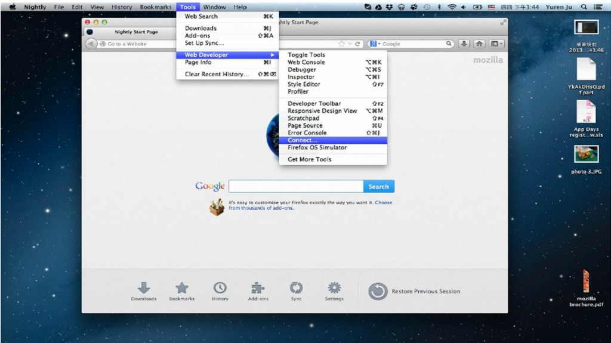
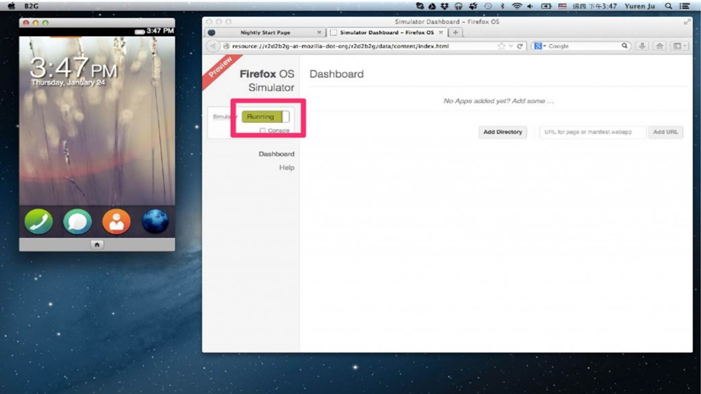
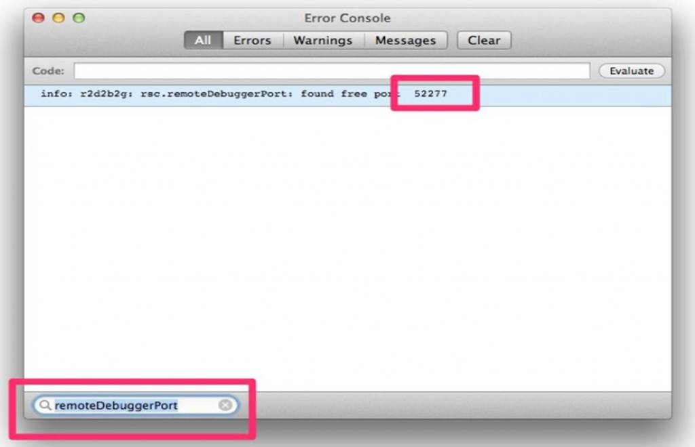
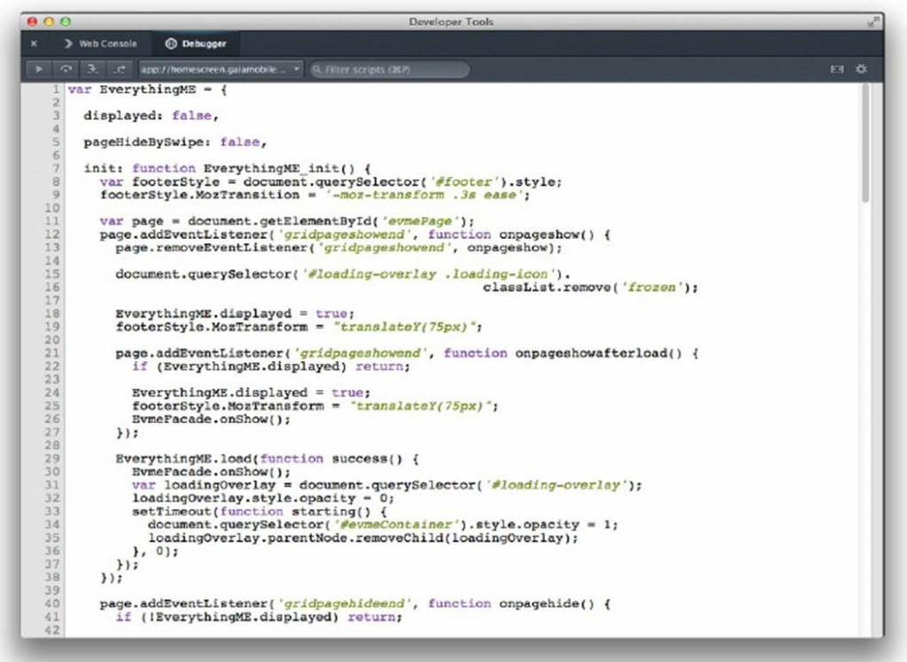

這幾天試了一下最近更新的 Firefox OS Simulator，發現現在的 Simulator 更新了，如果需要在上面使用 Remote debugger 還需要一番工夫，在這邊跟大家說明一下。

如果你正在用 Remote debugger on Simulator 會發現原本慣用的 port 6000 就算打開了 remote debugger 選項也不會動了，主要的原因是因為為了避免跟其他系統開的 port 衝突的關係，目前 remote debugger 的 port 改成隨機的了。還好我們可以在 error console 裡面看到這個資訊。

不過在這邊順便說明一下要怎麼啟用 remote debugger。

1. 首先你要下載以及安裝 Firefox Nightly。

2. 接下來在你的 nightly 裡面安裝 Firefox OS Simulator

接下來進入 nightly 在網址列鍵入 about:config，並且搜尋 devtools.debugger.remote-enabled，把這個數值設成 true 並且重新啓動 nightly，做完這步後你的 Tools -> Web Developer 就會出現 Connect… 的選項。

這個時候我們先不急著打開 remote debugger，先按 Tools -> Web Developer -> Firefox OS Simulator，並且把旁邊的 switch 撥到 running…

啓動之後，此時 remote debugger 也會隨著 simulator 跟著啟動了，現在我們需要得知 remote debugger 的 port number。這個時候請到 Tools -> Web Developer -> Error Console，並且在左下角的 Filter 裡面輸入 remoteDebuggerPort，這個時候就會過濾出 remote debugger port。

這個時候到 Tools -> Web Developer -> Connect… 當中，保持 Host 為 localhost，並且把剛剛得知的 port 鍵入，選擇 shell.xul 你就可以開始使用 Remote Debugger 囉！有兩個分頁，第一個是 Web Console，第二個是 Javascript debugger：

Enjoy!

本文章由 Firefox OS 開發工程師 Yuren Ju 撰寫
