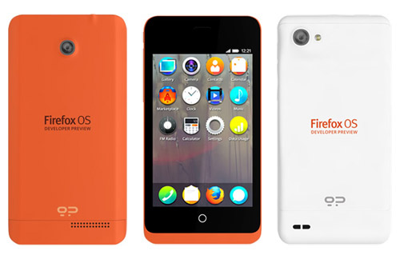
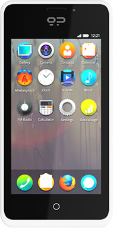

基於網路開放標準的全新 Open Web 作業系統[Firefox OS](https://mozilla.com.tw/firefoxos/)，讓使用者利用 [HTML5](https://developer.mozilla.org/en-US/docs/HTML/HTML5) 技術就可以實現「手機功能」，例如來電震動、打電話或是發簡訊…。

本周 Mozilla 發佈全新的 Firefox OS 開發者預覽版手機，我們相信開發者會將傳統網路的強大力量帶入行動市場。這批開發者預覽版手機由 Mozilla、西班牙電信 (Telefónica ) 以及[Geeksphone](https://www.geeksphone.com/)合作，由Geeksphone 開發，預計 2 月正式上市。

兩款開發機名為 Keon 和 Peak，以下為其型號和規格介紹：

Keon：

CPU Qualcomm Snapdragon S1 1Ghz

UMTS 2100/1900/900 (3G HSPA)

GSM 850/900/1800/1900 (2G EDGE)

Screen 3.5″ HVGA Multitouch

3 MP Camera

4GB ROM, 512 MB RAM

MicroSD, Wifi N, Light and proxmity Sensor, G-Sensor, GPS, MicroUSB

1580 mAh battery

Over the air updates

Unlocked, add your own SIM card

Peak：

CPU Qualcomm Snapdragon S4 1.2Ghz x2.

UMTS 2100/1900/900 (3G HSPA).

GSM 850/900/1800/1900 (2G EDGE).

Screen 4.3″ qHD IPS Multitouch.

Camera 8 MP (back) + 2 MP (front).

4 GB (ROM) and 512 (RAM).

MicroSD, Wifi N, Light and proxmity Sensor, G-Sensor, GPS, MicroUSB, Flash (camera).

Battery 1800 mAh.

Mozilla 的使命是讓 Web 和所有人緊緊相連，而開發者在 Web 的發展上具關鍵性地位，Mozilla 相信開發機的釋出可讓使用者在未來獲得更好的行動 Web 體驗，全球有數不清的用戶在網路上使用 Firefox 瀏覽器，而其開放標準和開放技術更是有目共睹，如果沒有各位 Web 開發者的努力，Firefox 不會有今天。現在，讓我們再一次把網路世界的強大力量，透過 Firefox OS 帶入行動市場，我們邀請廣大 Web 開發者加入我們，與 Mozilla 的開放標準和開放社群一同努力。

搶先體驗 Firefox OS

如果您是一位對 Web 技術、行動市場有興趣的開發者，現在您可試試 Firefox OS。使用後您會發現，您用 HTML 為基礎做成的 app，在所有平台上運用是多麼的方便容易，同時，使用相同 Web 技術就可做到手機震動提示、相機拍照等等功能。別懷疑，動手試試把自己的網站做成一個 Web App 吧。

您可以順手打造一款可在 [Firefox OS 上使用的 App](https://developer.mozilla.org/en-US/docs/Apps/Getting_Started)，您只需對原有網站進行些許微調。下面列出了幾種方法：

- 在 Android 手機安裝[Marketplace for Android](https://hacks.mozilla.org/2012/10/firefox-marketplace-aurora/)（凡使用 Android 系統的人都可嘗試，和安裝一般應用程式一樣簡單）

- 使用 Firefox 瀏覽器上的 [Firefox OS 模擬器](https://blog.mozilla.com.tw/posts/1537/)，在桌機上來使用和測試自己的 Web app。

- 在自己的硬體設備上[安裝 Firefox OS](https://developer.mozilla.org/docs/Mozilla/Firefox_OS/Building_and_installing_Firefox_OS)。

- [購買一台 Firefox OS 開發者預覽版手機](https://www.geeksphone.com/)！這是由 Mozilla、Geeksphone 和西班牙電信 (Telefónica ) 聯手打造，專門針對開發者使用的開發機，第一批將於 2 月推出。

為什麼要為 Firefox OS 開發 App?

- 網路保持開放。支持開放網路精神，確保網路 (Web) 甚至行動平台上也能夠為每一個人所用。

- 簡潔。基於單一技術棧（HTML5/CSS/JavaScript/新的 [WebAPIs](https://wiki.mozilla.org/WebAPI)）進行開發，同時可以跨越不同平台和設備使用。

- 自由。開發者不會被侷限在特定廠商所控制的生態系統中。你可以透過 Firefox Marketplace、個人網站或是其他同樣用 Mozilla 開放技術打造的 App 商店，發佈自己的應用。

更多問題，請見[Firefox OS FAQ](https://blog.mozilla.com.tw/posts/1300)。

加入我們一起“前進”行動市場！
