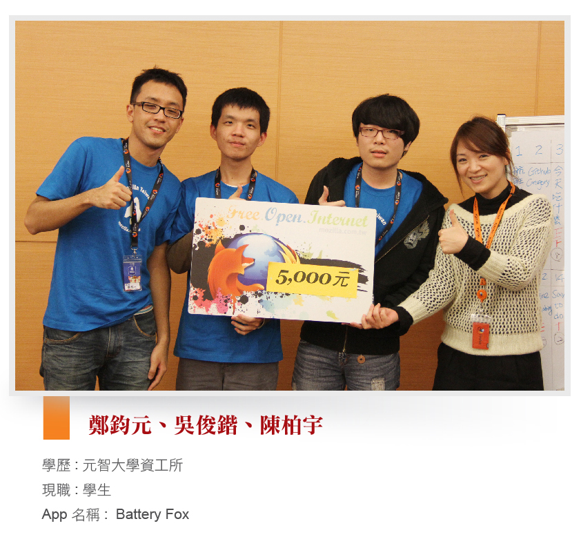
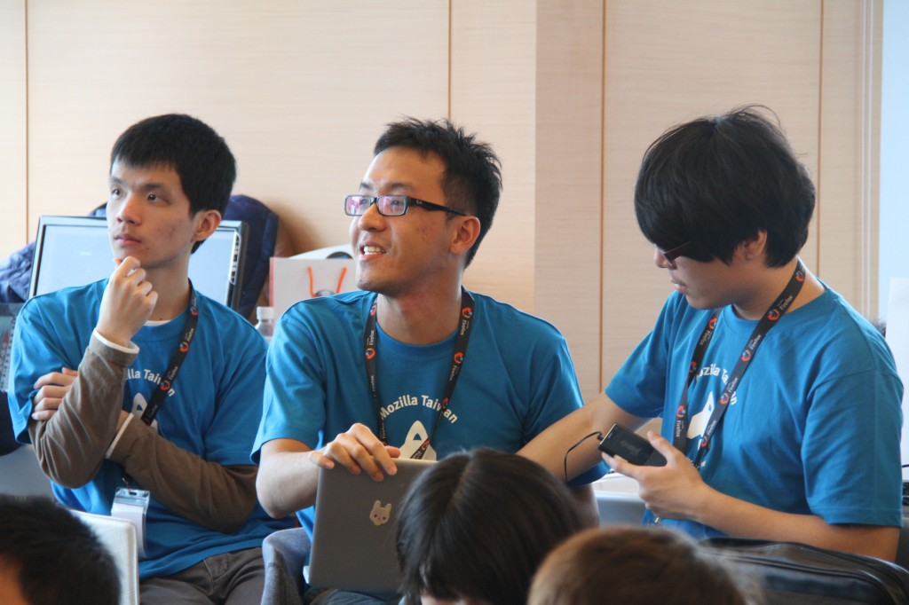
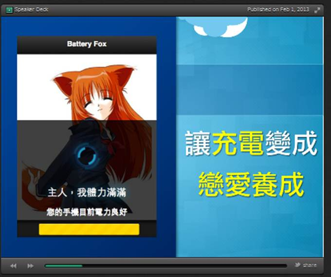

Q: App 構想來由

在賽前研究 MozillaWiki 上 WebAPI 的 Battery Status API，原本想說做個電源管理工具，但似乎又顯得太過枯燥乏味，如果能夠將充電的過程做成一個遊戲，讓這簡單的動作成為有趣的體驗…於是 Battery Fox 的最初構想出現了，一個透過充電進行育成的戀愛養成遊戲！

Q: App 使用到的技術

最主要是 Battery API；後來加入了成就系統，透過充電即可完成不同的成就，於通知列閃出，這部分使用了 Notification API；介面則使用 jQuery Mobile，以及在不同電量時，發出音效用到的 HTML5 audio。

Q: 參加 Firefox OS App Days 的原因與心得

新奇，Firefox OS App 最吸引我的就是不用再學習新語言，而是熟悉的 Web 開發。參加這次活動讓我見識到了台灣 App 開發者的創意以及技術，尤其能在這麼短時間內，做出完成度極高又富有創意的 App。

而這也考驗了團隊開發時的工作分配，畢竟要在短時間內開發完成，妥善的分配非常重要，我們用了 GitHub 做版本控制，這讓程式開發速度變得更容易掌控。

