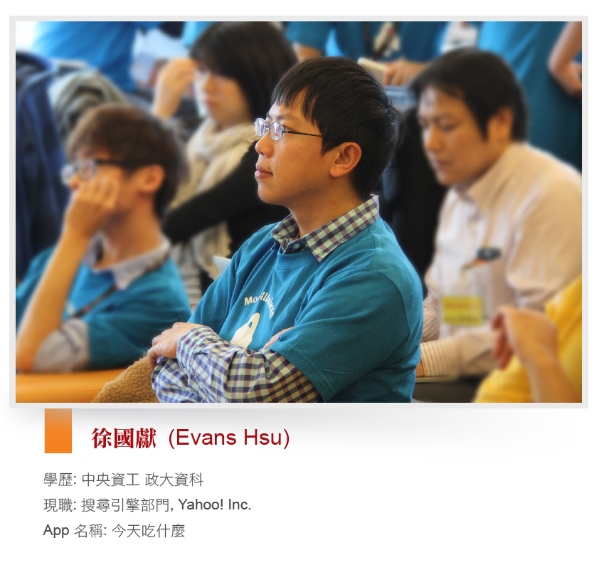
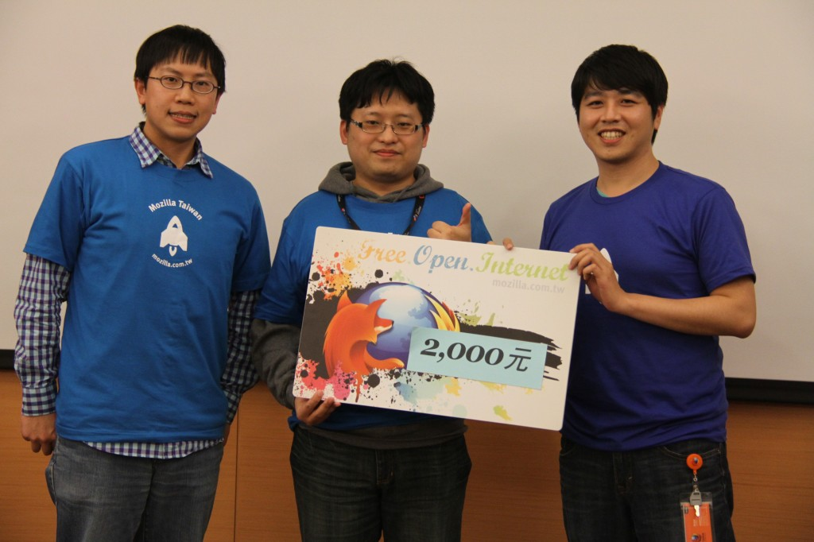

Q: App 構想來由

平常生活中，常常會遇到很多問題，這些問題常常都是靈感的來源。

這一次的 App 的構想，是來自於平常中午跟同事去吃午餐，每次大家都很難決定要吃哪一間餐廳，所以就做了一個 App 希望可以幫我們做決定。平常晚上吃飯的時候，或者週末跟朋友聚餐的時候，似乎也會有一樣的問題，於是就有了這個 App，希望可以幫助大家快速的做決定，找到不錯的餐廳。

Q: App 使用到的技術

前端主要使用到的技術是：Geolocation API

後端使用到的是：Google App Engine 平台，以及事前分析好的資料，目前只用很簡單的方式去找出熱門的餐廳，等使用者比較多之後，可以藉由使用者的使用情形，去做個人化 (分析消費習慣、飲食喜好、生活圈…等資訊)，使得推薦更為準確。

Q: 參加 Firefox OS App Days 的原因與心得

平常就很喜歡參加類似的活動，不但可以學習新的知識，還可以認識很多厲害的高手！雖然之前在類似的活動中也有得到第一名，但是那次是組隊的，而且隊友都很強。這次一個人來參加，原本只是想要來了解 Firefox OS 是怎樣的一個技術及架構，沒想到還可以幸運的得獎，真的很興奮！回公司之後，也舉辦了一場小小的 sharing，讓其他同事也可以一窺 Firefox OS 神祕有趣的地方。

