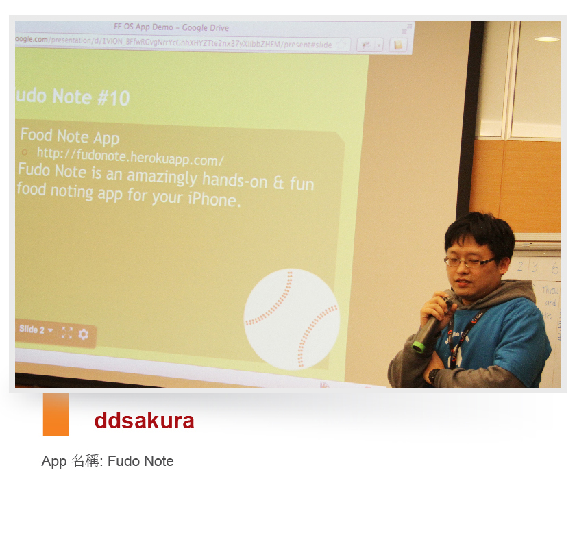

Q: App 構想來由

Fudo Note 原本是我之前個人的 iPhone side project，這是一個讓個人記錄食記的 app，一直以來很想將 Fudo Note 這個 idea 轉成 Web App，這個這次剛好有機會趁著 Firefox OS Apps Day 將這個構想付諸實行，也藉此機會看看 Firefox OS App 要如何製作。

Q: App 使用到的技術

用 Firefox 的 location api 與 web activity 去取得相簿相片，此外亦使用 Yahoo Mojito Framework、Bottle UI Library、 Facebook Graph API。

Q: 參加 Firefox OS App Days 的原因與心得

想知道 Firefox OS 上怎麼開發 App 並認識同好朋友，Hack 得不得名倒是其次。活動基本上還不錯，也練習到怎麼開發 Firefox OS App，不過沒有看到實機展示有點可惜，此外，介紹部份也許因為時間因素，步調有點快。

