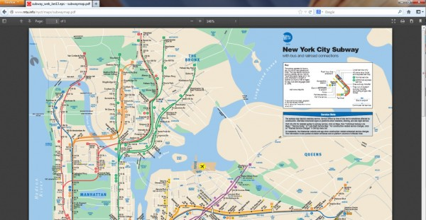

【美商謀智訊息】以推動網路平等、自由、開放為宗旨的全球非營利組織－ Mozilla 基金會，2012 年推出以 HTML5 為基礎的行動作業系統 Firefox OS 並獲得市場廣大期待。今於美西時間 19 日釋出全新 Windows、Mac 和 Linux 版本適用的新版 Firefox 瀏覽器，以及行動版專用的 Firefox for Android。桌機版本特別內建 PDF 閱讀器，使用者不需安裝額外的外掛程式，就能獲得快速、安全的瀏覽體驗。此外，Firefox for Android 新版除了擴大支援約 1500 萬支的 ARMv6 處理器手機，更針對廣大繁體中文市場用戶，正式推出繁體中文語系，讓使用者使用起來更順手！

Firefox 針對 Windows、Mac 和 Linux 桌機使用者，正式推出內建於瀏覽器的 PDF 文件閱讀器。使用者不需安裝額外的外掛程式 (如程式 Reader)，就能獲得快速、直接的瀏覽體驗。您可享受 PDF 文件閱讀器帶給您的許多便利，如直接開啓您最愛的餐廳菜單、閱覽/列印票券、開啓工作用的 PDF 文件等，現在，您不需像過往得藉由額外的點擊或下載來完成這項任務了！

Firefox for Android 新版除了首度支援繁體中文語系之外，更擴大支援約 1500萬支的 ARMv6 處理器手機，決心把更好的 Web 體驗，提供給更多的手機用戶，包括 LG 的 Optimus One、T-Mobile 的 myTouch 3G slide、HTC 的野火機 (Wildfire S)以及中興的 R750 等多款熱門手機皆在支援範圍內。此外，新版本支援易於使用的個性面板附加元件，使用者可以輕鬆改變瀏覽器的介面，卻不會影響原本的上網瀏覽體驗。直接利用 Android 手機造訪 [addons.mozilla.org](https://addons.mozilla.org/)，點選「個性面板」選項，選擇喜歡的主題並按下「儲存」。透過以上簡單的動作，不論新舊個性面板都會自動儲存，使用者可於任何時刻隨時切換並個人化你的 Firefox 行動瀏覽器。

更多相關訊息：

- 下載 [Windows、Mac 或 Linux 版 Firefox](https://mozilla.com.tw/firefox/download/)

- [桌機版本資訊與技術細節](https://www.mozilla.org/en-US/firefox/19.0/releasenotes/)

- 下載 [Firefox for Android](https://play.google.com/store/apps/details?id=org.mozilla.firefox&referrer=utm_source%3DMozilla%26utm_medium%3DWebBlog%26utm_campaign%3Dblogpost-mobile-downloadlink-20121811)

- [Firefox for Android版本資訊與技術細節](https://www.mozilla.org/mobile/19.0/releasenotes/)
