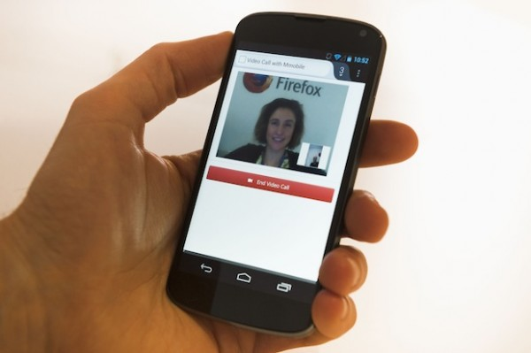

網路即時通訊 (Web Real-Time Communications，WebRTC)，是由 Mozilla 與其他多家公司所共同主導的開放原始碼專案。目的是要透過即時通訊 (Real Time Communication，RTC)，讓視訊電話與檔案共享 (目前由 Firefox 搶先支援) 等功能在內，均可跨所有網站而輕鬆整合瀏覽器，進而建構高效率的網路。目前正由 [W3C WebRTC working group](https://www.w3.org/2011/04/webrtc/)進行 WebRTC 的標準化作業。不論是網站或行動裝置的網頁應用程式，開發人員均能輕鬆跨平台而整合即時通訊功能。

WebRTC 不需下載其他插件或外掛程式；甚至跨平板電腦、行動電話、桌上型電腦等平台時，亦不需安裝可能不相容的瀏覽器，即可提供 VoIP 與視訊會議以外的更多功能。WebRTC 的優勢顯而易見。想像一下：將來消費者在線上選購任一產品時，點選產品網頁即可與客服人員進行即時的視訊通話，讓客服人員為您展示您所要購買小玩意。或如同我們[最近才展示](https://blog.mozilla.com.tw/posts/1628/)的，您將可透過 WebRTC，輕鬆向親朋好友分享自己電腦或行動裝置上的任何檔案，如度假時的歡樂相片或具紀念意義的影片。此外，若是您發現任何有趣的故事，只要將該項目拖曳至視訊聊天視窗中，即可分享該連結。

現在您可至 Firefox Aurora users 找到 WebRTC、getUserMedia、PeerConnection、DataChannels 的所有相關資訊。透過 getUserMedia，開發人員可輕鬆擷取使用者的相機與麥克風資料 (需經過使用者同意)。PeerConnection 則是以安全且簡單的方式，進行語音與視訊通話。而由 Mozilla 率先建構的 DataChannels，除了其本身的功能之外，亦可整合音訊/視訊的聊天功能。只要是瀏覽器所能存取的資料，均可透過 DataChannels 而完成傳送。此外，所有的聲音、音訊、資料通訊均已加密，可達高安全性的人際通訊或資訊交換作業。

在 2 月 25 ~ 28 日登場的全球行動通訊大會 (Mobile World Congress，MWC) 上，Mozilla、AT&T、愛立信 (Ericsson) 攜手展示了相關概念，確實將 WebRTC 帶入新的階段。在未下載任何插件的狀態之下，Firefox 同步了現場客戶現有的電話號碼，並隨即提供相關的通話服務。而在我們的攤位 (Mozilla 位於 Hall 8.1, booth F20；Ericsson 位於 Hall 2, location 2D140) 上，則讓現場客戶透過 WebRTC，輕鬆以行動電話或桌上型電腦的瀏覽軟體，就撥打/接聽視訊電話。當然，不論身在何處的親朋好友，只要他們具備行動電話或桌上型電腦，即可與他們分享任何美好經驗。此聯合展示共利用了 [Ericsson 的 Web Communications Gateway](https://www.ericsson.com/ourportfolio/products/web-communication-gateway)、Mozilla 的 Firefox Social API、Firefox 中的 WebRTC 支援功能。另亦讓 Firefox 執行了行動裝置上所常見的多項功能，如一般語音電話、視訊電話、SMS/MMS 訊息傳遞等。您可至這裡[參閱完整聲明](https://www.ericsson.com/thecompany/press/releases/2013/02/1680640)。

另可於下方參觀我們的展示：

WebRTC 另將推出更多功能！

- Mozilla
