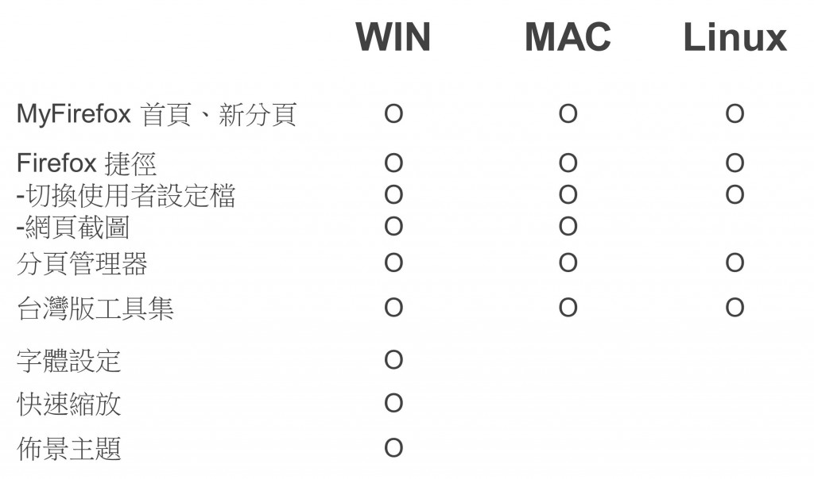
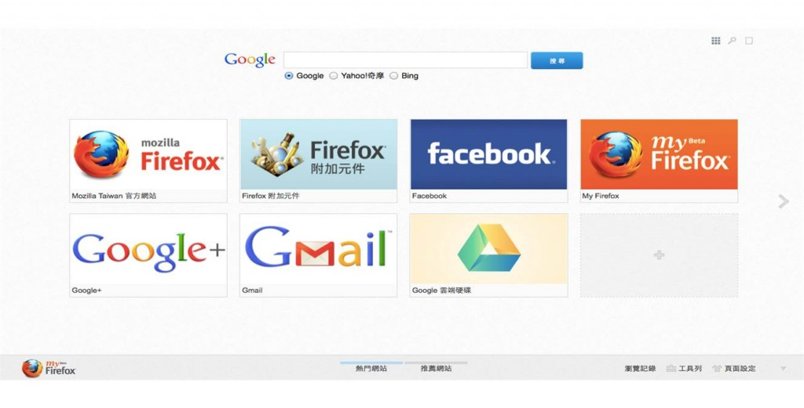
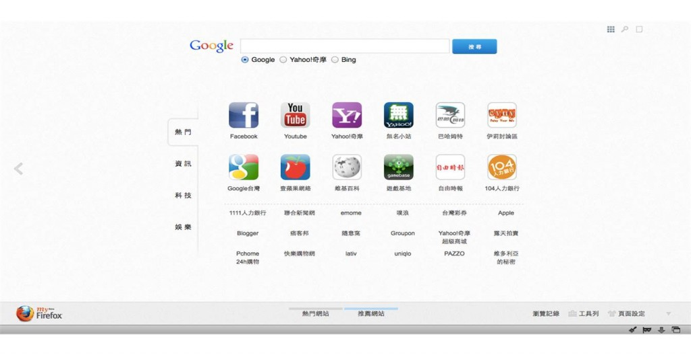
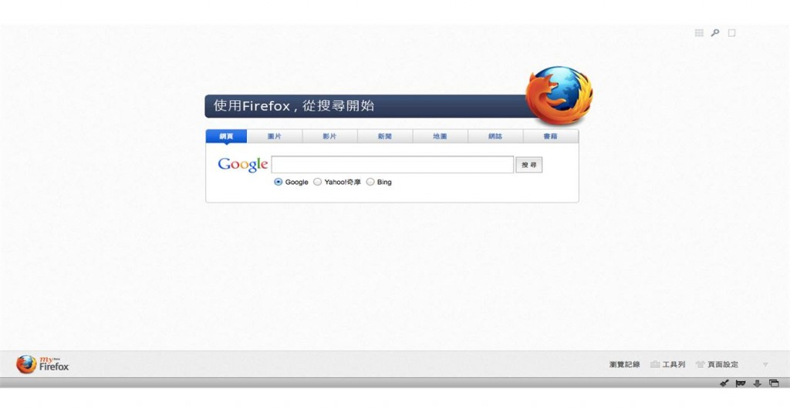
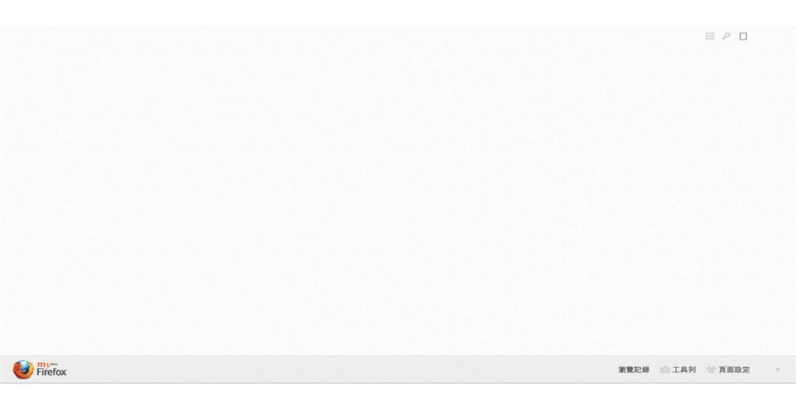
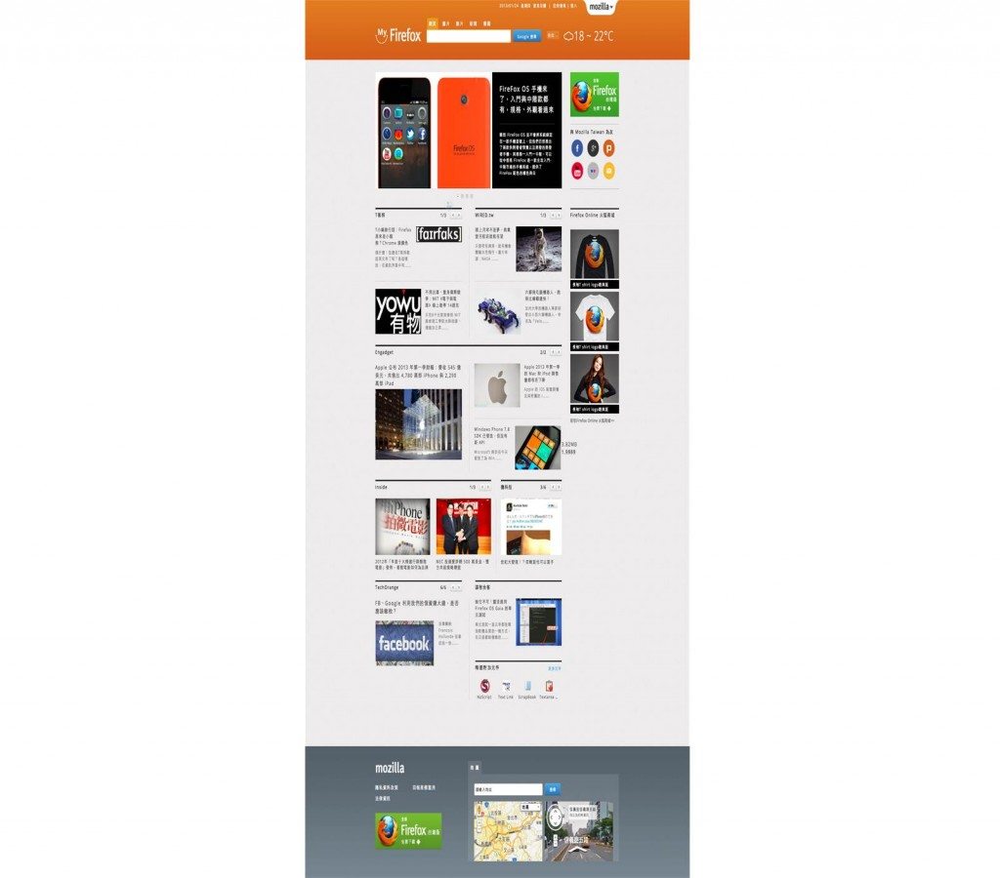

特別為台灣設計的 Firefox 正體中文 (繁體) 版瀏覽器，內建附加元件提供更多新功能，以提升使用者體驗。包括：Firefox 捷徑 (網頁截圖 for Windows & Mac)、分頁管理器 (開啟新分頁有更多選擇，並介紹各類型推薦網站)、台灣版工具集 (意見回饋、書籤管理、隱私瀏覽模式、網站安全標誌、恢復先前關閉的網頁、清除歷史紀錄等)。而 Windows 使用者可使用字體設定、快速縮放、佈景主題等元件，並能選擇另外安裝。

內建附加元件一覽表

開新分頁

最常造訪頁面-熱門網站

開新分頁

最常造訪頁面-推薦網站

開新分頁

切換至搜尋頁

開新分頁

切換至空白頁

MyFirefox 首頁

