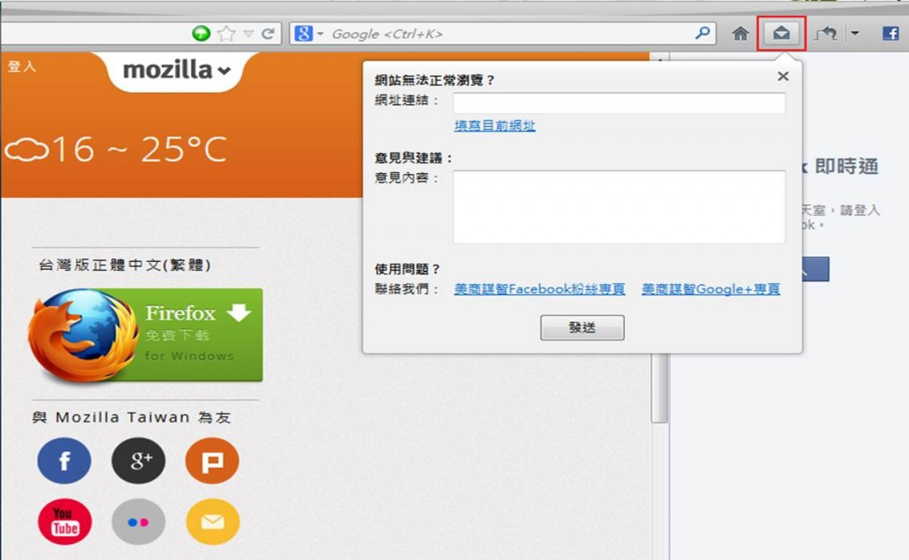
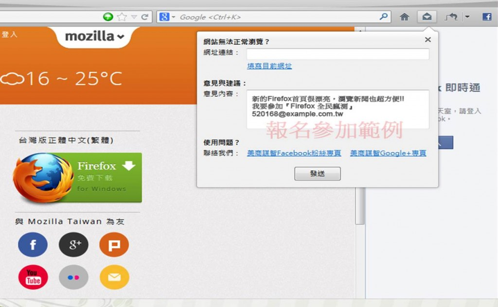

針對台灣使用者設計的台灣版 Firefox 瀏覽器，內建附加元件提供更多新功能，大大提升使用者體驗。你下載試用了嗎？[請點選這裡到活動頁面參加](https://mozilla.com.tw/firefox/tw_beta/)。你用台灣版 Firefox 用得開心嗎？你可能超愛用 Firefox，也想跟其他人分享自己最喜歡的功能；甚至沒這個功能就像家裡附近沒有便利商店一樣！

你可能發現台灣版 Firefox 的某個 bug 嗎？或是某個功能不符合使用習慣？但是到支援網頁目前又找不到任何答案？發個牢騷立刻放棄很簡單──但或許別人也遇上相同的問題，正好又可以幫你解決問題。

你腦海中可能閃過某個想法，能協助改善台灣版 Firefox 並成為更好用的瀏覽器。別懷疑自己的無敵創意，任何具體的建議和概念都有機會改變整個網路生態。

針對上面幾個情形，現在，就是現在！台灣版 Firefox – Open Beta 測試意見強力召集中。我們絕對重視你的意見！任何反應都將提醒我們可改進的空間，協助台灣版 Firefox 瀏覽器更趨完善！

請在即日起至 3 月 31 日[下載台灣版 Firefox](https://download.myfirefox.com.tw/releases/webins3.0/official/zh-TW/Firefox-latest.exe), 安裝完畢後即可進行測試。若使用者的電腦已有 Firefox, 請參考[此步驟](https://bit.ly/firefox-profile-backup)備份個人設定。請將測試後的意見, 透過 Firefox 瀏覽器的『提供意見』按鈕回傳。

提供意見內容請留下個人 Email 信箱、註明：我要參加「Firefox 全民瘋測」並留下你寶貴的意見，以方便中獎聯絡。

凡於活動期間回傳意見回饋者，將有機會獲得獨家精美好禮！

『Firefox 獨家悠遊卡』一張 (空卡) 。

再加碼『Firefox QQ 狐抱枕』一只！

I love Firefox
