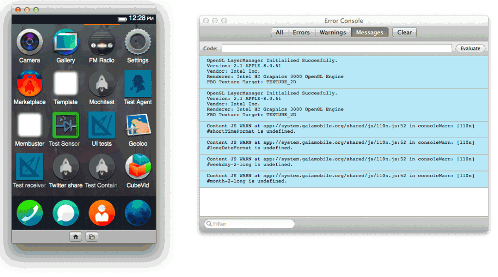
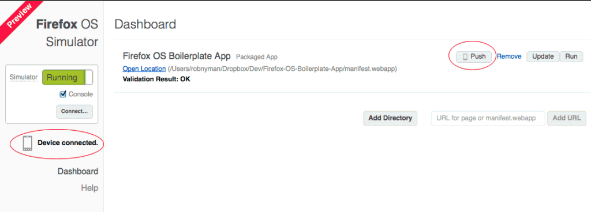
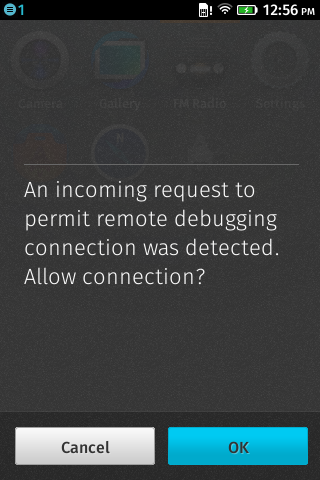
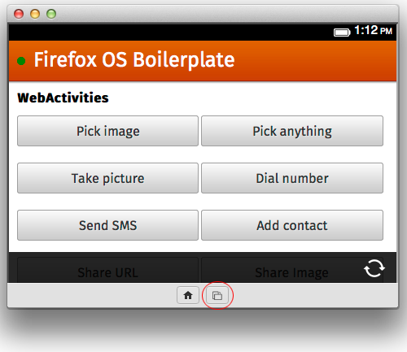
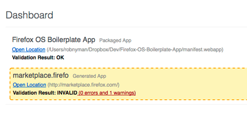
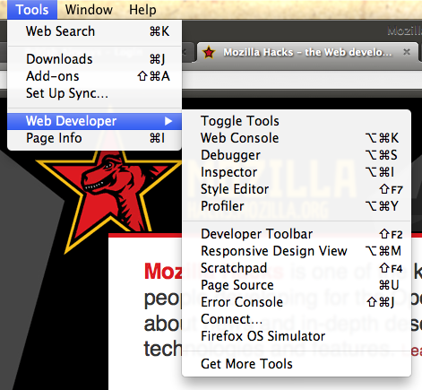

不過 3 個月之前，我們才發表了 [Firefox OS 模擬器的 1.0 版](https://hacks.mozilla.org/2012/12/firefox-os-simulator-1-0-is-here/)。期間我們不斷改善，大約 1 個月之前也就發表了 2.0 版，也是[最新的官方版本](https://addons.mozilla.org/en-US/firefox/addon/firefox-os-simulator/)。邁開大步繼續往前，我們現在要讓大家搶先預覽即將發表的 3.0 版！

我們內部先討論過到底要不要說明這個新版本。其實目前整個架構還稍嫌粗糙，但基於下面 2 個理由，我們還是決定先讓大家知道：

- 我們是 Mozilla，我們在開放的環境下工作，也樂於分享自己的進度。所以想讓你知道我們在忙些什麼事，同時讓大家能參與其中。

- 在正式版本發表之前，你也能有機會加入測試、向我們回饋意見，甚至貢獻你自己所擅長的部分。

## 新功能預覽

我們聽到了反應意見，也針對大家的需求而嘗試打造最熱門的功能。新功能包含：

- Push to Device ─ 直接傳輸功能

- Rotation simulation ─ 旋轉模擬功能

- Basic geolocation API simulation ─ 基本地理位置定位 API 模擬功能

- Manifest validation ─ Manifest 驗證功能

- 修正 App 安裝與更新作業的穩定性

- 新版本 Firefox 亦將隨時更新引擎與 Gaia (即 Firefox OS 的 UI)

### 直接傳輸 (Push to Device) 功能

如果你手上的裝置就能支援 Firefox OS，那只要透過 USB 連線，即可直接在裝置的 Firefox OS 模擬器上安裝 App。

請注意：

- 需啟用裝置上的遠端除錯功能： Settings → Device information → More Information → Developer → Remote debugging

- 在 Linux (至少要 Ubuntu) 上，必須建立 /etc/udev/rules.d/51-android.rules 作為「根」檔案。再如 [Android’s Setting up a Device for Development](https://developer.android.com/tools/device.html#setting-up) 中所述，為裝置新增製造商指定的輸入項。以我們的測試裝置為例，必須輸入： SUBSYSTEM==”usb”, ATTR{idVendor}==” 19d2″, MODE=”0666″, GROUP=”plugdev”

- 尚未完整支援 Windows。目前規劃最後發表的版本將可支援。

- 確認你的裝置上具備最新版的 Firefox OS (特別注意如 [bug 842725](https://bugzilla.mozilla.org/show_bug.cgi?id=842725) 的最新修正)。

### 旋轉模擬 (Rotation simulation)

新功能將可旋轉模擬器、取得事件等，讓內容在橫縱切換的同時，亦可搭配人物相片與景觀照片，提供更好的閱讀經驗。可支援 mozorientationchange 事件。

### 基本地理位置定位模擬 (Basic geolocation API simulation)

模擬器現可支援地理位置定位 (Geolocation)，所以你也可在自己的 App 中測試此功能，並能讀出經度、緯度等數值。

敬請期待功能：後續將可指定地理位置定位！

### Manifest 驗證 (Manifest validation)

一旦要為 Firefox OS 模擬器新增 App 時，模擬器隨即將針對錯誤與警告，快速檢驗你的 Manifest 檔案。其中的問題將包含：避免於模擬器中安裝 App、模擬器尚未模擬的 API (not all APIs in there yet)、為 Marketplace 或裝置所必備，卻遺失的屬性。

## 下載預覽版本

我們的 [FTP 伺服器已具備所有版本的 Firefox OS 模擬器](https://ftp.mozilla.org/pub/mozilla.org/labs/r2d2b2g/)，其檔案名稱為「r2d2b2g」。以下是安裝檔案的鏈結 (將安裝於 Firefox 中成為附加元件)

- [Firefox OS Simulator Preview for Windows](https://ftp.mozilla.org/pub/mozilla.org/labs/r2d2b2g/r2d2b2g-windows.xpi)

- [Firefox OS Simulator Preview for Mac](https://ftp.mozilla.org/pub/mozilla.org/labs/r2d2b2g/r2d2b2g-mac.xpi)

- [Firefox OS Simulator Preview for Linux](https://ftp.mozilla.org/pub/mozilla.org/labs/r2d2b2g/r2d2b2g-linux.xpi)

一旦安裝完畢，則可點選 Firefox 功能表的「工具 (Tools) → 網頁開發者 (Web Developer)」找到：

## 提出建議給我們！

請[到這裡給我們任何建議或填寫發現的 Bug](https://github.com/mozilla/r2d2b2g/issues?state=open)。希望你會喜歡未來所改善的功能，且提升的功能也將協助你開發 App！

## 入門 Firefox OS & 並建立開放式 Web App

在開始之前，歡迎你到 Firefox OS 頁面找尋更多資料：

- [http://mozilla.com.tw/firefoxos/](https://mozilla.com.tw/firefoxos/)

你也可以到 Mozilla Hacks 去看先前的幾篇文章：

- [Getting started with Open Web Apps – why and how](https://hacks.mozilla.org/2013/02/getting-started-with-open-web-apps-why-and-how/)

- [Using WebAPIs to make the web layer more capable](https://hacks.mozilla.org/2013/02/using-webapis-to-make-the-web-layer-more-capable/)

- [Introducing the Firefox OS Boilerplate App](https://hacks.mozilla.org/2013/01/introducing-the-firefox-os-boilerplate-app/)

- [Introducing Web Activities](https://hacks.mozilla.org/2013/01/introducing-web-activities/)

我們還有其他資源：

- [Apps documentation on MDN](https://developer.mozilla.org/en-US/docs/Apps)

- [Developer Hub on Firefox Marketplace](https://marketplace.firefox.com/developers/)

原文網址：https://hacks.mozilla.org/2013/03/firefox-os-simulator-previewing-version-3-0/
