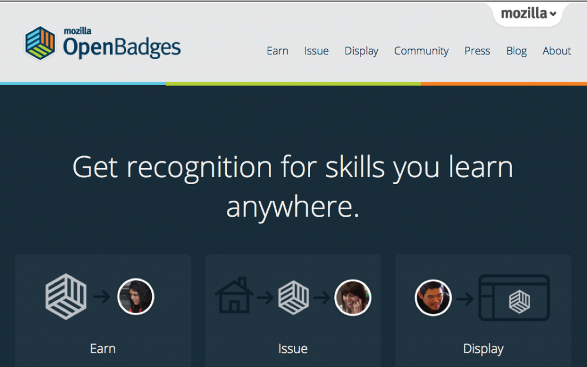
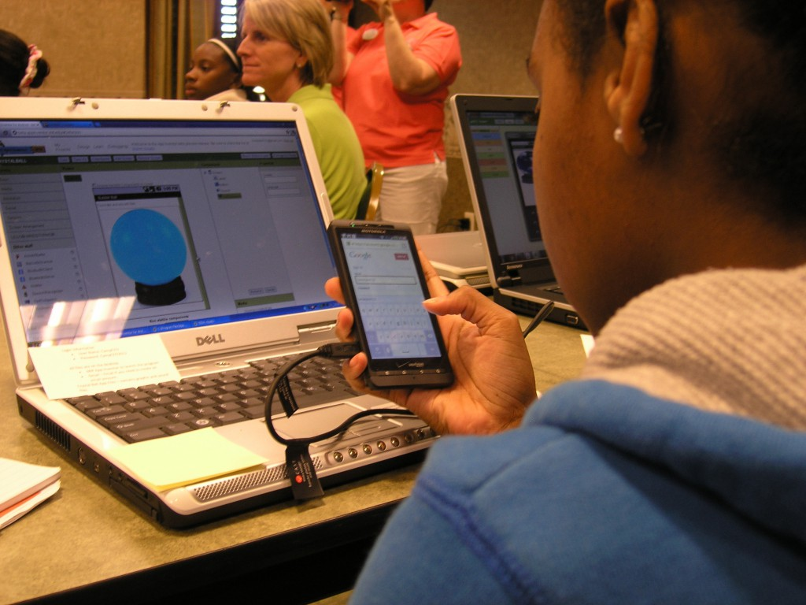
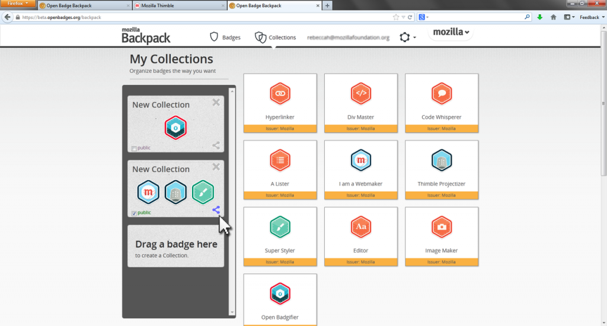
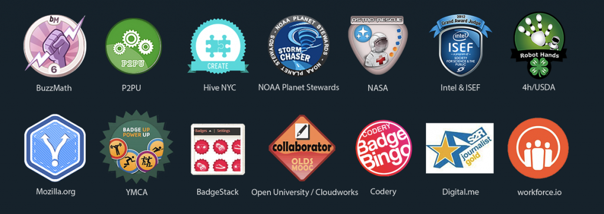

### 『以線上徽章做為學習證明，展現你的真本事』

我們很開心的發表 [Mozilla Open Badges 1.0](https://openbadges.org/)。這個有趣的線上標準，將為學習的過程與機制提供相關認證。開放徽章可讓你輕鬆……

- 確實了解自己線上/離線學習到的技巧

- 讓自己所傳授的東西取得認證

- 在重要場合展現自己的徽章

過去 2 年來，我們與麥克阿瑟基金會 (MacArthur Foundation) 合作開發這個專案。為何這麼重要？雖然現在有許多管道可以學習新的東西，但是卻沒什麼機會可取得這些技術的認證。像是學歷或證書的傳統認證，也不太能夠真正讓人展示自己所學 ─ 例如工程師撰寫程式碼的技術。

而不論你在哪裡取得的傳統認證，也沒辦法隨時讓自己裝備所有技術，在某個地方確實展現。但是開放徽章打破了這個限制，讓數位徽章 (Digital badge) 更上一層樓，成為更有說服力、更高可信度的連網認證。

現有超過 [600 家頂尖組織](https://openbadges.org/community/)透過開放徽章機制而發行徽章，涵蓋學界、業界、終生學習等領域除了將帶動新一波的學習風潮之外，我們也認為開放徽章也將激起未來 Web 的教育潛力。

女童軍在建構「My Sash is an App」專案的部份 App 之後，取得了數位徽章。

Mozilla 資深教育總監 Erin Knight 說：「我們不斷想找到某個方法，讓更多人能夠自由自在的學習。而開放徽章就能達到這個理想。我們應能合法學習所有感興趣的事情，並讓大家針對工作、教育、機會，走出一條自己的路。」

開放徽章之所以非用不可的理由？

- 合併自己所擁有的技術 。透過開放徽章所共享的標準，不論徽章是否由單一或許多組織所頒發，在串連相同技術的徽章之後，將可建立另一個新的徽章。個人可透過線上或離線的多樣資源，取得相關的認證徽章 ─ 在 [Mozilla](https://badges.webmaker.org/) 學習的 HTML 技術、志工經歷與領導經驗，甚至到 [NASA](https://dmlcompetition.net/Competition/4/badges-projects.php?id=2247?) 學習的工程與機器人基本概念，都可以取得徽章。

- 具備完整資訊 。以開放徽章產生的所有徽章，均將內建重要資料，包含徽章發行機構、徽章發行標準，甚至取得徽章所應完成的專案。其他人 (也許老闆最在乎) 可找出豐富的資料，並完整了解徽章背後的技術與成就。

- 網路上通行無阻 。[Open Badges backpack 功能](https://backpack.openbadges.org/)，可讓使用者輕鬆蒐集自己的徽章、按照分類排序，並能於人力銀行網站或社群網路的個人資料上展示這些徽章。

- 確實了解自己所學習的東西 。開放徽章的[免費軟體](https://openbadges.org/issue/)，可讓任何符合標準的組織發行並認證自己的徽章。目前共有 600 家機構，為 23,000 名學員發行了 62,000 個徽章。[這裡](https://www.openbadges.org/community/)可查看徽章發行機構列表。

- 免費開放給任何人，而且同樣屬於 Mozilla 非營利理念的一部分 。開放徽章同樣是由熱情的廣大社群所設計並建構。從修復錯誤到啟用新功能，基於開放源碼的理念，所有人都能參與其中並隨時嘉惠其他人。

立刻加入

- 現在就取得自己的第一個徽章 。來獲得[Mozilla Webmaker 徽章 吧](https://badges.webmaker.org/)。或是取得 [開放徽章社群](https://openbadges.org/community/)成員所發行的任何徽章。

- [著手發行開放徽章](https://openbadges.org/issue/)。了解應如何為自己所傳授的東西取得認證。

- [參觀開放徽章社群](https://openbadges.org/community/)。看看有哪些機構正透過開放徽章機制而發行、設計徽章。

- 聯絡我們 。透過 [Twitter](https://twitter.com/OpenBadges) 了解開放徽章的動態、聯絡開放徽章的[開發社群](https://groups.google.com/forum/#!forum/openbadges-dev)、下載[原始碼](https://github.com/mozilla/openbadges)。

英文原文：https://blog.mozilla.org/blog/2013/03/14/open_badges/
