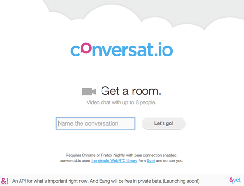
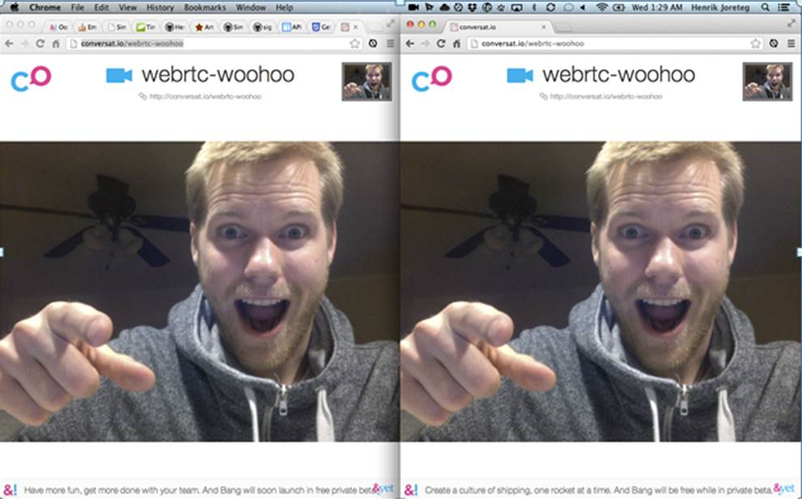

以下原文發表在 Mozilla Hacks，由 Henrik Joreteg 以及 Robert Nyman 共同完成。

—

WebRTC 的功能很讚，但似乎就是少了那麼一點親和度。上個禮拜，我和我的同事才在 &yet 上發佈了幾種工具，想要能稍微修正 WebRTC 一下，而且還「冒險」要讓這些小工具真的能用。

為了展示這些工具，我們迅速建立了簡單產品並稱之為 conversat.io，可讓你建立多個通話方的免費視訊電話。而且不用申請帳戶或安裝附加元件，只要使用瀏覽器裡面的 URL 就可以了。任何人都可透過相同的 URL 加入這通視訊電話。

conversat.io 可分為 2 種用途。首先就是好用的通訊工具。我們的團隊使用 And Bang 而集體討論相關作業細項，所以只要把某個鏈結拖曳到我們集體討論的「視訊聊天室」，就可加入討論；真的很方便。第二種用途就是可展示 SimpleWebRTC.js 函式庫，還有執行該函式庫的小型 signaling server ─ signalmaster。

(SimpleWebRTC 與 signalmaster，都已經在 Github 與 MIT 上提供為授權過的開放源碼。快來幫我們修正吧！)

## 可支援的瀏覽器

WebRTC 目前僅可用於 Chrome stable 與 FireFox Nightlies (必須啟動 about:config 中的 media.peerconnection.enabled 參照) 之上。我們也希望很快就能支援更多的瀏覽器。我尤其想要能快點在智慧型手機與平板電腦上使用 WebRTC。

## 親和度與普及度

我個人十分確信：某一項新的網路技術是否能普及，與其本身簡單易用的程度密不可分。我當初開始接觸 JS 時，就是 jQuery 本身的親和度，讓我覺得自己一定能寫出一些有趣的玩意兒。

之所以愛上 javascript，就是因為我用 jQuery 完成了：

		
		

$('#demo').slideDown();
			
				
					
				
					1
				
						$('#demo').slideDown();
					
				
			
		

接著就可以在我的螢幕上看到元素移動。其實我那時什麼都不懂。現在看起來或許沒什麼，但就是這簡單編碼，讓我覺得可以再寫出更有趣的東西來。

若是想建立 App，以將資料從伺服器帶往用戶端，則 Socket.io 也可以達到上面的效果：

		
		

// server:
client.emit("something", {
    some: "data" 
});
			
				
					
				
					1234
				
						// server:client.emit("something", {    some: "data" });
					
				
			
		

		
		

// client:
socket = io.connect();
socket.on("something", function (data) {
    // here's my data!
    console.log(data);
});
			
				
					
				
					123456
				
						// client:socket = io.connect();socket.on("something", function (data) {    // here's my data!    console.log(data);});
					
				
			
		

與其想著要如何設定 BOSH、XMPP、長輪詢 (Long-polling)，才能讓瀏覽器送出資料，我現在只要把訊息傳送到瀏覽器即可。事實上，如果我不想傳送訊息，甚至根本不需考慮序列化與反序列化 (Serializing /De-serializing)。我只要設法在用戶端與伺服器之間，確實來回傳送簡單的 Javascript 物件就好。

我也聽過某些「硬底子」的開發人員抱怨，像這種工具會導致更多品質堪慮的工具，然後再有更多盲目跟隨的開發人員根本不知道自己在幹嘛。這種東西根本就是垃圾！

簡單易用的高親和度工具，除了能讓開發人員寫出有趣的東西之外，也是今天網路如此成功又多變的關鍵。

這種工具就像是毒品一樣，讓工程師可以用相關技術不眠不休的撰寫程式碼。同時也讓我們了解許多概念，協助我們思考更多可能性。不論開發人員最後是不是用這些工具寫出 App，其背後引導的力量確實功不可沒。

## WebRTC 的潛力

我深切相信，WebRTC 絕對會大幅影響人們目前的溝通方式；至少 WebRTC 已經在 &yet 上影響了我們團隊。當然，我們也用過 Skype、Facetime、Google Hangouts 等等。但只要在瀏覽器裡面開啟 URL，就可以馬上進入對話，這點實在是太簡單、太方便了。

一旦這個技術在行動裝置上普及之後，絕對會成為通訊產業的重大變革。

## 挑戰

當然，WebRTC 仍有許多瓶頸需要突破，如連線作業需考量其複雜性與瀏覽器的差異、必須產生/處理「內含指令的訊息 (Signaling message)」、視訊元素必須附加媒體串流等。

即使上面的問題都解決了，也必須讓 2 名使用者找到對方，讓彼此能直接傳送適當的 Signaling message，或傳送給想要聯絡的人。

SimpleWebRTC.js 就是我們對用戶端複雜度所想出的對策，可解決 Firefox 與 Chrome 之間的 API 差異。

## 使用 SimpleWebRTC

最簡單的方法，就是納入 SimpleWebRTC.js 指令碼，為自己的本端視訊提供容器 (Container)。而作為遠端視訊的容器則如同：

		
		

 <!DOCTYPE html>
<html>
    <head>
         
    </head>
    <body>
        

        

    </body>
</html>
			
				
					
				
					12345678910
				
						 <!DOCTYPE html><html>    <head>             </head>    <body>        

        

    </body></html>
					
				
			
		

接著可在內部啟動 1 組 webrtc物件，告知其所該使用的容器：

		
		

var webrtc = new WebRTC({
    // the id of (or actual element) to hold "our" video
    localVideoEl: 'localVideo',

    // the id of or actual element that will hold remote videos
    remoteVideosEl: 'remoteVideos',

     // immediately ask for camera access
    autoRequestMedia: true
});
			
				
					
				
					12345678910
				
						var webrtc = new WebRTC({    // the id of (or actual element) to hold "our" video    localVideoEl: 'localVideo',     // the id of or actual element that will hold remote videos    remoteVideosEl: 'remoteVideos',      // immediately ask for camera access    autoRequestMedia: true});
					
				
			
		

在這個時候，如果執行了上述的程式碼，就會看到你啟動了視訊，並進入你所指定的容器中。

下一步就是實際指定所要連線的人。

考慮到簡單易用的目的，我們要求 2 名想連線的使用者加入相同的聊天室。其實意思就是：以相同的字串呼叫「加入 (join)」。

而這裡基於展示的理由，只要 webrtc 準備妥當 (也就是已連線至 Signaling server)，我們就要求 webrtc 加入特定的聊天室。如同下列：

		
		

// we have to wait until it's ready
webrtc.on('readyToCall', function () {
    // you can name it anything
    webrtc.joinRoom('your awesome room name');
});
			
				
					
				
					12345
				
						// we have to wait until it's readywebrtc.on('readyToCall', function () {    // you can name it anything    webrtc.joinRoom('your awesome room name');});
					
				
			
		

只要使用者完成上面指令，就可以等待其他人加入。如果想在本端測試，則可用 Firefox 與 Chrome 將之開啟；或在 Chrome 中開啟 2 個分頁 (Firefox 還不能用 2 個分頁同時存取本端媒體)。這時你應該會自動連上線，然後就可以和自己現場對話。但注意回音可能會很大喔！這時看起來應該會像我一樣：

未完待續~

英文原文: https://hacks.mozilla.org/2013/03/making-webrtc-simple-with-conversat-io/

—

作者介紹：

Henrik Joreteg 是 &yet 的合作夥伴，已經用十幾種方法撰寫了幾十種即時 App。他在 &yet 上主持 And Bang，針對 JavaScript 與 HTML5 應用提供相關的諮詢和訓練服務。

Robert 身為 Mozilla 的技術傳教士，並負責編輯 Mozilla Hacks 內的文章。
