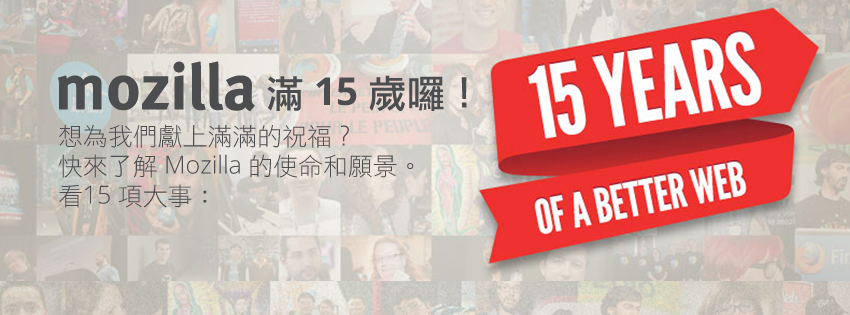

Mozilla 致力於提供平等、自由、開放的網路使用環境。15 年來，我們都抱持著這樣的信念。下面的 15 件事包含了一些我們曾經做過最大的成就與里程碑，可讓使用者快速了解我們是誰、做過了什麼事。然而在某些方面我們也才剛開始，每天都還在探索新科技、進入新領域，並接觸新的使用者。

- 為了提供使用者不同的選擇並帶領網頁技術持續創新，Mozilla 專案始於 1998 年 3 月 31 日的 Netscape（網景公司）。

- Mozilla 本著非營利的理念，提供如 Firefox 的產品，只為了讓所有網路使用者掌握 Web 的力量。

- 超過 10,000 位貢獻者在 Firefox 1.0 於 2004 年發行時，買了《紐約時報》 的全版廣告以支持我們的使命。

- 時至今日，Mozilla 的貢獻者遍及全球，包含南極洲都有愛用者 (南極洲有超過八成的 Firefox 使用者)。

- Firefox 的附加元件讓使用者能自訂並選擇自己的網路瀏覽體驗，至今的下載次數已經超過三十億。

- Mozilla 領先群倫，透過不要追蹤我 (Do Not Track) 與 Collusion 等瀏覽器的創新，讓使用者更能控制自己的個人資料，帶領業界保護您在網路上的隱私。

- 我們的全球社群把 Firefox 翻譯成 89 種語言版本，讓全世界超過 95% 的人口都能使用自己母語介面的 Firefox 瀏覽器。

- 2008 年，有 8,002,530 個人在同一天當中選擇使用 Firefox，創造「24 小時之內應用程式最多下載次數」的金氏世界紀錄。

- Mozilla Festival 是我們最大的年度活動，期間聚集了數百個創新理念，讓數以百計人們的能夠了解網路的潛能與威力。

- Mozilla Webmaker 將建構更高自由度的 Web，而透過相關工具與專案，協助大家更靈活運用自己的線上生活。

- Mozilla WebFWD 另針對開放源碼，將協助倡導者與開發人員不斷創新，建構產品與解決方案，以帶領大家進入 Web 新境界。

- Mozilla Developer Network （MDN）則為社群所主導的 Web 資源，提供最新穎的技術文件、線上教學、相關工具，每個月均有超過 2 百萬人次瀏覽。

- Mozilla 關注並引導 Web 成為大家所能共享的資源。

- 2013 年，Mozilla 將透過 Firefox OS 而解放智慧型手機的 Web 力量，同時將再次讓下一代的網路人口擁有控制與選擇的權利。

- Mozilla 致力的所有工作，都必須歸功於無數志工的參與 ─ 大家相信 Web 應該隨時開放給地球上的所有人共有、共享。

### 我們需要像您這樣的人參與，才能實踐我們的使命。

看看您可以如何支援 Mozilla 或參與我們，讓未來 15 年甚至更久的生活中處處都有所改變。

#### 幫助使用者

我們仰賴像您這樣的熱心成員，協助他人深入了解 Mozilla 的產品。請到下列網站了解如何[幫助 Firefox 使用者](https://support.mozilla.org/kb/superheroes-wanted) 與 [Thunderbird 使用者](https://support.mozillamessaging.com/kb/superheroes-wanted)。

#### 品質檢測

QA 品質檢測是 Mozilla 裡最容易上手的專案之一，也可以藉此多了解我們的程式碼及相關工具。請幫我們[抓出 Firefox 裡的問題](https://quality.mozilla.org/teams/desktop-firefox/)、[測試 Mozilla 網站](https://quality.mozilla.org/teams/web-qa/)，或也歡迎深入了解[其他協助測試的機會](https://quality.mozilla.org/)。

#### 寫程式

[開發者可以幫忙](https://developer.mozilla.org/en/Introduction) Mozilla 將軟體加入新功能，讓所佔容量更小、更快，或改善開發環境及流程。只要告訴我們[您最愛用哪個程式語言](https://www.whatcanidoformozilla.org/)，我們就能幫您找出適合的專案！

#### 協助宣傳

幫助我們推廣 Firefox 與其他 Mozilla 專案，打造一個更好的網路環境。您可以加入 [Firefox 夥伴計畫](https://affiliates.mozilla.org/)，向世界分享 Firefox 的資訊。也請參考[行銷指南](https://wiki.mozilla.org/MarketingGuide)，深入了解其他不同的參與方式。

#### 在地化

幫助我們教 Firefox、Thunderbird 及其他專案[說中文！](https://wiki.mozilla.org/L10n)Mozilla 網站也有許多部分需要您[協助翻譯的內容](https://wiki.mozilla.org/L10n:Web_parts)，讓網路的福音順利傳播。

#### 網頁開發

歡迎 Web 開發者一起加強我們的網站，詳情請見[網站專案](https://wiki.mozilla.org/Webdev/GetInvolved)。您的 Web 能力也可以[幫助我們打造最新的 Firefox OS](https://wiki.mozilla.org/Gaia/Hacking)。

#### 附加元件

Mozilla 的產品都擁有強大的擴充套件系統，您可以藉著這樣的系統微調軟體，也能大改程式。如果您還不知道怎麼做，歡迎來學學[打造附加元件的方法](https://addons.mozilla.org/developers/docs/getting-started)；老手們，也歡迎[加入 AMO 編輯群](https://wiki.mozilla.org/AMO:Editors/Applying)。

#### 視覺設計

我們相信潛藏在優秀美術設計中的力量，也希望讓藝術家能以富含 Mozilla 精神的作品讓 Web 變得更好。相關資訊請見[創意團隊的部落格](https://blog.mozilla.org/creative/)。

#### 撰寫文件

Mozilla 開發者社群是 Mozilla 相關技術的資訊中心，請幫我們[完善各式技術文件](https://developer.mozilla.org/docs/Project:How_to_Help)、撰寫新文章、蒐集現有資源，或是將文章翻譯為中文或其他語言。

#### 教育

一起打造「網路創造者」的世代，讓大眾從閱讀、使用 Web，進展到能夠製作 Web 上的內容。您可以教大家如何寫網頁程式、Web 的運作原理等等。[請參考 Mozilla Webmaker 專案](https://webmaker.org/)，也可以[在自己所屬社群中辦活動](https://webmaker.org/events/)，開始協助其他人成長。
