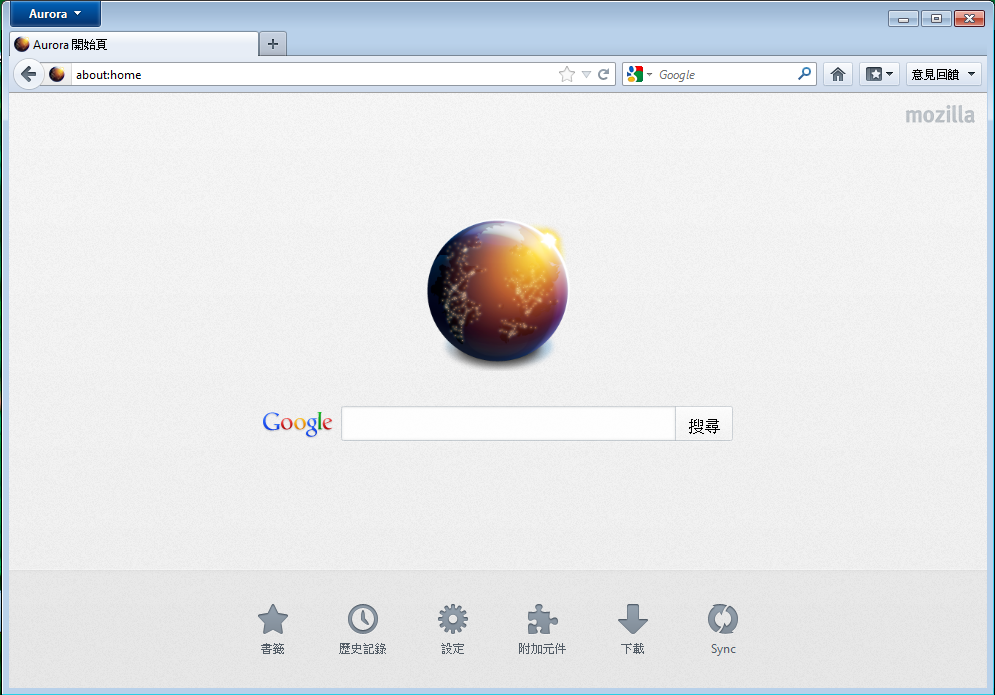

新版 Firefox Aurora 已經可以[下載測試](https://www.mozilla.org/firefox/aurora/)！

最新的 Firefox Aurora 今起公開測試，此版中有開發中新分頁畫面、首頁重新規劃、智慧位址列自動完成網址等功能。

新版首頁畫面

Firefox Aurora 新鮮事：

- 開新分頁時，會出現最近及最常瀏覽的網頁縮圖，以方便快速前往。

- 新版首頁提供使用者許多功能捷徑，可以在同一個地方取用書籤、瀏覽歷史記錄、附加元件、檔案下載歷程及 Firefox Sync 設定。新版首頁目前正在開發中，未來還會持續改良。

- 智慧位址列將協助您在輸入時自動完成網址。

新分頁快速網站選單

您現在就可以[下載最新版的 Firefox Aurora](https://www.mozilla.org/firefox/aurora/)，也別忘了[提供意見回饋](https://mzl.la/inputfa9)。對於這些新功能的意見，都能幫助我們了解該怎麼改良隨後的 Beta 及正式版。

更多資訊：

- [關於開發者工具的相關更新](https://hacks.mozilla.org/2012/03/firefox-aurora-13-developer-tools-updates/)

- [核心平台更新](https://hacks.mozilla.org/2012/03/firefox-aurora-13-is-out-spdy-on-by-default-and-a-list-of-other-improvements/)

- [詳細版本資訊與技術細節](https://www.mozilla.org/firefox/13.0a2/auroranotes/)
