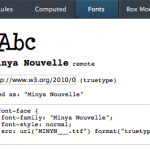
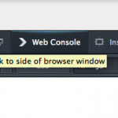

這篇文章要搶先報導從「Nightly (每夜更新版)」狀態進入「Aurora (曙光版)」的新版本 Firefox。當然，我們也想讓大家知道最近 6 個禮拜才出現的酷炫開發功能。啊？你還沒去看 [Firefox Aurora](https://www.mozilla.org/en-US/firefox/aurora/) 現在的情形？那你還等什麼？

#### 那是什麼字型？

先來看看檢測器 (Inspector) 新添的多樣功能吧！現在可以檢查目前 HTML 節點所套用的字型規則，或以單一視窗即可檢查頁面所使用的所有字型：

如果想要微調跨平台的字型差異，或測試自己 App 上的網頁字型運作情形，這項功能特別有用！

#### 重新繪製

開發工具現在提供新的模式，可透過多重色彩的「閃爍」效果，呈現由 Firefox 重新繪製的頁面。我這裡錄製了大約 1 分鐘長的影片，讓你可大概了解這個功能：

現在的網頁 App 都已經高度依賴 JS 函式庫與 CSS 動畫，以帶給使用者栩栩如生的效果。但為了確實達到絕佳的使用經驗，我們必須了解瀏覽器的頁面顯示機制。而「強調繪圖區 (Visual Paint)」模式則能讓我們更進一步看到瀏覽器運作的情形了解相關原理。

#### 把工具箱放到旁邊

筆記型電腦與桌上型 LCD 螢幕，已經越來越普遍採用寬螢幕，所以我們現在新增了切換功能，讓工具箱 (Toolbox) 可放在瀏覽器視窗的右側或底部，甚至可拉出來作為獨立視窗：原文

原文出處：https://hacks.mozilla.org/2013/04/developer-tools-update-firefox-22/
