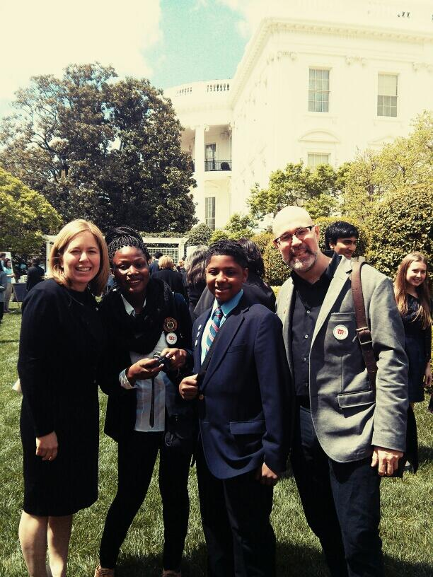

#### 直擊白宮的 Maker Party 2013

我們很開心的宣佈：Mozilla 參加了[白宮科學展](https://www.whitehouse.gov/sciencefair) (White House Science Fair)，而且歐巴馬總統還親自幫我們[開啟](https://www.whitehouse.gov/the-press-office/2013/04/22/new-details-president-obama-host-white-house-science-fair)了全新的夏季 [Maker Party](https://www.webmaker.org/party) ——為感謝 Web 帶給我們的便利與美好，來自於全球的數千個社群主導此慶祝活動。

來自於 Sprout 的Cathy Lewis Long，與 Zainab Oni、Senque Little-Poole、Mark Surman 合照於白宮科學展。

#### [白宮科學展](https://www.whitehouse.gov/sciencefair) 上的 Webmaking

[Mozilla 參加了總統歐巴馬](https://www.whitehouse.gov/the-press-office/2013/04/22/new-details-president-obama-host-white-house-science-fair)一年一度的白宮科學展，一起表揚於全美科學、工程、數學競賽中獲獎的學生。

在 [Mozilla 的 Hive Learning Network 專案](https://explorecreateshare.org/)中，有一名來自於紐約 [MOUSE](https://www.mouse.org/) 組織的學生成員，現年才 16 歲的 [Zainab Oni](https://mousecorps.wordpress.com/2013/04/11/dining-band-ny-tech-meetup-internet-fame/)。她所獲獎的腕帶式 Arduino 電路，可導引視覺障礙者找到桌上的食物。另外還有一名來自於 [Sprout 基金會](https://www.sproutfund.org/) Hive Pittsburgh 分部的 15 歲男孩 Senqué A. Little-Poole，也因反病毒細胞治癒疾病的研究而獲獎。

Mozilla 執行總監 Mark Surman 也出現在活動現場，並分享了 Mozilla 在科技教學方面的努力，另[透過白宮的協助之下](https://www.whitehouse.gov/blog/2013/04/20/watch-live-2013-white-house-science-fair)，一同開啟 Mozilla 的盛大夏季活動：[Maker Party 2013](https://www.webmaker.org/party)。

#### [Maker Party 2013](https://www.webmaker.org/party) 介紹

今年從 6 月 15 日到 9 月 15 日整個夏天，將由 Mozilla 與 [National Writing Project](https://www.nwp.org/) 共同邀請全球諸多合作夥伴，一同參與盛大的 Maker Party。屆時會有上千場活動來慶祝 Web 帶給我們的驚喜和美好；其內容囊括視訊混音、App 與網頁，甚至動手設計機器人等，琳琅滿目的活動內容。

Maker Party 2013 是貫穿整個夏季的第二屆大型活動，主軸為 Mozilla 所重視的 Web 教育與數位和數字文化素養。[去年的 Mozilla Summer Code Party](https://webmaker.org/en-US/hall-of-fame/)，共吸引社群主導超過 700 場活動，並有 80 個國家超過 1 萬人參加。今年更將擴大活動規模，[目前有 40 多個知名的合作夥伴決定參與，後續還會有更多夥伴加入](https://www.webmaker.org/party)。

### 誰會來參與活動？

Maker Party 2013 屬於大型活動，將有許多公營機構、創業公司、科技公司、非營利性組織隨時加入，包含[英特爾 (Intel)](https://www.intel.com/)、[Black Girls Code](https://www.blackgirlscode.com/)、[California Academcy of Sciences](https://www.calacademy.org/)、[DIY.org](https://www.diy.org/)、[Girl Scouts of Greater Chicago and Northwest Indiana](https://www.girlscoutsgcnwi.org/)、[NYC Department of Education](https://schools.nyc.gov/default.htm)、[the Sesame Workshop](https://www.sesameworkshop.org/)。我們將吸引超過 50 萬人次，一同了解 Web 所帶給我們的一切。參與 Maker Party 的完整組織清單可參閱 [webmaker.org/party](https://webmaker.org/party)，而清單仍不斷加長中。

Mozilla 執行總監 Mark Surman 談到：「這是全球性的聚會，我們也歡迎你隨時加入。Mozillians 網羅了許多有創造力的人，而且我們也屬於是不斷成長中的全球性社群。因為如此，今年活動將不僅要學著撰寫程式碼，也要慶祝 Web 所帶給我們的學習、實踐、創造等機會。」

### 參與方法：

- [加入活動](https://www.webmaker.org/party)。立刻到 [webmaker.org/party](https://www.webmaker.org/party) 報名。將自己所學分享、實現、傳授給其他人。

- [觀看科學展現場直播](https://www.whitehouse.gov/live) 。白宮 [科學展](https://www.whitehouse.gov/blog/2013/04/20/watch-live-2013-white-house-science-fair)將從早上 11:30 起開始直播實況。

- [舉辦或參與 Maker Party](https://www.webmaker.org/party)。我們能讓所有人輕鬆找到自己身邊的活動；你也可以從這宣傳自己的活動。

- [帶更多人來](https://www.webmaker.org/teach) 。嘗試我們全新的「 Teach the Web」開放式線上課程。只要是擁有跟與你同樣想法的人，都能直接交流。

- 透過臉書把訊息發佈出去。 We’ll be [tweeting](https://www.twitter.com/mozilla) our announcement live from the White House using the [#MakerParty](https://twitter.com/search/realtime?q=%23MakerParty&src=typd) hashtag. 快來！

Mozilla 的 Maker Party，屬於 John D. and Catherine T. MacArthur 基金會 Summer of Connected Learning 的一部分。

英文原文：[https://blog.mozilla.org/blog/2013/04/22/makerparty2013/](https://blog.mozilla.org/blog/2013/04/22/makerparty2013/)
