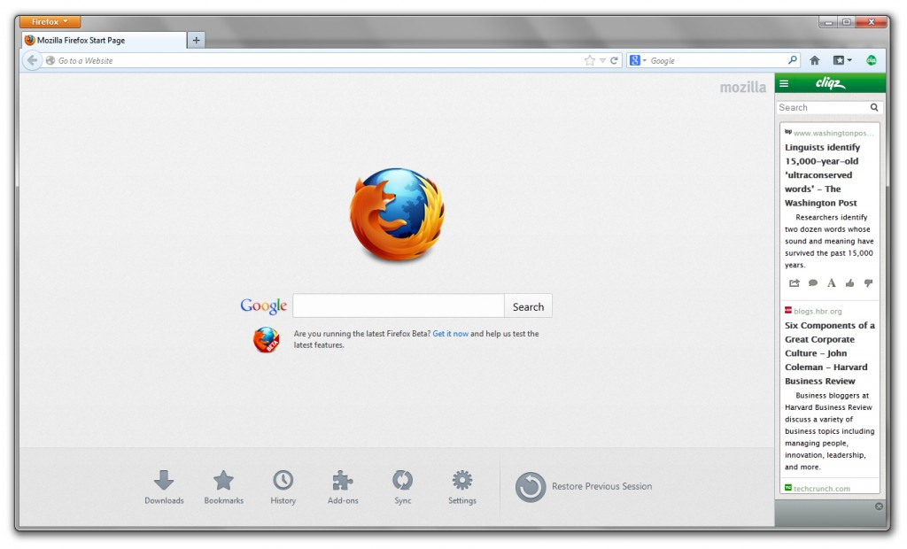

【美商謀智訊息】以推動網路平等、自由、開放為宗旨的全球非營利組織－Mozilla 基金會，2012年推出以HTML5 為基礎的行動作業系統 Firefox OS 並獲得市場廣大期待。今於美西時間(14日) 釋出 Windows、Mac 和 Linux 版本適用的新版 Firefox 瀏覽器，以及行動版專用的 Firefox for Android。Firefox 桌面版除了新增更多樣化的社交功能，更隆重推出多項便捷工具，包括可即時更新科技新知的 [MyFirefox 首頁](https://myfirefox.com.tw/)、多樣化選擇的新分頁、火狐工具集等最好用的 Firefox 功能。而新版Firefox for Android 以Charis 與 Open Sans 作為客製且開放的原始字型，讓小螢幕的裝置亦可清楚呈現 Web 內容。為慶祝新版本轟動上線，於即日起至 6月30日盛大推出「玩火狐送手機」闖關活動，將有機會獨得特獎 Firefox OS 開發者預覽手機！

全新 Firefox 桌面版從安裝起就關心您的自主選擇，針對 Windows 用戶提供附加元件自訂安裝的選項。同時，即時更新科技新知的[MyFirefox 首頁](https://myfirefox.com.tw/)，更與 Inside、T客邦、癮科技、WIRED、TechOrange 等知名網站合作，上網立即接收第一手科技訊息。此外，開啓新分頁的分頁選擇，讓使用者可切換至最常造訪的網頁、搜尋頁、空白頁、並可一覽台灣熱門網站及資訊、科技、娛樂等推薦網站。全新火狐工具集，讓使用者不論網頁截圖，書籤管理、隱私瀏覽模式、網站安全標誌等，都可以用最立即便利的方式使用 Firefox。

面對社交網站的線上主流，新版Firefox桌面版透過Mozilla 所開發的 Social API，讓 Firefox 直接與社交功能整合，讓您擁有更全面、更客製、更個人化的社交體驗。使用者可針對最喜歡、最常用的社交服務於 Firefox 上新增側邊欄，或直接在 Firefox 的工具列上新增通知鈕。現在除了 Facebook Messenger for Firefox 之外，Firefox 再新增 Cliqz、Mixi、msnNow 等社交服務，讓你不論身在何方，都能在瀏覽 Web 的同時，掌握自己與親朋好友的社交狀態，更同時進行線上聊天、即時獲知新聞、娛樂、個人網路等資訊。

大力感謝狐迷們對Firefox for Android的支持，目前Firefox for Android已經在 Google Play 中獲得平均 4.5 分的高評價。新版 Firefox for Android 再推出以 [Charis 與 Open Sans 作為客製且開放的原始字型](https://blog.mozilla.org/ux/2013/03/improved-type-on-firefox-for-android/)，並取代目前 Android 的 3 種預設字型，讓小螢幕的裝置亦可清楚並賞心悅目的呈現 Web 內容。同時，新版Firefox for Android 也強化了 HTML5 的相容性，並在HTML5test.com 的測試中獲得421 分與 14 分額外積分 (總分為 500)。

大轟動！為慶祝 Firefox 新功能亮相，即日起至6月30日熱鬧推出[「玩火狐送手機」活動](https://myfirefox.com.tw/event/firefox_game_prize2013)，邀請所有狐友一起來闖關拿大禮！首先，請狐友重新下載 Firefox 最新版，接著搶先體驗瀏覽器全新功能，以及為狐友們特別打造的 MyFirefox 首頁，熟悉新功能後就可信心滿滿的進行闖關囉！參加者需回答三道題目，題目將採隨機推出，若三道題目皆答對者，不只可獲得獨家 Firefox Online 火狐商店來店禮一份，還有機會抽中好禮獎不完的抽獎活動，中獎者可獲得超夯 Firefox OS 開發者預覽手機、Firefox 雙肩背包等最驚喜 Firefox 好禮。本活動加碼開放可無限次參加，參加越多得獎機會越高。2013 年最酷炫的 Firefox 活動快揪狐迷共襄盛舉！

更多相關訊息：

- 下載最新 [Windows、Mac 或 Linux 版 Firefox](https://mozilla.com.tw/firefox/download/)

- [「玩火狐送手機」活動頁](https://myfirefox.com.tw/event/firefox_game_prize2013)

- [MyFirefox 首頁](https://myfirefox.com.tw/)

- [桌面版本資訊與技術細節](https://www.mozilla.org/en-US/firefox/21.0/releasenotes/)

- 下載 [Firefox for Android](https://play.google.com/store/apps/details?id=org.mozilla.firefox&referrer=utm_source%3DMozilla%26utm_medium%3DWebBlog%26utm_campaign%3Dblogpost-mobile-downloadlink-20121811)

- [Firefox for Android版本資訊與技術細節](https://www.mozilla.org/en-US/mobile/21.0/releasenotes/)
