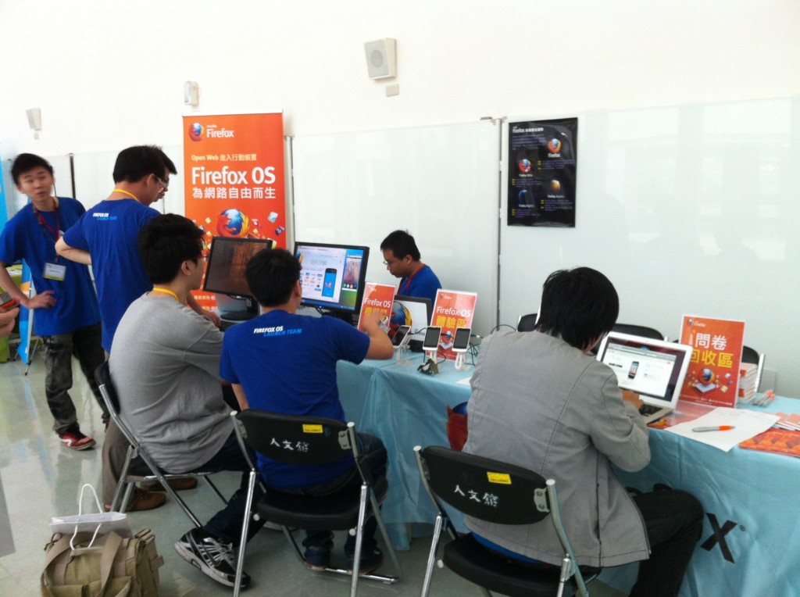

花絮報導久等啦！2013 年台灣 JavaScript 盛會已於 5/18、5/19 成功落幕，身為合作黟伴的 Mozilla Taiwan 為了這次活動，特別從 Mozilla 位於加拿大多倫多的辦公室邀請到 Mozilla 研發總監 Vladimir Vukicevic 到場，就主題「High-performance games and more in JavaScript with asm.js」討論Mozilla 在 3D Gaming 新技術上的突破和深刻的研究；此外，Mozilla 第二位講者「黃亭遠」也以「初步了解 Emscripten 並輕鬆前進 Web」做為演講主題和與會來賓現場交流，真是收獲滿滿的活動！

場內演講精彩，場外攤位也同時熱鬧！Mozilla Taiwan 這次大陣仗的請出 Firefox OS 研發工程師，現場有 Firefox OS demo、3D gaming、填問卷送好禮…精彩活動，以下跟著圖片來現場回味一下！

來到攤位實際體驗

我想多了解 Firefox OS

熱鬧的打卡送 Firefox 悠遊卡活動

攤位大人氣~

