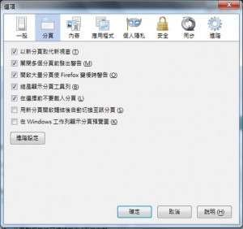

喜歡 Firefox 的你，一定也愛用 Firefox 的分頁功能吧？這裡有幾個好用的分頁秘訣提供給你。

建議你先開啟「選項」視窗中的某些設定 (當然也有更多好用的設定)，[也可以先來這裡看看如何調整分頁設定](https://support.mozilla.org/kb/tab-preferences-and-settings)。

- 以新分頁取代新視窗 (Open new windows in a new tab instead)：如果你想同時開啟很多網站，開了許多視窗反而拖慢速度，而且也很難找到想瀏覽的網頁。我推薦用新分頁取代新視窗來開啟網站。另外要確定自己勾選了這個功能喔！

- 關閉多個分頁前發出警告 (Warn me when closing multiple tabs)：如果你要關閉的視窗中有許多分頁，Firefox 會詢問你確定嗎？你可能只是想關閉目前的分頁，而這個功能可以避免你意外手滑關閉了整個視窗。或在關閉 Firefox 之前，讓你把網頁標記進書籤，這樣就不會錯失喜歡的網站了。

- 在選擇前不要載入分頁 (Don’t load tabs until selected)：只要選用「在選擇前不要載入分頁」，就能讓 Firefox 運作得更順暢。在 Firefox 啟動或恢復之前瀏覽的頁面時，Firefox 只會載入目前點選的分頁。只要你點選其他開啟的分頁，才會載入該分頁。

當然還有更多秘訣……

如果你開分頁開上癮了，那應該也早就用完分頁的空間了吧？分頁群組 (Tab Groups) 就是這樣設計出來的。分頁群組功能可根據工作 (例如你新開啟的所有分頁) 而歸納分頁為群組，接著再讓你切換分頁。[這篇文章可讓你迅速學會分頁群組的使用方式](https://support.mozilla.org/zh-TW/kb/what-are-tab-groups)。

如果還想再進一步成為分頁達人，這裡還有 Firefox 附加元件可用。像 [Tab Mix Plus](https://addons.mozilla.org/firefox/addon/tab-mix-plus/) 就可新增更多分頁功能。像我就喜歡鎖定分頁的功能。即使我不小心點到任一鏈結，也會用新的頁去開啟，而不會把我目前的網頁蓋掉。你也快去下載這個附加元件看合不合用吧。

安裝了這個元件之後，可以看到的選項如下：

現在你有更多方法可以管理自己的分頁了。快來用 Firefox 的絕妙分頁功能吧！

原文鏈結：[http://blog.mozilla.org/theden/2013/05/01/5-top-tab-tips-for-firefox/](https://blog.mozilla.org/theden/2013/05/01/5-top-tab-tips-for-firefox/)
