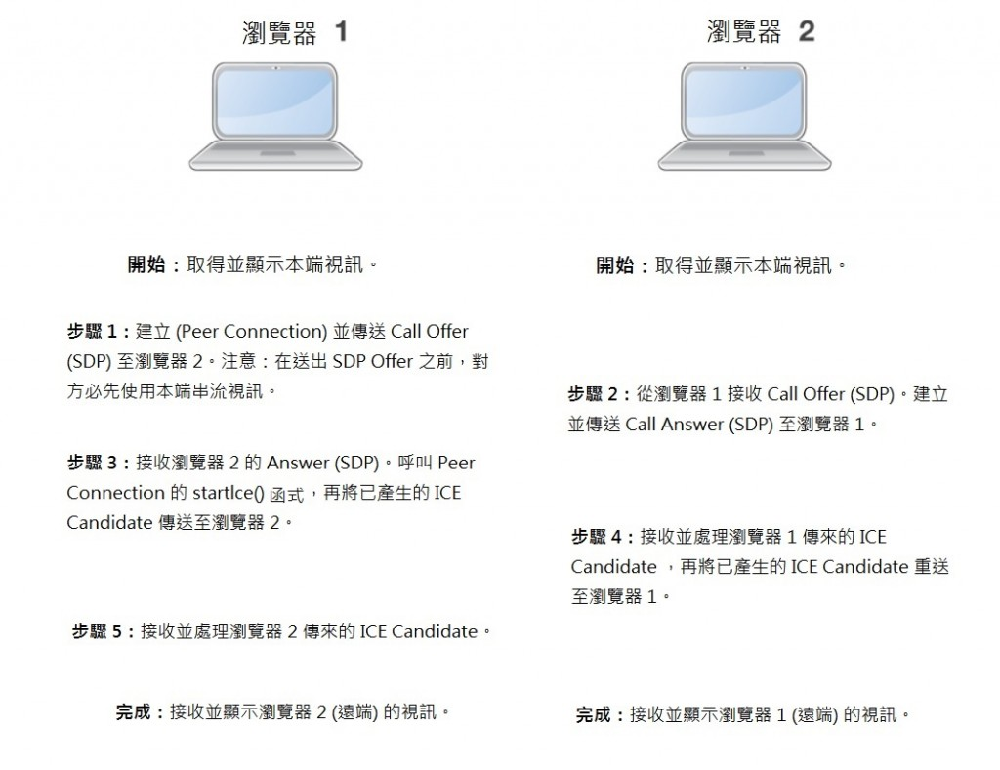

你應該還記得不久前有過一篇：[史上第一次，Firefox 與 Chrome 跨瀏覽器新利器 ─ WebRTC](https://blog.mozilla.com.tw/posts/1903) 的文章，就展示了 Firefox 與 Chrome 之間的 WebRTC 視訊聊天功能。這個當然引起很多人的興趣。從這時開始，我們 Fresh Tilled Soil 網頁設計公司，陸續會見了多家企業。這些公司都利用 WebRTC 視訊技術而設計全新產品。大力推廣 WebRTC 的工程師 Tsashi Levent-Levi，也在自己的部落格中列出自己曾訪談過的公司，[快來看看這份精采的名單](https://bloggeek.me/webrtc-interviews/)！

###

### WebRTC 聊天展示

如同許多早期就接觸 WebRTC 的朋友，我們也研究了一段時間並寫出[自己的 WebRTC 視訊聊天 Demo](https://freshtilledsoil.com/the-future-of-web/webrtc-video/)，最近還發表了 WebRTC 視訊聊天小元件。

這個小元件操作起來很簡單，任何人都可使用下列 HTML 嵌入碼：

		
		

<!-- Begin Fresh Tilled Soil Video Chat Embed Code -->

<!-- End Fresh Tilled Soil Video Chat Embed Code -->
			
				
					
				
					1234
				
						<!-- Begin Fresh Tilled Soil Video Chat Embed Code -->

<!-- End Fresh Tilled Soil Video Chat Embed Code -->
					
				
			
		

而這組程式碼可新增至任何網頁或部落格文章中。接著就可以在網頁上看到這個小元件：

從這裡要開始 WebRTC 視訊聊天就有夠簡單的！只要先想一個聊天室名稱，打入名稱再點選「Start Chat」就好了。你的好友只要重複同樣步驟，就全部設定完畢。

你如果要試試這組程式碼，請確認自己在使用 [Firefox Nightly](https://nightly.mozilla.org/) 或最新版的 [Google Chrome](https://www.google.com/intl/en/chrome/browser/)。如果要在平板電腦中使用 Google Chrome 瀏覽器，就必須使用 Google Chrome beta。

另外還必須提醒大家，在這個第一版的視訊聊天功能裡，一個聊天室只能有 2 個人。如果聊天室已經有 2 個人了，那就沒其他人可以再連進這個聊天室。

###

### 運作方式

我們這裡不會深入探討 WebRTC 視訊聊天的程式碼如何運作。先簡單了解在按下了「Start Chat」按鈕之後，背景到底發生了什麼事，看看 WebRTC 視訊聊天實際是如何運作的。這裡提供詳細步驟來説明：

這裡簡單說明：「一旦遠端媒體開始串流，則隨即停止添加 ICE Candidates (Once remote media starts streaming stop adding ICE candidates)」。這個步驟算是臨時的解決方案，而對許多網路拓撲來說，如此可能導致媒體路由無法達到最佳效果。只要修正 Chrome 的 ICE 支援功能之後，就會停止使用這個步驟。

另外再說明 1 個很重要的小技巧。我們使用類似 [Remy Sharp 這篇文章](https://remysharp.com/2010/10/08/what-is-a-polyfill/)所提到的「填充式」技術。我們特別撰寫一小段程式碼以因應 Firefox 的語法，進而達到跨瀏覽器的功能。

###

### 我們遇到的問題與解決方式

在撰寫出這個程式碼時，我們當然遇過很多問題。WebRTC 的發展十分快速，我們也每天都在解決很多問題。下面列出一些我們遇過的問題與解決方式：

#### Google Chrome 中的 PeerConnection 功能

在 Chrome 中測試新的 PeerConnection 功能時，必須搭配嚴格的規則才能順利運作，具體來說：

- 在傳送 SIP (Offer/Answer SDP) 之前，雙方均必須使用本端串流視訊

- 對「Answerer」而言，必須等對方產生「Answer SDP」，才能添加 ICE Candidate

- 一旦遠端媒體開始串流作業，就會停止添加 ICE Candidate

- 必須取得「Offer SDP」，才能與 Answerer 建立相對連線

我們解決了相關問題，而且要依上述順序處理連線作業，才完全修正了這個問題。視訊連線作業首重順暢進行。在解決這個問題之前，只能碰運氣看它能不能正常運作。

#### 延遲所造成的潛時

在串流到行動裝置時，因為延遲與行動電話的網路限制，又拉長了潛時。

我們在 URL 的結尾加了雜湊標籤 (Hash tag)，降低了視訊串流的解析度，才解決了這個問題。URL 可選擇是否納入「#res=low」參數而達到低解析度的串流視訊；反之就是用「#res=hd」參數達到高解析度的視訊。現在也支援其他設定屬性，例如每秒幀數 (frames per second，fps) 也可達到相同的效果。

#### 錄製 WebRTC 展示的影片

我們已經開始錄製 WebRTC 展示的視訊片段。在錄製影片時，是透過 JavaScript 的新型態陣列而儲存串流資料。結果我們立刻發現，這種方法卻只能分開錄製視訊與音訊。

為了解決這個問題，我們建立 2 組物件 (Instance) 進行錄製，就分別用於視訊與音訊。另可有效利用新的 JavaScript 資料型態，並同步記錄 2 組串流。

###

### 結論

我們很高興能加入 WebRTC 的開發行列。有多好玩？我們甚至用 WebRTC 搭配其他技術寫出[專屬網頁](https://freshtilledsoil.com/the-future-of-web/)，來記錄相關過程。我們認為 WebRTC 與這些技術，會在 2013 年大幅改變 Web。如果你有任何問題或建議，歡迎隨時聯絡我們。

原文鏈結：[https://hacks.mozilla.org/2013/05/embedding-webrtc-video-chat-right-into-your-website/](https://hacks.mozilla.org/2013/05/embedding-webrtc-video-chat-right-into-your-website/)
