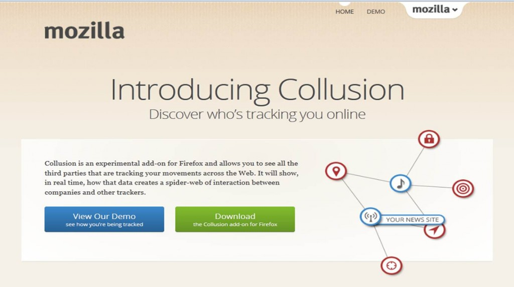
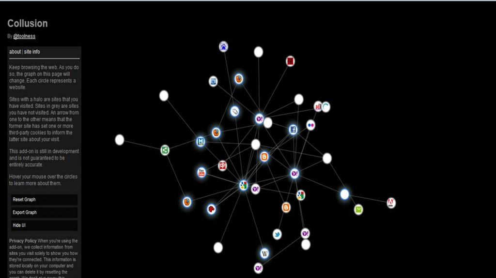

【美商謀智新聞】以推動網路平等、自由、開放為宗旨的全球非營利組織－Mozilla基金會，旗下著名之瀏覽器Firefox在全球擁有數億名愛好者。2011年第一季搶先業界推出Do Not Track (DNT) 內建功能以來，目前全球已有7%的Firefox桌機版和18%的手機版使用者勾選 DNT選項，並獲得全球Yahoo的公開支持。Ｍozilla 從瀏覽器出發當網路守門員，率先還給使用者選擇被追蹤或拒絕追蹤的權力！

為了更加推動使用者在網路上的權益，自2011年在瀏覽器內建DNT功能，引起各界對網路隱私的重視與各家瀏覽器跟進之後，2012年Mozilla再釋出『Collusion』附加元件，讓使用者即時瞭解自己在網路上被追蹤的狀況，透過即時動態圖表顯示各個網站背後的追蹤行為，使用者透過安裝Collusion附加元件可以充分瞭解自己在瀏覽網站的同時，該網站已將使用者的行蹤透漏給哪些第三方網站。 Mozilla Taiwan研發總監何福軒James Ho表示，我們期待看到更多台灣Firefox使用者利用『Do Not Track』和『Collusion』兩項功能，透過自主性的選擇，建立維護一個具開放、自由與平等的網路環境！

『Collusion』是由Mozilla開發、Ford基金會所贊助的實驗性專案，目的是還給使用者透明的網路環境，使用者在即時動態圖表中將看到代表確定追蹤的紅色，有可能追蹤的灰色等顯示， 一目了瞭知道自己網路上的行蹤正在被哪些第三方網站追蹤著。Mozilla相信並非所有的追蹤都是不好的服務，大部分的追蹤是為了提供使用者更優質的網路內容和服務，然而，唯有透過選擇與同意的追蹤才是合理的，這也是Mozilla推出Do Not Track功能與Collusion附加元件的根本理念。

目前DNT功能已經獲得Yahoo公開支持，Yahoo表示日後當使用者透過開啟DNT功能的瀏覽器瀏覽Yahoo網站，Yahoo將不再記錄使用者的上網行為與瀏覽內容來取得潛在廣告利益，將網路隱私的選擇權還給使用者。Mozilla日後將持續推動DNT保護使用者的網路隱私，也期待此一理念可以獲得更多人的認同。

Collusion介紹/安裝網站：[http://www.mozilla.org/en-US/collusion/](https://www.mozilla.org/en-US/collusion/)

DNT相關文章：[http://support.mozilla.org/zh-TW/kb/how-do-i-stop-websites-tracking-me](https://support.mozilla.org/zh-TW/kb/how-do-i-stop-websites-tracking-me)

Mozilla Taiwan: mozilla.com.tw
