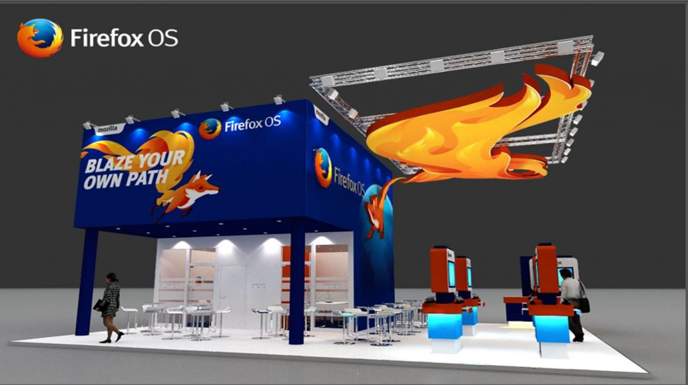

地圖不可用

	活動時間

	日期 2013/06/06 - 2013/06/28

09:00:00 - 17:00:00

	地點

	

你好奇 Mozilla 的下一步嗎？你和我們一樣大力期待 Firefox OS 嗎？搶先宣佈我們將前往 2013 亞洲移動通信博覽會與大家面對面！今天釋出 Mozilla 展位示意圖給大家搶先看，活力充沛的 Firefox OS 小狐狸也等不及要和各位見面了！今年 Mozilla 將透過 Firefox OS、Marketplace、Firefox for Android 和 WebRTC …最令人驚喜的產品和與會人員現場交流，現場更有機會與 Firefox OS 開發團隊近距離交換意見！除此之外，精彩的有獎徵答展位活動更是少不了，歡迎大家在 6/26 – 6/28 於中國上海新國際博覽中心到 Mozilla 攤位與我們相見歡噢！

[點擊大會網址](https://www.mobileasiaexpo.com/cn/?utm_source=google&utm_medium=cpc&utm_campaign=gsma_mae_tw&utm_content=ad_016)

繼2012年首屆亞洲移動通信博覽會的成功舉辦，GSMA 現已開始籌備2013年規模更大且更加完善的第二屆亞洲移博會活動。敬請關注活動日期：2013年6月26日至28日，地點：中國上海新國際博覽中心，亞洲頂級移動行業盛會期待您的參與。

2013活動主題：連動未來

移動通信正以令人驚歎的步伐推進整個世界的聯繫。它跨越時代的差異，造就多元的社區，點燃思想火花，消除溝通的障礙。亞洲移動通信博覽會將展示改變我們現在和未來生活的移動發展趨勢和解決方案，從而強化和推進移動影響力。與未來連接，期待您的參與！

2013年亞洲移動通信博覽會將包括：

- 世界級的[展覽會](https://www.mobileasiaexpo.com/cn/expo-overview)，向移動通信行業專業人士和熱衷移動產品的消費者展示尖端技術、產品、設備和應用。

- [意見領袖會議](https://www.mobileasiaexpo.com/cn/conference-overview) ，雲集資深移動通信業界專業人士，提供見解獨到的主題演講，特色專題討論會和世界級的互動交流機會。

- [App Planet](https://www.mobileasiaexpo.com/cn/featured-programmes) 開發者大會，應用程式開發人員可以通過該活動學習和拓展當前移動應用程式市場的相關知識。

- “ [互聯城市](https://www.mobileasiaexpo.com/cn/connected-city) “ 首次亮相亞洲移動通信博覽會, 是2013年全新的活動亮點。以位於博覽會中心的一條城市街道為舞臺，本次創新展會將為觀眾帶來夢幻般的魅力”互聯”體驗。”互聯城市”將展現互聯的當前現狀和未來遠景。

2013年6月26至28日，相約上海！
