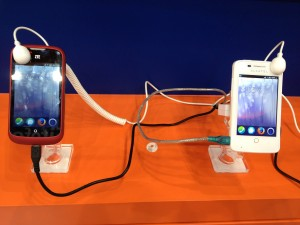
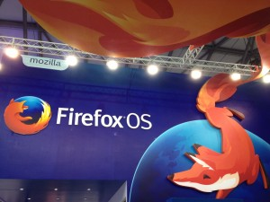

【美商謀智訊息】以推動網路平等、自由、開放為宗旨的全球非營利組織－Mozilla 基金會，2013 年以 HTML5 為基礎的行動作業系統 Firefox OS 獲得市場廣大期待。Mozilla宣佈今日 (26日) 參展於上海舉辦的 GSMA 亞洲移動通信博覽會，會場上將展出多款產品與最新技術，包括備受矚目的Firefox OS、Firefox for Android、Firefox Marketplace 和 WebRTC 四大主力。這是暨今年 2 月西班牙的 MWC (Mobile World Congress ) 大會後，於亞洲的首次大型展出。本次展出包括ZTE中興、TCL 以及展訊等多款搭載 Firefox OS 的手機，而這些 Firefox OS 手機預計將於今年起陸續於全球正式上市。

Firefox OS 使用 HTML5 及開放網路標準打造，跳脫現有的封閉行動平台架構，讓跨裝置、跨平台的應用得以實現。目前全球各電信業者、手機製造商和開發者都對 Firefox OS 給予了高度的期望和支援。在今年 2 月 MWC (Mobile World Congress ) 大會上，Firefox OS 獲得了來自全球 18 家電信商和包括中興、華為、TCL、LG 等多家手機製造商的支持。4 月，首批搭載 Firefox OS 的開發者預覽手機由 Geeksphone 在全球發售，手機在上線幾小時後即銷售一空，顯示出開發者們對這款以 Open Web 平台的行動作業系統具備濃厚的興趣。6月初，鴻海集團（Foxconn）與Mozilla 簽署合作備忘錄，雙方將進行策略聯盟，攜手合作開發搭載以 HTML5 與開放網路技術為核心的 Firefox OS 裝置。

隨著全球 Firefox OS 熱潮持續加溫，Mozilla 在亞洲市場也與各大電信商以及手機製造商緊密聯繫，希望在最短時間讓亞洲的開發者和手機用戶體驗 Firefox OS 的迷人之處。

在現場攤位部分，Mozilla 精心準備了「拍照發微博，Firefox OS 驚喜好禮帶回家！」和「有獎徵答 Firefox 我最強」攤位活動邀請大家一起來同樂，豐富 Firefox OS 驚喜好禮等你拿。

