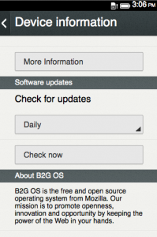
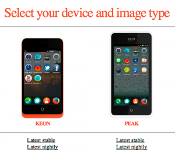
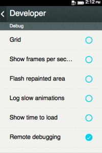

社群朋友手上拿到的 Firefox OS 開發者預覽手機，主要是由 [Geeksphone](https://www.geeksphone.com/) 所發售。因為是專屬於開發者的手機，我們希望你能儘量、努力的把玩它，進而發現潛藏的錯誤並將之改正！

接著將提供幾項小技巧，讓你能輕鬆更新 Geeksphone 手機，並提升 Gaia 系統的 App 功能。

### 更新 Geeksphone 的最新映像檔

只要進入 Settings App 中的「Device information」之內，就能下載 Firefox OS 的更新檔。另外也可設定手機執行每天、每星期、每個月的更新檢查作業。此外，也可以按下「Check now」按鈕立即檢查。一旦發現可用的更新檔案，系統便會提示使用者下載並安裝最新版本。

Geeksphone 團隊目前也已提供 Latest Stable (最新穩定版) 與 Latest Nightly (每夜更新版) 版本，且其本身就具備刷機用的下載檔。在繼續刷機程序之前，你必須先依照「[寫好 Firefox OS 的App 了嗎？快送進 Geeksphone 來玩玩吧！](https://blog.mozilla.com.tw/posts/2819/)」一文中的「設定 Geeksphone 手機」段落，先設定自己的手機，確保可將資料送入手機之中。

這些版本目前置放在 [Geeksphone 下載網頁](https://downloads.geeksphone.com/)。你可在網頁中看到自己的手機型號，再選擇所要使用的版本。

請下載自己所需的版本，再將檔案解壓縮至 filesystem 中。此壓縮檔內含刷機所需的映像檔與指令，且必須在 Windows、Mac OS X，或 Linux 環境下刷機。在刷機之前，請先確實啟用手機的「遠端除錯 (Remote debugging)」功能。只要進入 Settings App 再找到 Device information -> More information -> Developer 分頁，即可啟用遠端除錯功能。請注意手機電量低於 50% 以下時，請勿刷機。

本篇技術文章將接著說明 Windows、Mac OS X、Linux 環境下的刷機方式，還有提升手機效能的微調步驟。如果刷機後手機不幸變磚，文章最後亦提供相關解決方式。

若需要更進一步的資訊，請參閱完整的原文鏈結：[https://hacks.mozilla.org/2013/06/updating-and-tweaking-your-firefox-os-developer-preview-phonegeeksphone/](https://hacks.mozilla.org/2013/06/updating-and-tweaking-your-firefox-os-developer-preview-phonegeeksphone/)
