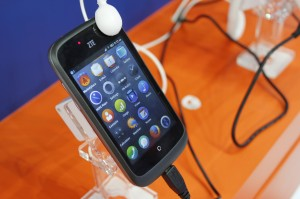
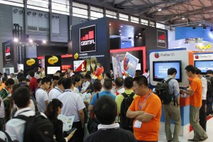

2013 亞洲移動通信博覽會已經順利於 6/26 – 6/28 舉辦完畢，今年 Mozilla 攤位絕對亮眼，會場上展出備受矚目的 Firefox OS、Firefox for Android、Firefox Marketplace 和 WebRTC 四大重點。這也是暨今年 2 月西班牙的 MWC (Mobile World Congress ) 大會後，於亞洲的首次大型展出。話不多說，快藉圖說讓大家親身體驗一回吧！

準備開展了，工作人員用心的測試機器中

充滿活力的 Firefox OS 小狐狸，現身 2013 亞洲移動通信博覽會

這是 Firefox OS 的展台，擺放著 Firefox OS 展示手機

近一點，沒錯，搭載 Firefox OS 的手機就在你眼前！

這是 WebRTC 的展台，體驗 Firefox 桌面版瀏覽器與行動版對話的快感！

現場無限火紅的小狐狸活動獎品，大人氣❤

來自世界各地的與會者

Firefox OS 開發團隊工程師們最專業的解說

絡繹不絕的攤位人潮

「拍照發微博」現場活動

大家急著在參加什麼？原來是 「Firefox 有獎問答」活動

選我選我，我要拿 Firefox 小狐狸！

精彩的活動就在愉快的氣氛中結束了，Firefox 下一次又會出現在哪裡？請狐迷們和我們一起期待，Firefox 加油！
