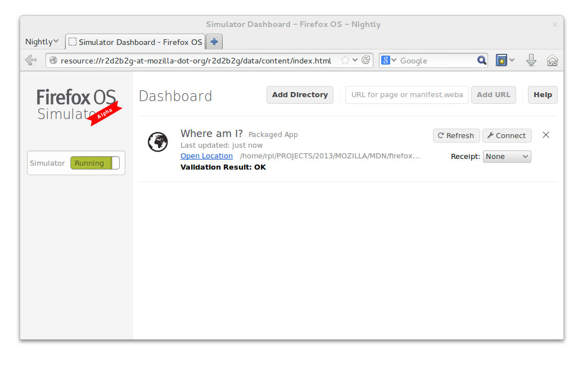
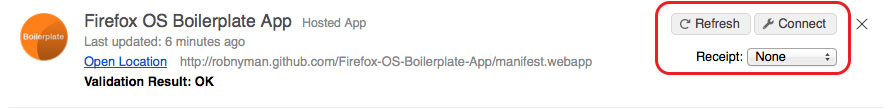
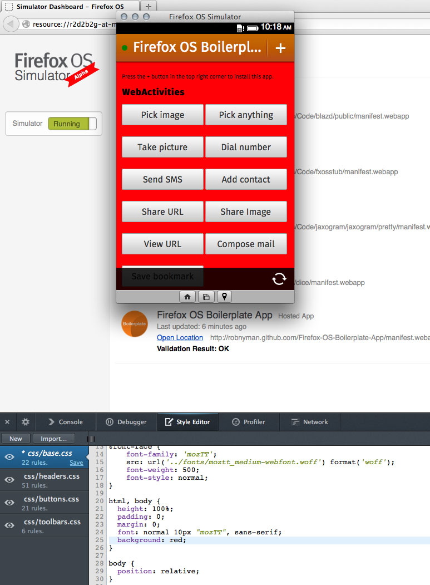

對於 Firefox OS 的開發者而言絕對是個好消息，因為我們正式發表了 Firefox OS 模擬器 (Firefox OS Simulator) 4.0。特別一提，針對想透過自己 App 在 Marketplace 上獲利的 Firefox OS 開發者，Firefox OS 模擬器 4.0 應該能為他們帶來實質助益。

## 4.0 版新功能

改善過的 Dashboard 截圖

### 新的「 Connect 」按鈕

現在針對各 App 提供了新的「Connect」按鈕，能讓特定 App 連上開發者工具箱。也就是說，現在你不需搜尋「Console (主控台)」中的訊息，或篩選「Debugger (除錯器)」中的指令碼，也能找到 App 的特定資訊。

### 測試付費 Apps 的 Receipt

現在各 App 的 Dashboard 都新增了下拉式選單，讓你能選擇「Receipt (收據)」的類型。而模擬器隨即會從 Marketplace 的收據服務下載測試收據，並重新安裝該收據所對應的 App。如此可讓你測試不同類型收據 (valid、invalid、refunded) 的收據驗證。

新的「Connect」、「Refresh」按鈕，還有「Receipt」下拉式選單

### 遠端 CSS 樣式編輯

如果是用 Firefox Nightly 或 Aurora 版本連接 App，則可透過樣式編輯器 (Style Editor) 工具來編輯 App 的樣式表 (Style sheet)，並能立刻套用變更以查看編輯之後的效果。 

編輯 Firefox OS Boilerplate App 之後，立刻就能看到漂亮紅色背景的效果

### 模擬觸控事件

現在模擬器支援觸控事件 (Touch event) 模擬功能。在模擬器中，Gaia 內建 Apps 現將真正模擬觸控事件而解決許多問題。另外亦可測試第三方 Apps 的觸控事件，而不再只能使用滑鼠事件 (Mouse event)。

### 隱藏功能： Shift-Ctrl/Cmd-R

按下快捷鍵 Ctrl-R (Mac 電腦則為 Cmd-R) 即可重新整理 App。你也可同時按住 Shift 鍵不放，則模擬器在重新整理 App 時，會一併清除永久性儲存資料，如AppCache、localStorage、sessionStorage、[IndexedDB](https://developer.mozilla.org/en/IndexedDB)。

### 模擬器逐步解說

想知道更多細節嗎？可參閱 [Simulator Walkthrough](https://developer.mozilla.org/en-US/docs/Tools/Firefox_OS_Simulator/Simulator_Walkthrough) 進一步了解模擬器。另可到 Mozilla 開發者社群 (MDN) [參閱《Firefox OS 模擬器》一文](https://developer.mozilla.org/zh-TW/docs/Tools/Firefox_OS_Simulator)。

### 下載並安裝模擬器

可至附加元件網站[下載或更新模擬器](https://addons.mozilla.org/en-US/firefox/addon/firefox-os-simulator/)。

### 發現錯誤？有任何意見？

你可在下方意見欄中留下自己的想法，或透過原文鏈結直接向作者提供自己的意見。如果你發現程式上的錯誤，則請[到這裡填寫錯誤報告](https://github.com/mozilla/r2d2b2g/issues)。

原文鏈結：[https://hacks.mozilla.org/2013/07/firefox-os-simulator-4-0-released/](https://hacks.mozilla.org/2013/07/firefox-os-simulator-4-0-released/)
