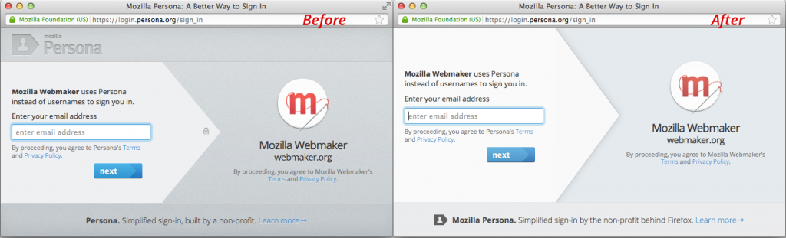
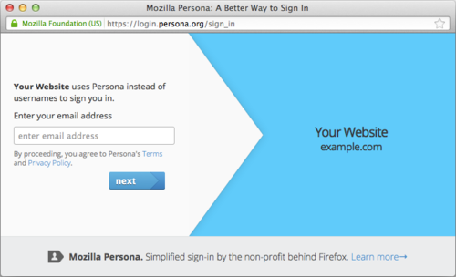

在你下次使用 Persona 網路身分識別服務時，可能會發現它略有不同。為因應使用者所回饋的意見，我們移除了登入對話框中的 Mozilla 品牌圖示。希望藉此讓大家在登入時更專注在個別網站上，而不是注意到使用的是哪一家開發的登入機制。

Persona 會將「你的」品牌置於前端。

我們亦將提供更客製化的對話框。除了 siteName 與 siteLogo 之外，各網站亦可自行設定backgroundColor，讓 Persona 對話框更貼近網站本身的設計。

舉例來說，網站只要呼叫 navigator.id.request({backgroundColor: “#00c3ff"});，即可設定出淡藍色的對話框：

歸功於 Mozilla 社群成員與開放源碼軟體貢獻者歐斯曼 (Dirkjan Ochtman) 的努力，我們才能順利推出此功能。預定下個禮拜發佈的簡短訪談中，歐斯曼將現身說說自己的心血結晶。

如果你也想參與 Persona 的工作，可透過 [irc.mozilla.org](https://irc.mozilla.org/) 的 #identity，或透過 dev-identity 郵件群組聯絡 Persona 團隊。另可到 GitHub 上找到 Persona 的開放源碼。

原文鏈結：[http://identity.mozilla.com/post/55796551587/persona-a-login-that-matches-your-site](https://identity.mozilla.com/post/55796551587/persona-a-login-that-matches-your-site)
